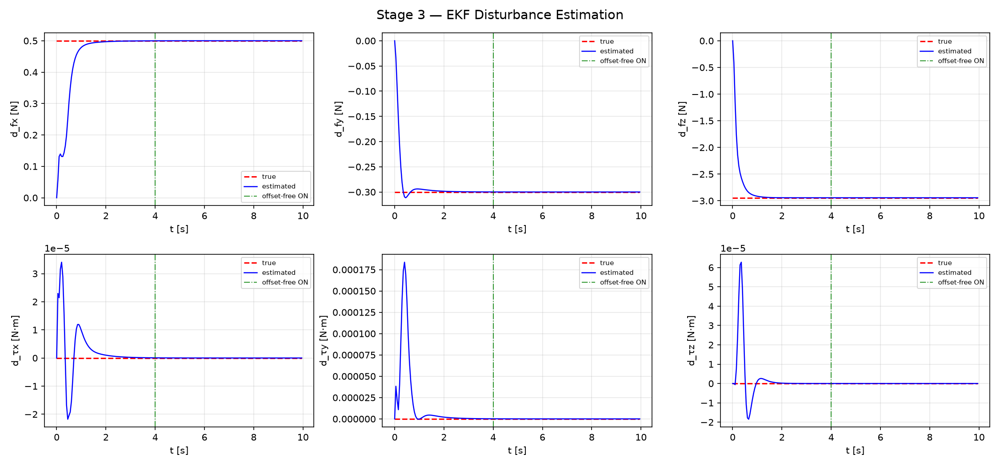
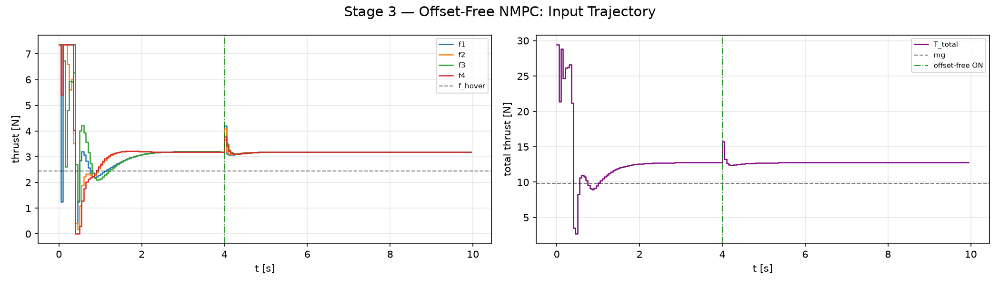
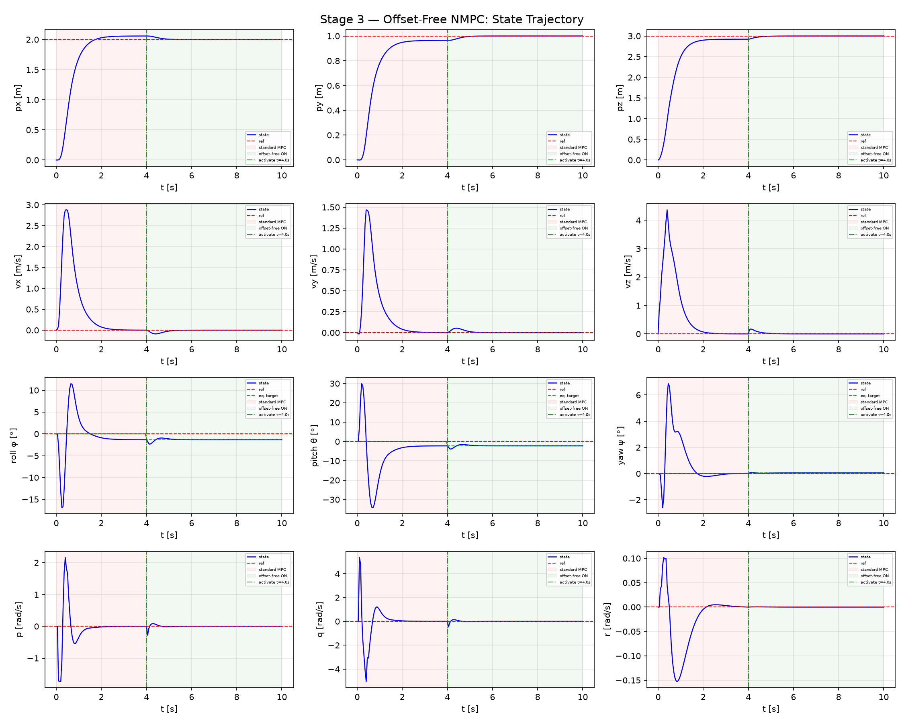

# 3D Quadrotor NMPC

Nonlinear Model Predictive Control for a 3D quadrotor, implemented in Python using the [acados](https://docs.acados.org/) solver and [CasADi](https://web.casadi.org/) symbolic framework. The project progresses through MPC stability frameworks and extensions — from basic terminal cost to quasi-infinite horizon, offset-free tracking, and beyond — applying each method to the same quadrotor plant for direct comparison.

## Quadrotor Model

Quaternion orientation (scalar-first, body→world), `+` motor layout.

| Property | Value |
|----------|-------|
| States `x` (13) | `[px py pz, vx vy vz, qw qx qy qz, p q r]` |
| Inputs `u` (4) | `[f1 f2 f3 f4]` — individual motor thrusts [N] |
| Frames | position & linear velocity in world frame; angular rates `p q r` in body frame |
| Hover | `q = [1,0,0,0]`, `f_hover = m·g / 4 ≈ 2.45 N` |
| Torques | `τx = L(f4−f2)`, `τy = L(f3−f1)`, `τz = c_τ(−f1+f2−f3+f4)` |
| Integration | ERK4 (acados) |

Motor thrust is used as the direct control input — valid for simulation given the time-scale separation between the MPC loop and motor dynamics. Quaternion cost weights are set ≈ 4× the equivalent Euler-angle weights (small-angle: `φ ≈ 2·qx`); `qw` is only lightly weighted. The plant state is passed through `normalize_quaternion(x)` after every step to prevent norm drift.

> Note on naming: `q` in `[p q r]` is the body pitch rate — not to be confused with the quaternion components `qw, qx, qy, qz`.

### Equations of Motion

**Translational dynamics** (world frame). Only the third column of the rotation matrix `R(q)` is needed, since thrust acts along the body z-axis:

```
ṗ = v
v̇ = (f_total / m) · R(q)[:, 2] − g · e_z
```

where `f_total = f1 + f2 + f3 + f4` and `R(q)[:, 2]` is the body z-axis expressed in the world frame.

**Rotational kinematics** — quaternion propagation (scalar-first, expanded form):

```
q̇w = −0.5 (qx·p + qy·q + qz·r)
q̇x =  0.5 (qw·p + qy·r − qz·q)
q̇y =  0.5 (qw·q − qx·r + qz·p)
q̇z =  0.5 (qw·r + qx·q − qy·p)
```

equivalently `q̇ = 0.5 · q ⊗ [0, p, q, r]`.

**Rotational dynamics** — rigid-body Euler equations in the body frame, independent of attitude representation:

```
I · ω̇ = τ − ω × (I · ω)
```

with `ω = [p, q, r]` and body-frame torques generated by differential motor thrust:

```
τx = L(f4 − f2)
τy = L(f3 − f1)
τz = c_τ(−f1 + f2 − f3 + f4)
```

`L` is the arm length and `c_τ` the rotor drag/thrust torque coefficient. `I` is the (diagonal) body inertia tensor.

**Full state derivative** — stacking the above gives the 13-state model `ẋ = f(x, u)` integrated by acados via ERK4.

## Stage Roadmap

Each stage implements a distinct MPC method or extension on top of the same quadrotor model. Working stages are tagged in git.

| Tag | Stage | Method |
|-----|-------|--------|
| `stage1` | 1 | **Basic NMPC** — terminal cost `W_e = Q`, no terminal constraint. Practical stability with residual error. |
| `stage2` | 2.1 | **Quasi-Infinite Horizon** — `W_e = P_lyap` from modified Lyapunov equation + soft terminal set `x_N ∈ Ω_α`. Asymptotic stability + recursive feasibility. |
| `stage2` | 2.2 | **DARE terminal cost** — `W_e = P_lqr` from reduced-order DARE (qw removed), no terminal constraint. |
| `stage3` | 3 | **Offset-Free NMPC** — disturbance-augmented model + EKF (state+disturbance) + analytical steady-state target calculator. Eliminates steady-state offset under constant disturbances. |
| *upcoming* | 4 | Obstacle-avoidance state constraints. |
| *upcoming* | 5 | Time-varying reference trajectory. |
| *upcoming* | 6 | Noisy measurements — EKF/MHE + nominal MPC. |
| *upcoming* | 7 | Stochastic MPC. |
| *upcoming* | 8 | Robust MPC. |

## File Structure

```
quadrotor_3d_nmpc/
├── quadrotor_3d_model.py       # Shared: CasADi dynamics (nominal + disturbance-parameterized
│                               #         + augmented [x;d] variants), hover linearization,
│                               #         AcadosSimSolver plant(s), quaternion utilities
├── plot_utils.py               # Shared: plot_states, plot_inputs, plot_disturbance,
│                               #         plot_3d_trajectory, plot_terminal_constraint
│
├── ocp_config_basic.py         # Stage 1   — OCP setup (W_e = Q)
├── simulate_basic.py           # Stage 1   — closed-loop simulation
│
├── compute_qih_params.py       # Stage 2.1 — CARE, Lyapunov eq., terminal α, Lipschitz check
├── ocp_config_qih.py           # Stage 2.1 — OCP setup (P_lyap + soft terminal set)
├── simulate_qih.py             # Stage 2.1 — simulation + terminal constraint diagnostics
│
├── ocp_config_dare.py          # Stage 2.2 — OCP setup (W_e = P_lqr, reduced-order)
├── simulate_dare.py            # Stage 2.2 — closed-loop simulation
│
├── ekf_aug.py                   # Stage 3   — AugEKF: augmented EKF (z=[x;d], RK4 predict,
│                               #             Joseph-form update)
├── ss_target.py                 # Stage 3   — analytical steady-state target calculator
│                               #             (force/torque balance → x_s, u_s)
├── ocp_config_offsetfree.py     # Stage 3   — OCP setup (disturbance model as runtime
│                               #             parameter + DARE terminal cost)
├── simulate_offsetfree.py       # Stage 3   — closed-loop sim: EKF + target calculator,
│                               #             standard-vs-offset-free A/B in one run
│
├── run.sh                      # WSL bridge launcher (Windows Git Bash → WSL2)
├── CLAUDE.md                   # Project guide for Claude Code
├── docs/
│   ├── stage1_theory.md
│   ├── stage2_theory.md
│   └── stage3_theory.md        # Offset-free derivation, EKF/target-calculator logic, flow chart
├── results/                    # Saved plots per stage (gitignored)
│   ├── stage1_basic/
│   ├── stage2.1_qih/
│   ├── stage2.2_dare/
│   └── stage3_offsetfree/      # states.png, inputs.png, disturbance.png
└── c_generated_code/           # acados auto-generated (gitignored)
```

All simulation scripts import from `quadrotor_3d_model.py` and `plot_utils.py`. OCP configuration is separated from the simulation loop for clarity and side-by-side method comparison.

## Toolchain

- **acados** (Python interface, `acados_template`) — OCP solver, `SQP_RTI`, `NONLINEAR_LS` cost
- **CasADi** 3.7.2 — symbolic dynamics and automatic differentiation
- **NumPy** 2.x, **SciPy** — offline computations (CARE / DARE, Lyapunov equations)
- **WSL2 / Ubuntu** — acados C libraries and Python venv (`~/acados_env`)
- **VS Code** on Windows for editing; execution routed through the WSL bridge

## Running

Project files live on the Windows E: drive; acados runs in WSL2. The wrapper handles the hop:

```bash
# From Windows Git Bash, in the project directory
./run.sh simulate_basic.py
./run.sh simulate_qih.py
./run.sh simulate_dare.py
./run.sh simulate_offsetfree.py

# Quick environment check
./run.sh -c "import acados_template; print('ok')"
```

Or, working directly inside WSL:

```bash
source ~/acados_env/bin/activate
cd /mnt/e/WorkSpace/GitHub/quadrotor_3d_nmpc
python simulate_dare.py
```

First solver build compiles C code (~30 s); `c_generated_code/` is regenerated on subsequent runs and is gitignored. Plots are saved under `results/<stage>/`.

## MPC Methods Overview

**Basic NMPC (Stage 1).** Standard NMPC with terminal cost equal to the stage cost weight matrix (`W_e = Q`). Produces practical stability — the system converges to a neighborhood of the reference but a soft terminal penalty cannot formally guarantee asymptotic convergence. Establishes the baseline and demonstrates why terminal cost design matters. → [derivation details](docs/stage1_theory.md)

**Quasi-Infinite Horizon (Stage 2.1).** Uses `W_e = P_lyap` computed offline from the continuous algebraic Riccati equation and a modified Lyapunov equation, together with a terminal set constraint `x_N ∈ Ω_α`. Ω_α is the largest positively invariant ellipsoidal region where the auxiliary LQR controller respects input bounds. This combination provides both asymptotic stability and recursive feasibility guarantees. The terminal constraint is softened (L1+L2 slack penalties) so the solver degrades gracefully rather than becoming infeasible under large disturbances. → [derivation details](docs/stage2_theory.md#21-quasi-infinite-horizon-nmpc)

**DARE terminal cost (Stage 2.2).** Terminal cost `W_e = P_lqr` from a reduced-order Discrete Algebraic Riccati Equation at the hover linearization (with `qw` removed to keep the linearization full-rank). P_lqr encodes the infinite-horizon LQR cost-to-go and acts as a Control Lyapunov Function, giving an asymptotic stability guarantee for sufficiently long horizons — without the added complexity of a terminal set constraint. → [derivation details](docs/stage2_theory.md#22-dare-terminal-cost-stage-22)

**Offset-Free NMPC (Stage 3).** Nominal NMPC has no integral action: under a persistent disturbance (wind, mass mismatch, CoG offset) the closed loop settles at a *neighboring* equilibrium rather than the true reference, since the receding-horizon control law reacts to state error but its internal model doesn't know the disturbance exists. Stage 3 fixes this the textbook way — via an augmented disturbance model: a 6-state constant disturbance `d = [d_fx, d_fy, d_fz, d_tx, d_ty, d_tz]` is estimated online by an EKF (`z = [x; d] ∈ R^19`) and fed into the NMPC prediction model as a runtime parameter. Because the corrected model now predicts hover at level attitude as physically impossible under wind, an analytical **steady-state target calculator** solves the force/torque balance for the achievable equilibrium `(x_s, u_s)` (tilted attitude, redistributed motor thrust) each step, and the NMPC tracks that instead of the fixed, physically-inconsistent reference. → [derivation, EKF/target-calculator logic, and flow chart](docs/stage3_theory.md)

## Stage 3 — Offset-Free NMPC: Demonstration Results

Validation scenario (`simulate_offsetfree.py`): a constant disturbance (`d_fx = 0.5 N` wind, `d_fy = −0.3 N` wind, `d_fz = −2.943 N` ≈ 30 % mass error) is active on the plant from `t = 0`; offset-free correction switches on at `T_ACTIVATE = 4 s`. This isolates the failure mode (pink shading, standard MPC) from the fix (green shading, offset-free ON) within a single run.



The EKF converges `d̂` to the true disturbance within ~2 s from a zero initial guess — well before `T_ACTIVATE` — confirming the estimator (not the correction mechanism) is the bottleneck on activation delay. Transient torque-disturbance estimates (bottom row, note the `1e-5` scale) decay to ~0 as expected, since no true torque disturbance is injected.



After activation, total thrust settles at `T_s ≈ 12.8 N` (vs. `m·g = 9.81 N`) and each motor at `≈ 3.19 N` (vs. `f_hover ≈ 2.45 N`) — exactly the equilibrium the target calculator predicts analytically for this disturbance (see [Stage 3 theory §7](docs/stage3_theory.md#7-validation-scenario--cross-check)).



Position converges close to the reference under standard MPC already (feedback alone limits, but doesn't eliminate, the offset); the diagnostic signal is attitude: roll/pitch settle at a non-zero tilt (~−1.3°/−2.6°) that standard MPC reaches only approximately, while after activation the state locks onto the `eq. target` (green dashed) computed by `ss_target.py` — the small transient at `t = 4 s` is the reference jumping from `(x_ref, u_hover)` to the computed `(x_s, u_s)`, after which velocity and angular rates settle exactly to zero at the tilted equilibrium.
