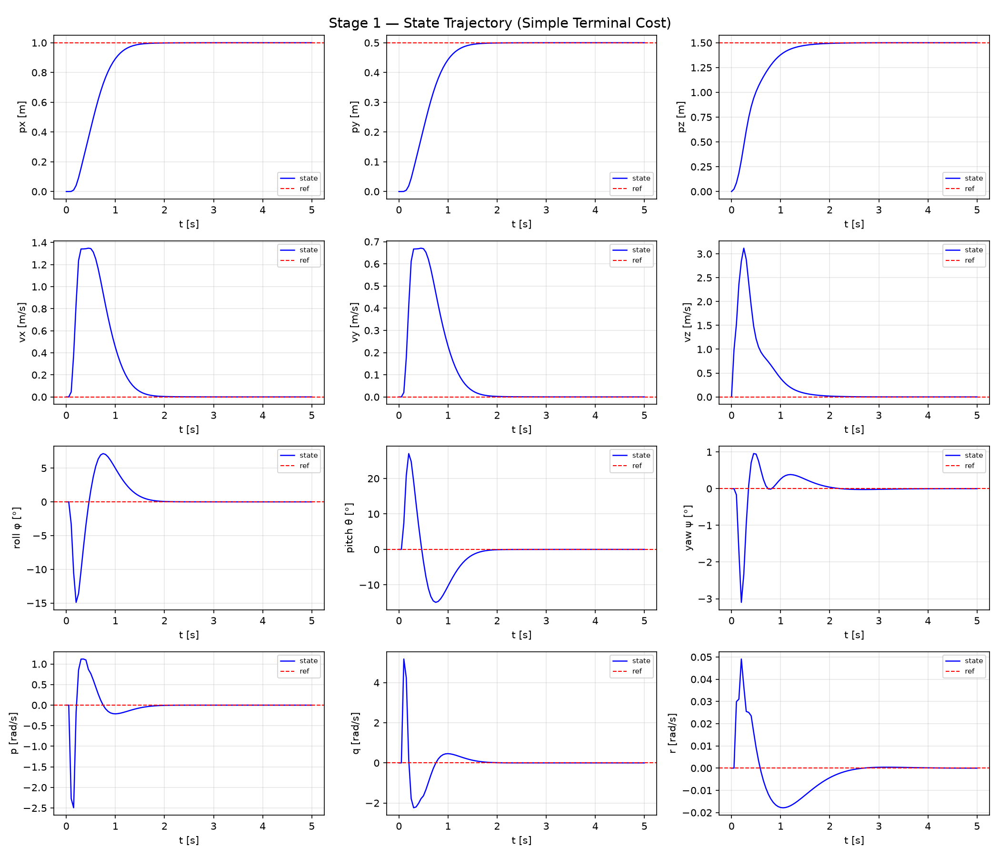
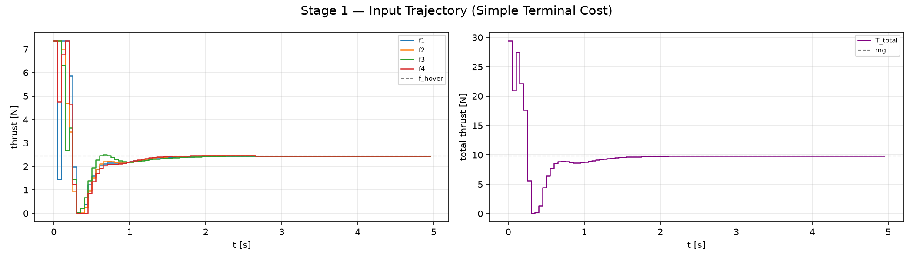
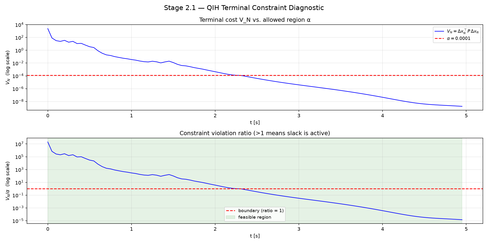

# 3D Quadrotor NMPC

Nonlinear Model Predictive Control for a 3D quadrotor, implemented in Python using the [acados](https://docs.acados.org/) solver and [CasADi](https://web.casadi.org/) symbolic framework. The project progresses through MPC stability frameworks and extensions — from basic terminal cost to quasi-infinite horizon, offset-free tracking, and beyond — applying each method to the same quadrotor plant for direct comparison.

## Quadrotor Model

Quaternion orientation (scalar-first, body→world), `+` motor layout.

| Property | Value |
|----------|-------|
| States $x$ (13) | $[p_x\; p_y\; p_z,\; v_x\; v_y\; v_z,\; q_w\; q_x\; q_y\; q_z,\; p\; q\; r]$ |
| Inputs $u$ (4) | $[f_1\; f_2\; f_3\; f_4]$ — individual motor thrusts [N] |
| Frames | position & linear velocity in world frame; angular rates $p\; q\; r$ in body frame |
| Hover | $q = [1,0,0,0]$, $f_{\text{hover}} = mg/4 \approx 2.45$ N |
| Torques | $\tau_x = L(f_4-f_2)$, $\tau_y = L(f_3-f_1)$, $\tau_z = c_\tau(-f_1+f_2-f_3+f_4)$ |
| Integration | ERK4 (acados) |

Motor thrust is used as the direct control input — valid for simulation given the time-scale separation between the MPC loop and motor dynamics. Quaternion cost weights are set $\approx 4\times$ the equivalent Euler-angle weights (small-angle: $\phi \approx 2 q_x$); $q_w$ is only lightly weighted. The plant state is passed through `normalize_quaternion(x)` after every step to prevent norm drift.

> Note on naming: $q$ in $[p\; q\; r]$ is the body pitch rate — not to be confused with the quaternion components $q_w, q_x, q_y, q_z$.

### Equations of Motion

**Translational dynamics** (world frame). Only the third column of the rotation matrix $R(q)$ is needed, since thrust acts along the body z-axis:

$$\dot{p} = v$$

$$\dot{v} = \frac{f_{\text{total}}}{m} \cdot R(q)_{:,2} - g \cdot e_z$$

where $f_{\text{total}} = f_1 + f_2 + f_3 + f_4$ and $R(q)_{:,2}$ is the body z-axis expressed in the world frame.

**Rotational kinematics** — quaternion propagation (scalar-first, expanded form):

$$\begin{aligned}
\dot{q}_w &= -0.5\,(q_x p + q_y q + q_z r) \\
\dot{q}_x &= \quad 0.5\,(q_w p + q_y r - q_z q) \\
\dot{q}_y &= \quad 0.5\,(q_w q - q_x r + q_z p) \\
\dot{q}_z &= \quad 0.5\,(q_w r + q_x q - q_y p)
\end{aligned}$$

equivalently $\dot{q} = 0.5 \cdot q \otimes [0, p, q, r]$.

**Rotational dynamics** — rigid-body Euler equations in the body frame, independent of attitude representation:

$$I \cdot \dot{\omega} = \tau - \omega \times (I \cdot \omega)$$

with $\omega = [p, q, r]$ and body-frame torques generated by differential motor thrust:

$$\begin{aligned}
\tau_x &= L(f_4 - f_2) \\
\tau_y &= L(f_3 - f_1) \\
\tau_z &= c_\tau(-f_1 + f_2 - f_3 + f_4)
\end{aligned}$$

$L$ is the arm length and $c_\tau$ the rotor drag/thrust torque coefficient. $I$ is the (diagonal) body inertia tensor.

**Full state derivative** — stacking the above gives the 13-state model $\dot{x} = f(x, u)$ integrated by acados via ERK4.

## Stage Roadmap

Each stage implements a distinct MPC method or extension on top of the same quadrotor model. Working stages are tagged in git.

| Tag | Stage | Method |
|-----|-------|--------|
| `stage1` | 1 | **Basic NMPC** — terminal cost $W_e = Q$, no terminal constraint. Practical stability with residual error. |
| `stage2` | 2.1 | **Quasi-Infinite Horizon** — $W_e = P_{\text{lyap}}$ from modified Lyapunov equation + soft terminal set $x_N \in \Omega_\alpha$. Asymptotic stability + recursive feasibility. |
| `stage2` | 2.2 | **DARE terminal cost** — $W_e = P_{\text{lqr}}$ from reduced-order DARE ($q_w$ removed), no terminal constraint. |
| `stage3` | 3 | **Offset-Free NMPC** — disturbance-augmented model + EKF (state+disturbance) + analytical steady-state target calculator. Eliminates steady-state offset under constant disturbances. |
| *upcoming* | 4 | Obstacle-avoidance state constraints. |
| *upcoming* | 5 | Time-varying reference trajectory. |
| *upcoming* | 6 | Noisy measurements — EKF/MHE + nominal MPC. |
| *upcoming* | 7 | Stochastic MPC. |
| *upcoming* | 8 | Robust MPC. |

## File Structure

```
quadrotor_3d_nmpc/
├── quadrotor_3d_model.py       # Shared: CasADi dynamics (nominal + disturbance-parameterized
│                               #         + augmented [x;d] variants), hover linearization,
│                               #         AcadosSimSolver plant(s), quaternion utilities
├── plot_utils.py               # Shared: plot_states, plot_inputs, plot_disturbance,
│                               #         plot_3d_trajectory, plot_terminal_constraint
│
├── ocp_config_basic.py         # Stage 1   — OCP setup (W_e = Q)
├── simulate_basic.py           # Stage 1   — closed-loop simulation
│
├── compute_qih_params.py       # Stage 2.1 — CARE, Lyapunov eq., terminal α, Lipschitz check
├── ocp_config_qih.py           # Stage 2.1 — OCP setup (P_lyap + soft terminal set)
├── simulate_qih.py             # Stage 2.1 — simulation + terminal constraint diagnostics
│
├── ocp_config_dare.py          # Stage 2.2 — OCP setup (W_e = P_lqr, reduced-order)
├── simulate_dare.py            # Stage 2.2 — closed-loop simulation
│
├── ekf_aug.py                   # Stage 3   — AugEKF: augmented EKF (z=[x;d], RK4 predict,
│                               #             Joseph-form update)
├── ss_target.py                 # Stage 3   — analytical steady-state target calculator
│                               #             (force/torque balance → x_s, u_s)
├── ocp_config_offsetfree.py     # Stage 3   — OCP setup (disturbance model as runtime
│                               #             parameter + DARE terminal cost)
├── simulate_offsetfree.py       # Stage 3   — closed-loop sim: EKF + target calculator,
│                               #             standard-vs-offset-free A/B in one run
│
├── run.sh                      # WSL bridge launcher (Windows Git Bash → WSL2)
├── CLAUDE.md                   # Project guide for Claude Code
├── docs/
│   ├── stage1_theory.md
│   ├── stage2_theory.md
│   └── stage3_theory.md        # Offset-free derivation, EKF/target-calculator logic, flow chart
├── results/                    # Saved plots per stage (gitignored)
│   ├── stage1_basic/
│   ├── stage2.1_qih/
│   ├── stage2.2_dare/
│   └── stage3_offsetfree/      # states.png, inputs.png, disturbance.png
└── c_generated_code/           # acados auto-generated (gitignored)
```

All simulation scripts import from `quadrotor_3d_model.py` and `plot_utils.py`. OCP configuration is separated from the simulation loop for clarity and side-by-side method comparison.

## Toolchain

- **acados** (Python interface, `acados_template`) — OCP solver, `SQP_RTI`, `NONLINEAR_LS` cost
- **CasADi** 3.7.2 — symbolic dynamics and automatic differentiation
- **NumPy** 2.x, **SciPy** — offline computations (CARE / DARE, Lyapunov equations)
- **WSL2 / Ubuntu** — acados C libraries and Python venv (`~/acados_env`)
- **VS Code** on Windows for editing; execution routed through the WSL bridge

## Running

Project files live on the Windows E: drive; acados runs in WSL2. The wrapper handles the hop:

```bash
# From Windows Git Bash, in the project directory
./run.sh simulate_basic.py
./run.sh simulate_qih.py
./run.sh simulate_dare.py
./run.sh simulate_offsetfree.py

# Quick environment check
./run.sh -c "import acados_template; print('ok')"
```

Or, working directly inside WSL:

```bash
source ~/acados_env/bin/activate
cd /mnt/e/WorkSpace/GitHub/quadrotor_3d_nmpc
python simulate_dare.py
```

First solver build compiles C code (~30 s); `c_generated_code/` is regenerated on subsequent runs and is gitignored. Plots are saved under `results/<stage>/`.

## MPC Methods Overview

**Basic NMPC (Stage 1).** Standard NMPC with terminal cost equal to the stage cost weight matrix ($W_e = Q$). Produces practical stability — the system converges to a neighborhood of the reference but a soft terminal penalty cannot formally guarantee asymptotic convergence. Establishes the baseline and demonstrates why terminal cost design matters. → [derivation details](docs/stage1_theory.md)

**Quasi-Infinite Horizon (Stage 2.1).** Uses $W_e = P_{\text{lyap}}$ computed offline from the continuous algebraic Riccati equation and a modified Lyapunov equation, together with a terminal set constraint $x_N \in \Omega_\alpha$. $\Omega_\alpha$ is the largest positively invariant ellipsoidal region where the auxiliary LQR controller respects input bounds. This combination provides both asymptotic stability and recursive feasibility guarantees. The terminal constraint is softened (L1+L2 slack penalties) so the solver degrades gracefully rather than becoming infeasible under large disturbances. → [derivation details](docs/stage2_theory.md#21-quasi-infinite-horizon-nmpc)

**DARE terminal cost (Stage 2.2).** Terminal cost $W_e = P_{\text{lqr}}$ from a reduced-order Discrete Algebraic Riccati Equation at the hover linearization (with $q_w$ removed to keep the linearization full-rank). $P_{\text{lqr}}$ encodes the infinite-horizon LQR cost-to-go and acts as a Control Lyapunov Function, giving an asymptotic stability guarantee for sufficiently long horizons — without the added complexity of a terminal set constraint. → [derivation details](docs/stage2_theory.md#22-dare-terminal-cost-stage-22)

**Offset-Free NMPC (Stage 3).** Nominal NMPC has no integral action: under a persistent disturbance (wind, mass mismatch, CoG offset) the closed loop settles at a *neighboring* equilibrium rather than the true reference, since the receding-horizon control law reacts to state error but its internal model doesn't know the disturbance exists. Stage 3 fixes this the textbook way — via an augmented disturbance model: a 6-state constant disturbance $d = [d_{f_x}, d_{f_y}, d_{f_z}, d_{\tau_x}, d_{\tau_y}, d_{\tau_z}]$ is estimated online by an EKF ($z = [x; d] \in \mathbb{R}^{19}$) and fed into the NMPC prediction model as a runtime parameter. Because the corrected model now predicts hover at level attitude as physically impossible under wind, an analytical **steady-state target calculator** solves the force/torque balance for the achievable equilibrium $(x_s, u_s)$ (tilted attitude, redistributed motor thrust) each step, and the NMPC tracks that instead of the fixed, physically-inconsistent reference. → [derivation, EKF/target-calculator logic, and flow chart](docs/stage3_theory.md)

## Stage 1 — Basic NMPC: Demonstration Results

Scenario (`simulate_basic.py`): hover-to-hover step from the origin to $x_{\text{ref}} = (1.0, 0.5, 1.5)$ m, $T_{\text{sim}} = 5$ s, no terminal set — just $W_e = Q$.





With no terminal set to shape the early transient, the solver uses the full actuation range immediately: all four motors saturate near $f_{\max} \approx 7.35$ N ($= 3 \cdot f_{\text{hover}}$) at $t = 0$, then swing down to the lower bound ($0$ N) by $t \approx 0.3$ s, before settling to $f_{\text{hover}} \approx 2.45$ N by $t \approx 2$ s. Attitude reflects the same aggressiveness — pitch swings from $+27°$ to $-14°$ and back before settling, roll from $-15°$ to $+7°$ — a two-sided overshoot with no mechanism holding it back, since a soft terminal-cost-only formulation has no guarantee against it, only a tendency to eventually damp it out. Position converges cleanly onto $x_{\text{ref}}$ by $t \approx 2$ s and holds for the remaining $3$ s of the run — visually indistinguishable, at this precision, from an exact zero steady-state error, even though the formulation's only proven property is *practical* (not asymptotic) stability. That gap between "looks converged" and "is provably converged" is exactly what Stage 2 is for.

## Stage 2.1 — Quasi-Infinite Horizon: Terminal Constraint Diagnostic

Rather than repeat Stage 1's state/input plots (see the note below), Stage 2.1's demonstration is the one artifact specific to QIH: whether and when the trajectory enters the invariant terminal set $\Omega_\alpha$.



$V_N = \Delta x_N^\top P_{\text{lyap}}\, \Delta x_N$ starts around $5 \times 10^3$ — many orders of magnitude above $\alpha = 10^{-4}$ — meaning the terminal-set constraint is infeasible at the start and the softening (L1+L2 slack) is actively doing its job, exactly as it's designed to under a large initial displacement. $V_N$ decreases essentially monotonically (visible discretization "steps" from `SQP_RTI`'s single QP iteration per sample) and crosses $\alpha$ at $t \approx 2.3$ s — a little under half the 5 s run. From that point on the trajectory is *inside* $\Omega_\alpha$, the slack is inactive, and the formulation's asymptotic-stability guarantee formally applies for the remainder of the run; before that point, the guarantee is "the solver stays feasible," not "the trajectory is provably converging," which is the honest distinction a soft terminal constraint gives you.

**Why no separate Stage 2 state/input plots.** Both Stage 2.1 (QIH) and Stage 2.2 (DARE) are run on the same nominal, disturbance-free scenario as Stage 1, and their state/input trajectories come out visually identical to Stage 1's — which is expected, not a null result. What QIH and DARE add over Stage 1 is a *proof* about behavior in regimes this nominal run doesn't exercise (formal asymptotic convergence via a Control Lyapunov Function, and, for QIH specifically, recursive feasibility under the terminal set) — not a different nominal trajectory. Reproducing near-duplicate galleries for all three would suggest a difference that isn't there and wouldn't actually demonstrate what each method contributes; the terminal-constraint diagnostic above is the one plot that does.

## Stage 3 — Offset-Free NMPC: Demonstration Results

Validation scenario (`simulate_offsetfree.py`): a constant disturbance ($d_{f_x} = 0.5$ N wind, $d_{f_y} = -0.3$ N wind, $d_{f_z} = -2.943$ N $\approx 30\%$ mass error) is active on the plant from $t = 0$; offset-free correction switches on at $T_{\text{ACTIVATE}} = 4$ s. This isolates the failure mode (pink shading, standard MPC) from the fix (green shading, offset-free ON) within a single run.


The EKF converges $\hat{d}$ to the true disturbance within ~2 s from a zero initial guess — well before $T_{\text{ACTIVATE}}$ — confirming the estimator (not the correction mechanism) is the bottleneck on activation delay. Transient torque-disturbance estimates (bottom row, note the `1e-5` scale) decay to ~0 as expected, since no true torque disturbance is injected.


After activation, total thrust settles at $T_s \approx 12.8$ N (vs. $mg = 9.81$ N) and each motor at $\approx 3.19$ N (vs. $f_{\text{hover}} \approx 2.45$ N) — exactly the equilibrium the target calculator predicts analytically for this disturbance (see [Stage 3 theory §7](docs/stage3_theory.md#7-validation-scenario--cross-check)).


Position converges close to the reference under standard MPC already (feedback alone limits, but doesn't eliminate, the offset); the diagnostic signal is attitude: roll/pitch settle at a non-zero tilt (~$-1.3°$/$-2.6°$) that standard MPC reaches only approximately, while after activation the state locks onto the `eq. target` (green dashed) computed by `ss_target.py` — the small transient at $t = 4$ s is the reference jumping from $(x_{\text{ref}}, u_{\text{hover}})$ to the computed $(x_s, u_s)$, after which velocity and angular rates settle exactly to zero at the tilted equilibrium.
