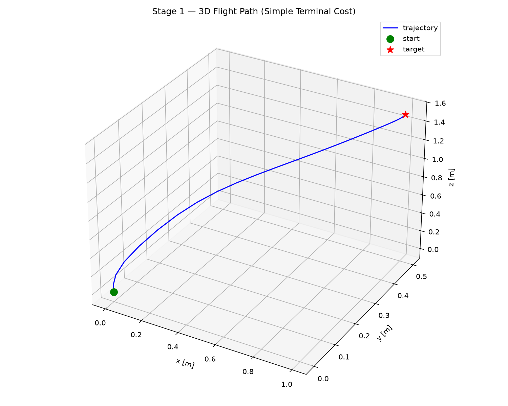
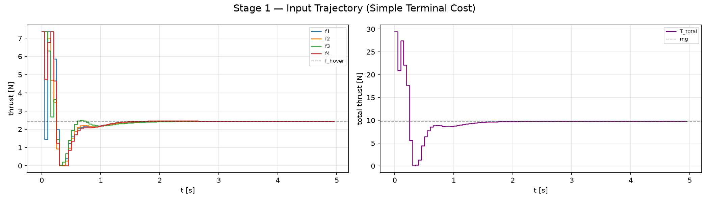
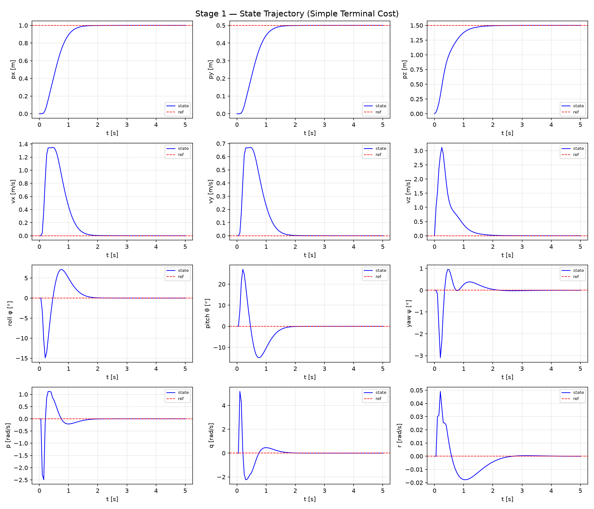

# Stage 1 — Basic NMPC (Terminal Cost $W_e = Q$)

| | |
|---|---|
| Git tag | `stage1` |
| Files | `ocp_config_basic.py`, `simulate_basic.py` (+ shared `quadrotor_3d_model.py`, `plot_utils.py`) |
| Terminal treatment | terminal cost $W_e = Q$, no terminal constraint |
| Results | `results/stage1_basic/` |

## 1. Motivation

Stage 1 is the baseline of the project: a standard NMPC with the simplest possible terminal
treatment. All later stages run on the same plant and the same cost structure, so differences
can be attributed to the one ingredient each stage changes. Stage 1 answers two questions:
does the toolchain (CasADi model → acados OCP → `SQP_RTI` closed loop) work on the 13-state
quadrotor, and what does an NMPC *without* stability-certifying terminal ingredients deliver?

## 2. Formulation

### 2.1 Starting point: zero-terminal-constraint MPC

The textbook route to a provably stable MPC scheme is the zero-terminal-constraint formulation.
At each time $t$, given the measured state $x(t)$ (written in error coordinates, so the
reference is the origin), solve

$$\min_{\bar{u}(\cdot;t)} \; J\bigl(x(t),\, \bar{u}(\cdot;t)\bigr) = \int_{t}^{t+T} L\bigl(\bar{x}(\tau;t),\, \bar{u}(\tau;t)\bigr)\, d\tau$$

subject to

$$\begin{aligned}
\dot{\bar{x}} &= f(\bar{x},\, \bar{u}) && \text{(system dynamics)} \\
\bar{x}(t;\,t) &= x(t) && \text{(initial condition)} \\
\bar{u}(\tau;\,t) &\in \mathcal{U}, \quad \bar{x}(\tau;\,t) \in \mathcal{X} && \forall\,\tau \in [t,\, t+T] \\
\bar{x}(t+T;\,t) &= 0 && \text{(zero-terminal constraint)}
\end{aligned}$$

Forcing the predicted terminal state exactly onto the origin makes the cost-to-go beyond
$t+T$ exactly zero. The optimal value $J^*(x)$ then serves as a Lyapunov function that strictly
decreases along the closed loop, which gives asymptotic stability.

### 2.2 Why it is too tight

The equality $\bar{x}(t+T;\,t) = 0$ is a hard constraint on all 13 terminal states. The solver
must find admissible motor thrusts that steer the full nonlinear model *exactly* to the
reference within $T$ seconds. With box-constrained thrusts and the short horizons needed for
real-time `SQP_RTI`, the feasible set shrinks to a small neighborhood of hover. Larger
setpoint changes, disturbances, or re-initialization then produce infeasible QPs, which is
unacceptable for an online controller. This motivates relaxing the constraint into a
**terminal cost** (this stage) or a **terminal cost + terminal set** (Stage 2a).

### 2.3 Stage 1 relaxation: terminal cost only

Stage 1 drops the terminal constraint and penalizes the terminal state with the stage-cost
weight:

$$J\bigl(x(t),\, \bar{u}(\cdot;t)\bigr) = \int_{t}^{t+T} L(\bar{x},\, \bar{u})\, d\tau \;+\; \bar{x}(t+T;\,t)^\top Q\, \bar{x}(t+T;\,t)$$

with no constraint on $\bar{x}(t+T;\,t)$ beyond the regular bounds.

**What this gives up.** $Q$ is chosen for tracking performance, not derived from the plant, so
$\bar{x}^\top Q \bar{x}$ is not a certified control Lyapunov function. No argument in this
formulation proves that $J^*$ decreases along the closed loop, and nothing tells us *how long*
the horizon must be for the closed loop to be stable.

**What it keeps.** In the nominal case the reference is a true equilibrium of the plant
($x_{\text{ref}}$ at hover with $u_{\text{ref}} = u_{\text{hover}}$), where the cost is zero. The
reference is therefore a fixed point of the closed loop and there is no structural offset.
Results on unconstrained-terminal MPC (e.g. Jadbabaie & Hauser 2005; Grüne 2012) show that
such schemes are asymptotically stable for a *sufficiently long* horizon; the horizon bound is
just not available from this formulation. In practice Stage 1 is stable for reasonable
horizons, but stability is observed rather than certified.

**What it improves.** With no terminal equality, feasibility only depends on the input and
state bounds, so the OCP stays feasible even for large setpoint changes.

> A steady-state offset is a different phenomenon: it appears when the prediction model and
> the plant disagree (wind, mass error). That failure mode is treated in Stage 3.

## 3. Implementation

| Item | Setting |
|---|---|
| Model | 13 states $[p, v, q, \omega]$, 4 inputs $[f_1 \dots f_4]$, see [README](../README.md#quadrotor-model) |
| Integrator | ERK4 (acados) |
| Cost | `NONLINEAR_LS`, $y = [x;\,u]$, $W = \mathrm{blkdiag}(Q, R)$, $y_{\text{ref}} = [x_{\text{ref}};\, u_{\text{hover}}]$ |
| Terminal cost | $W_e = Q$, $y_e = x$ |
| Input bounds | $0 \le f_i \le f_{\max} = 3 f_{\text{hover}} \approx 7.35$ N |
| Solver | `SQP_RTI` (one QP per sample), Gauss-Newton Hessian, `PARTIAL_CONDENSING_HPIPM` |
| Horizon | $N = 20$ steps, $T = 1.0$ s, so $T_s = T/N = 0.05$ s |
| Weights $Q$ | position $(80, 80, 120)$, velocity $(10, 10, 15)$, quaternion $(q_w, q_x, q_y, q_z) = (10, 120, 120, 80)$, body rates $(1, 1, 1)$ |
| Weights $R$ | $0.1$ per motor |

The quaternion weights are scaled from Euler-angle weights: since $\phi \approx 2 q_x$ for small
angles, a quaternion weight of $4 w$ matches an Euler weight $w$ (here roll/pitch $30$, yaw
$20$). $q_w$ is only lightly weighted because it is not independent of the vector part.

The plant is an `AcadosSimSolver` on the same model. After every plant step the quaternion is
re-normalized (`quat_normalize`) to prevent norm drift.

Run it from the tag:

```bash
git checkout stage1
./run.sh simulate_basic.py        # → results/stage1_basic/
```

## 4. Scenario

Hover-to-hover step from the origin to $p_{\text{ref}} = (1.0,\; 0.5,\; 1.5)$ m with level
attitude and zero velocity, $T_{\text{sim}} = 5$ s. Nominal plant: no disturbance, no model
mismatch, full state measured.

## 5. Results

### 5.1 Flight path



The drone first climbs almost vertically and then flies a nearly straight line to the target.
The vertical start comes from $v_z$ building up before the horizontal velocities (it peaks
at $\approx 3.1$ m/s at $t \approx 0.25$ s). After that the path is straight because the
horizontal velocities stay proportional to the displacement: the peaks
$v_x \approx 1.35$ m/s and $v_y \approx 0.67$ m/s have the same $2:1$ ratio as
$\Delta p_x : \Delta p_y = 1.0 : 0.5$.

### 5.2 Inputs



The controller uses the full actuation range. At $t = 0$ all four motors sit at
$f_{\max} \approx 7.35$ N, so total thrust is $3mg \approx 29.4$ N. During the first
$\approx 0.25$ s the motors split (e.g. $f_1$ briefly drops to $\approx 1.4$ N) to generate the
torques that tilt the airframe. Between $t \approx 0.3$ s and $0.45$ s all motors are at
the lower bound $0$ N: the drone is in near free fall to brake the upward velocity. From there
thrust recovers and settles at $f_{\text{hover}} \approx 2.45$ N ($T_{\text{total}} = mg$) by
$t \approx 2$ s. Both input bounds are active during the transient, which is exactly the regime
where MPC differs from an unconstrained LQR.

The aggressiveness follows from the weighting. Position errors are weighted $80$–$120$ while
thrust deviations cost only $R = 0.1$, so the optimizer treats thrust as almost free and goes
straight to the bounds. A larger $R$ would give a smoother, slower transient.

### 5.3 States



**Position** reaches the reference by $t \approx 2$ s with no overshoot in any axis and stays
there for the rest of the run, with no visible offset.

**Attitude** swings in both directions: pitch $+27° \to -15°$, roll $-15° \to +7°$. This is
not overshoot but the required maneuver: a quadrotor can only accelerate horizontally by
tilting, so it tilts toward the target to accelerate and tilts the other way to decelerate.
The large amplitudes reflect the aggressive acceleration chosen by the weights, with body
rates up to $q \approx 5.2$ rad/s and $p \approx -2.5$ rad/s. Yaw is not commanded but shows a
small transient ($\approx -3°$) caused by the yaw torque $\tau_z = c_\tau(-f_1+f_2-f_3+f_4)$ from
unequal motor thrusts during the saturated phase; it returns to zero by $t \approx 2.5$ s.

**Settling.** All 13 states settle to their references within $\approx 2$–$2.5$ s. This is
longer than the prediction horizon $T = 1.0$ s: at $t = 0$ the predicted trajectory ends far
from the target, and the terminal cost $W_e = Q$ is only a rough guess of the remaining
cost-to-go. The loop still converges, but this is the situation in which a certified terminal
cost matters most (Stage 2).

## 6. Takeaways

The terminal-cost-only NMPC works well in this nominal run: fast, constraint-respecting, and
convergent with no visible offset. What the run cannot show is *why* it converges. With
$W_e = Q$ there is no certificate, so a shorter horizon, a larger setpoint, or retuned weights
could break stability without any warning from the formulation.

Stage 2 adds the missing theory on the same scenario:

- **Stage 2a — Quasi-Infinite Horizon:** terminal cost $P_{\text{lyap}}$ plus terminal set
  $\Omega_\alpha$, giving asymptotic stability and recursive feasibility.
- **Stage 2b — DARE terminal cost:** terminal cost $P_{\text{lqr}}$ without a terminal set,
  giving a control Lyapunov function as terminal cost.

| | Terminal treatment | Guarantee |
|---|---|---|
| Zero-terminal-constraint MPC | hard equality $\bar{x}(t+T) = 0$ | asymptotic stability, often infeasible |
| **Stage 1 (this doc)** | terminal cost $W_e = Q$ | none certified; stable for sufficiently long horizon |
| Stage 2a — Quasi-infinite horizon | $P_{\text{lyap}}$ + terminal set $\Omega_\alpha$ | asymptotic stability + recursive feasibility |
| Stage 2b — DARE terminal cost | $P_{\text{lqr}}$, no terminal set | CLF terminal cost, asymptotic stability for sufficiently long horizon |

Because the nominal trajectories of Stages 1, 2a and 2b look nearly identical, Stage 2 compares
the methods through their certificates rather than through state plots →
[Stage 2](stage2_terminal_cost.md).

## References

- A. Jadbabaie, J. Hauser, "On the stability of receding horizon control with a general terminal cost," *IEEE TAC*, 2005.
- L. Grüne, "NMPC without terminal constraints," *IFAC NMPC Conference*, 2012.
- H. Chen, F. Allgöwer, "A quasi-infinite horizon nonlinear model predictive control scheme with guaranteed stability," *Automatica*, 1998.
