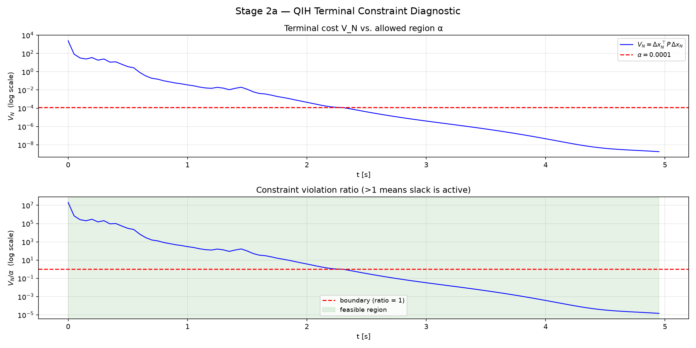

# Stage 2 — Certified Terminal Ingredients (2a QIH, 2b DARE)

| | Stage 2a — Quasi-Infinite Horizon | Stage 2b — DARE terminal cost |
|---|---|---|
| Git tag | `stage2` | `stage2` |
| Files | `compute_qih_params.py` (offline), `ocp_config_qih.py`, `simulate_qih.py` | `ocp_config_dare.py`, `simulate_dare.py` |
| Terminal cost | $W_e = P_{\text{lyap}}$ (modified Lyapunov equation) | $W_e = P_{\text{lqr}}$ (reduced-order DARE) |
| Terminal constraint | $x_N \in \Omega_\alpha$, softened | none |
| Results | `results/stage2a_qih/` | `results/stage2b_dare/` |

Main reference: H. Chen, F. Allgöwer, *A quasi-infinite horizon nonlinear model predictive
control scheme with guaranteed stability*, Automatica, 1998.

## 1. Motivation

Stage 1 ([basic NMPC](stage1_basic_nmpc.md)) uses $W_e = Q$: a tracking weight with no
connection to the plant. It converges in the nominal run, but nothing in the formulation
proves it, and its 1 s horizon is shorter than the 2 s maneuver. Stage 2 replaces that
arbitrary terminal weight with ingredients derived from the plant, in two ways:

- **2a — Quasi-Infinite Horizon (QIH):** the full Chen–Allgöwer construction, with a terminal
  cost *and* a terminal region in which a local controller is certified to work.
- **2b — DARE terminal cost:** keep only the terminal cost, using the LQR cost-to-go, and drop
  the terminal region.

Plant, stage cost $Q, R$, horizon, solver and scenario are identical to Stage 1. Only the
terminal treatment changes.

## 2. Formulation

### 2.1 Stage 2a — Quasi-Infinite Horizon NMPC

The zero-terminal constraint of Stage 1 §2.1 is replaced by three ingredients:

1. a **terminal region** $\bar{x}(t+T;\,t) \in \Omega_\alpha = \{x : x^\top P x \le \alpha\}$,
2. a **terminal cost** $F(x) = x^\top P x$,
3. a **local auxiliary controller** $u = Kx$, used only offline to certify (1) and (2) and
   never applied online.

The OCP (in error coordinates, reference at the origin) is

$$\min_{\bar{u}(\cdot;t)} \int_{t}^{t+T} \Bigl(\|\bar{x}\|_Q^2 + \|\bar{u}\|_R^2\Bigr)\, d\tau \;+\; \|\bar{x}(t+T;\,t)\|_P^2$$

subject to the dynamics, $\bar{x}(t;\,t) = x(t)$, $\bar{u} \in \mathcal{U}$, and
$\bar{x}(t+T;\,t) \in \Omega_\alpha$.

**What has to be certified.** Inside $\Omega_\alpha$, the local controller must (i) respect the
input bounds and (ii) make the terminal cost decrease at least as fast as the stage cost
accumulates:

$$\frac{d}{dt}\, x^\top P x \;\le\; -x^\top Q^{*} x, \qquad Q^{*} = Q + K^\top R K, \qquad \forall\, x \in \Omega_\alpha$$

along the *nonlinear* dynamics $\dot x = f(x, Kx)$. Then $F$ upper-bounds the infinite-horizon
cost of the tail, $\Omega_\alpha$ is positively invariant, and the standard argument gives
asymptotic stability and recursive feasibility.

**Design procedure** (lecture → `compute_qih_params.py`):

**Step 0 — Remove $q_w$.** At hover, the linearized $\dot q_w = -\tfrac12(q_x p + q_y q + q_z r)$
has zero row in both $A$ and $B$: $q_w$ is a marginal ($\lambda = 0$), uncontrollable mode, so
the pair $(A, B)$ is not stabilizable and Riccati solvers fail. It is also redundant, since
$\|q\| = 1$ fixes it. All offline computations use the 12-state model
$[p, v, q_x, q_y, q_z, \omega]$; $q_w$ is re-inserted at the end with its weight from $Q$.

**Step 1 — Stabilizing gain $K$.** Any $K$ with $A_K = A + BK$ Hurwitz is admissible. The
implementation uses the LQR gain from the CARE,

$$A^\top P_{\text{care}} + P_{\text{care}} A - P_{\text{care}} B R^{-1} B^\top P_{\text{care}} + Q = 0, \qquad K = -R^{-1} B^\top P_{\text{care}},$$

and checks $\max \mathrm{Re}\,\lambda(A_K) < 0$ explicitly.

**Step 2 — Modified Lyapunov equation.** Choose $0 < \kappa < -\max \mathrm{Re}\,\lambda(A_K)$
(implementation: a fixed fraction `kappa_fraction` of the stability margin) and solve

$$(A_K + \kappa I)^\top P + P (A_K + \kappa I) = -Q^{*}.$$

Compare with the CARE solution, which satisfies $A_K^\top P_{\text{care}} + P_{\text{care}} A_K = -Q^{*}$.
For the *linear* system, $P_{\text{care}}$ already gives $\frac{d}{dt}x^\top P_{\text{care}} x = -x^\top Q^{*}x$,
the required decrease with equality, but with zero slack. The nonlinear residual
$\varphi(x) = f(x, Kx) - A_K x$ can then destroy the inequality. The $\kappa$ term creates that
slack: along the nonlinear dynamics

$$\frac{d}{dt}\, x^\top P x = -x^\top Q^{*} x \;-\; 2\kappa\, x^\top P x \;+\; 2\, x^\top P\, \varphi(x),$$

so the decrease condition holds wherever the nonlinear term is dominated by the $\kappa$ term.
The price is $P = P_{\text{lyap}} \succ P_{\text{care}}$, a larger terminal cost and, through Step 4,
a smaller terminal region.

**Step 3 — Input constraints → $\alpha_1$.** With $u = u_{\text{hover}} + Kx$, the bounds
$0 \le u_i \le f_{\max}$ become $-f_{\text{hover}} \le K_i x \le f_{\max} - f_{\text{hover}}$. Over the
ellipsoid $x^\top P x \le \alpha$ the worst case has the closed form

$$\max_{x^\top P x \le \alpha} |K_i x| = \sqrt{\alpha\, K_i P^{-1} K_i^\top},$$

so each motor gives an upper bound on $\alpha$; $\alpha_1$ is the smallest of the four.

**Step 4 — Nonlinearity → final $\alpha$.** Using $|2x^\top P \varphi| \le 2\|P\|\, L_\varphi \|x\|^2$
and $x^\top P x \ge \lambda_{\min}(P)\|x\|^2$, the decrease condition holds on $\Omega_\alpha$ if

$$L_\varphi := \sup_{x \in \Omega_\alpha,\, x \ne 0} \frac{\|\varphi(x)\|}{\|x\|} \;\le\; \frac{\kappa\, \lambda_{\min}(P)}{\|P\|_2}.$$

$\alpha$ is decreased from $\alpha_1$ on a grid until this holds. The implementation estimates
$L_\varphi$ by **Monte Carlo sampling**: uniform samples in the ellipsoid (Cholesky transform of
the unit ball), the true nonlinear $f$ evaluated via CasADi, and the largest observed ratio
taken as $L_\varphi$. Because a sampled maximum is a *lower* bound on the true supremum, this
is an empirical certificate whose reliability depends on `n_lipschitz_samples` and
`n_alpha_steps`.

**Softened terminal constraint.** In the OCP the constraint is implemented as
$h_e(x_N) = \Delta x_N^\top P\, \Delta x_N \le \alpha + s$, $s \ge 0$, with slack penalty
$z_u s + Z_u s^2$ (L1 $z_u = 10^3$, L2 $Z_u = 10^5$). With a large enough L1 weight the
softened problem has the same solution as the hard one whenever the hard one is feasible
(exact penalty). When it is not, the solver still returns a solution instead of failing.
The consequence for the guarantee: **the theory applies only from the moment $s = 0$**.
Before that, softening guarantees a solution, not convergence.

### 2.2 Stage 2b — DARE Terminal Cost

Stage 2b keeps only the terminal cost:

$$W_e = P_{\text{lqr}}, \qquad A_d^\top P A_d - P - A_d^\top P B_d \bigl(R + B_d^\top P B_d\bigr)^{-1} B_d^\top P A_d + Q_{\text{red}} = 0,$$

where $(A_d, B_d)$ is the ZOH discretization ($T_s = T/N = 0.05$ s) of the 12-state hover
linearization (Step 0 above) and $Q_{\text{red}}$ is $Q$ without the $q_w$ entry. $P_{\text{red}}$ is
checked for positive definiteness and embedded into $13 \times 13$ with $P[q_w, q_w] = Q[q_w, q_w] = 10$,
which keeps the Gauss-Newton Hessian well-conditioned. There is no terminal constraint.

**Why it works without a terminal set.** $x^\top P_{\text{lqr}} x$ is the exact infinite-horizon
cost of the linearized system under the LQR gain, so it is a control Lyapunov function near
hover, and it is a much better estimate of the cost-to-go than $Q$. Like in Stage 2a, the
decrease holds with equality for the linearization and has no explicit margin for the
nonlinearity, and there is no constraint forcing $x_N$ into the region where the linearization
is valid. Stability therefore follows from the "sufficiently long horizon" results for MPC with
a CLF terminal cost (Jadbabaie & Hauser 2005): once the horizon is long enough that $x_N$ ends
up near hover, the terminal cost is accurate there. There is no computed bound on how long is
long enough.

## 3. Implementation

Both variants share every setting with Stage 1 except the terminal treatment:

| Item | Stage 2a (QIH) | Stage 2b (DARE) |
|---|---|---|
| Stage cost | `NONLINEAR_LS`, $W = \mathrm{blkdiag}(Q, R)$, same $Q, R$ as Stage 1 | same |
| Terminal cost | $W_e = P_{\text{lyap}}$ (continuous-time, 12-state + $q_w$) | $W_e = P_{\text{lqr}}$ (discrete-time, 12-state + $q_w$) |
| Terminal constraint | `con_h_expr_e` $= \Delta x_N^\top P\, \Delta x_N \in [0, \alpha]$, `idxsh_e = [0]` | none |
| Slack penalties | $z_u = 10^3$, $Z_u = 10^5$ (upper side only) | — |
| Offline result | $\alpha \approx 10^{-4}$ | $P_{\text{lqr}}$, printed with $P/Q$ diagonal ratio |
| Horizon, solver | $N = 20$, $T = 1$ s, `SQP_RTI`, ERK4, Gauss-Newton, HPIPM | same |

$P_{\text{lyap}}$ and $\alpha$ are baked into the generated code as numeric constants, so
`ocp_config_qih.py` must be rebuilt (or the reference passed as an acados parameter) if
$x_{\text{ref}}$ changes at runtime.

```bash
git checkout stage2
./run.sh simulate_qih.py          # → results/stage2a_qih/
./run.sh simulate_dare.py         # → results/stage2b_dare/
```

## 4. Scenario

Identical to Stage 1: hover-to-hover step from the origin to $p_{\text{ref}} = (1.0,\; 0.5,\; 1.5)$ m,
$T_{\text{sim}} = 5$ s, nominal plant, full state measured.

## 5. Results

### 5.1 Stage 2a — when does the trajectory enter $\Omega_\alpha$?



The plot shows the predicted terminal value $V_N = \Delta x_N^\top P_{\text{lyap}}\, \Delta x_N$ against
the bound $\alpha \approx 10^{-4}$ on a log scale.

- **Start:** $V_N$ is of order $10^3$, about seven orders of magnitude above $\alpha$. A hard
  terminal constraint would be infeasible here; the slack is active and the solver keeps
  returning solutions.
- **Transient:** $V_N$ decreases essentially monotonically. The visible steps come from
  `SQP_RTI` performing one QP iteration per sample.
- **Entry:** $V_N$ crosses $\alpha$ at $t \approx 2.3$ s, so the constraint is violated for
  $\approx 47\%$ of the steps. From then on the slack is zero and the QIH guarantee applies.

This is the central finding of Stage 2a. The terminal region certified for this quadrotor is
tiny: an ellipsoid with $\alpha \approx 10^{-4}$ contains only states that are already practically
at hover. The guarantee covers the last half of the run, when the drone is almost there,
and says nothing about the transient, where the controller does the real work. The small
$\alpha$ is the combined effect of the strong attitude nonlinearity (which enlarges $L_\varphi$),
the $\kappa$ margin, and the conservative sampled Lipschitz bound.

### 5.2 Why no separate state and input plots

The state and input trajectories of Stage 2a and 2b are visually identical to those of
[Stage 1](stage1_basic_nmpc.md#5-results). This is expected. In this nominal scenario the
Stage 1 controller already converges, and the terminal ingredients only change the weighting
of the last predicted state, which has little effect once the trajectory is near hover.
What Stage 2 adds is a *proof* of behavior, not a different trajectory. Repeating the
plots would suggest a difference that does not exist, so Stage 2 is documented through the
diagnostic above.

## 6. Takeaways

| | Terminal treatment | Guarantee | Offline effort | Online effort |
|---|---|---|---|---|
| Stage 1 | $W_e = Q$ | none certified | none | — |
| **Stage 2a — QIH** | $P_{\text{lyap}}$ + $\Omega_\alpha$ (soft) | asymptotic stability + recursive feasibility, for initial states from which $\Omega_\alpha$ is reachable within $T$; with the soft constraint, only once $s = 0$ | CARE + modified Lyapunov + sampled Lipschitz bound | one nonlinear terminal constraint + slack |
| **Stage 2b — DARE** | $P_{\text{lqr}}$ | asymptotic stability for a sufficiently long horizon (no explicit bound) | DARE only | none beyond Stage 1 |

- QIH is the textbook-complete answer, but for an agile quadrotor its certified terminal region
  is so small that the hard version is infeasible from realistic initial states, and the soft
  version only certifies the final approach.
- The DARE terminal cost keeps the useful part of QIH (a plant-derived terminal cost that
  approximates the infinite-horizon tail) without the terminal-set machinery. This is the
  common practical choice in drone NMPC, and it is the terminal cost used from Stage 3 on.
- Both stages assume a perfect model. With wind or a mass error, the controller settles at the
  wrong equilibrium regardless of terminal ingredients → [Stage 3 — Offset-free NMPC](stage3_offset_free.md).

## References

- H. Chen, F. Allgöwer, "A quasi-infinite horizon nonlinear model predictive control scheme with guaranteed stability," *Automatica*, 1998.
- A. Jadbabaie, J. Hauser, "On the stability of receding horizon control with a general terminal cost," *IEEE TAC*, 2005.
- J. B. Rawlings, D. Q. Mayne, M. M. Diehl, *Model Predictive Control: Theory, Computation, and Design*, 2nd ed., Nob Hill, 2017.
