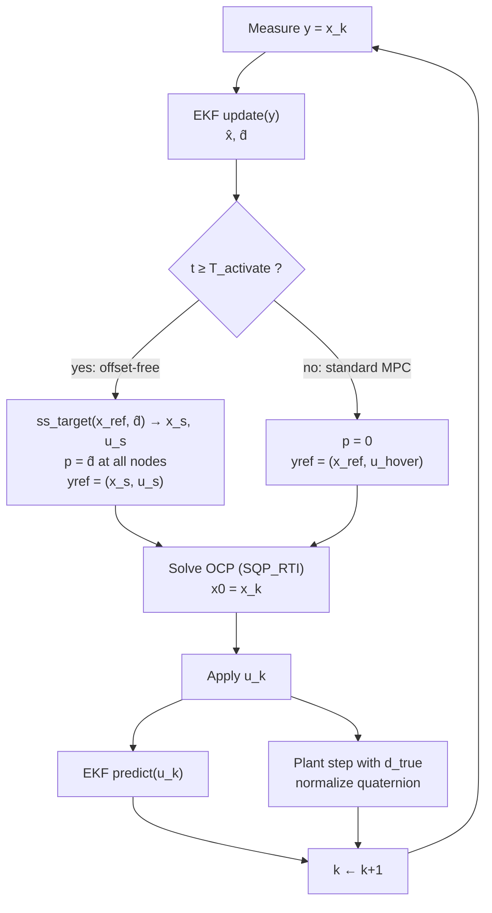
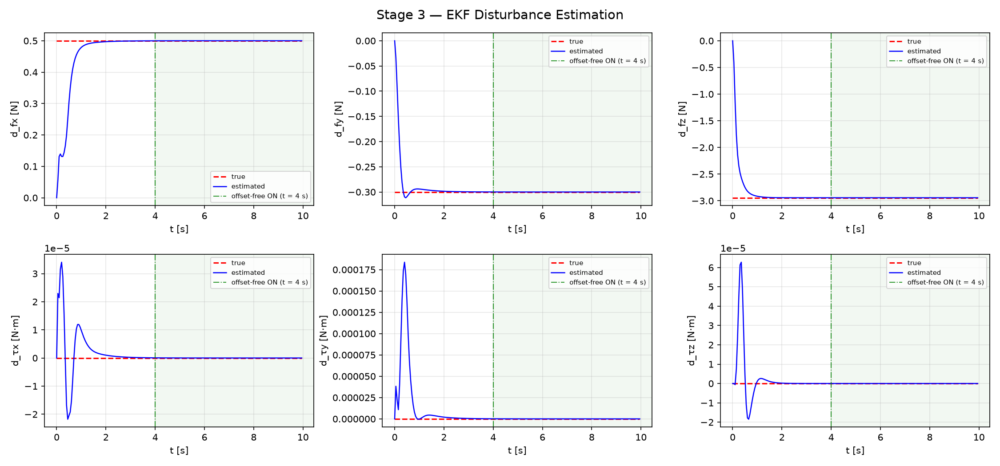
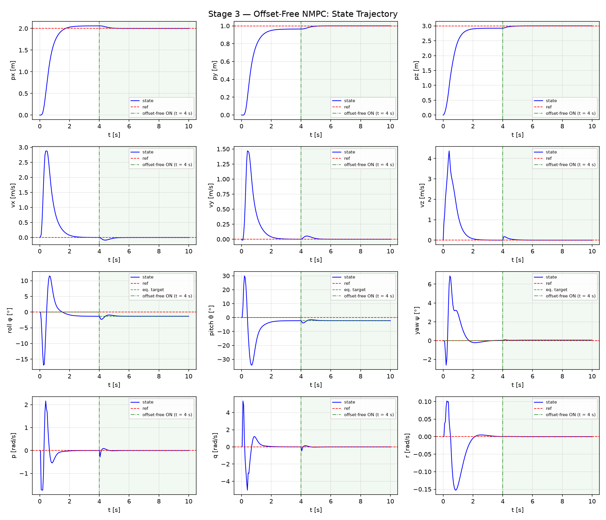
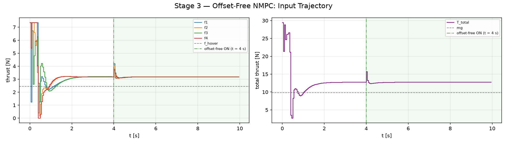
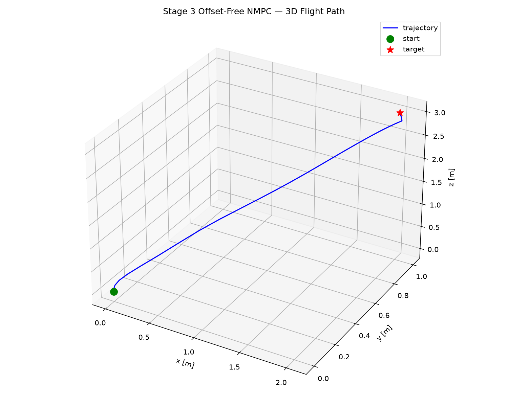

# Stage 3 — Offset-Free NMPC

| | |
|---|---|
| Git tag | `stage3` |
| Files | `ocp_config_offsetfree.py`, `ekf_aug.py`, `ss_target.py`, `simulate_offsetfree.py` (+ shared `quadrotor_3d_model.py`, `plot_utils.py`) |
| Method | disturbance-augmented prediction model + augmented EKF + analytical steady-state target calculator |
| Terminal cost | $W_e = P_{\text{lqr}}$ (DARE, unchanged from [Stage 2b](stage2_terminal_cost.md)) |
| Results | `results/stage3_offsetfree/` |

## 1. Motivation

Stages 1 and 2 assume the prediction model matches the plant exactly. Under that assumption
the reference is a true equilibrium and the controller converges to it. A real quadrotor
carries **persistent, unmodeled disturbances**: wind, a payload that changes the mass, a
center-of-gravity offset. NMPC has no integral action, so under such a disturbance it
settles at a *neighboring* equilibrium rather than the reference.

Near hover, approximate the NMPC law by a linear feedback $u = u_{\text{ref}} - K(x - x_{\text{ref}})$
acting on $\dot x = Ax + Bu + w$ with a constant disturbance $w$. Since
$(x_{\text{ref}}, u_{\text{ref}})$ is an equilibrium of the nominal model, the steady state satisfies

$$(A - BK)(x^* - x_{\text{ref}}) = -w \quad\Longrightarrow\quad x^* - x_{\text{ref}} = -(A - BK)^{-1} w,$$

which is nonzero for every $w \neq 0$. Stronger weights shrink the offset but never remove it.

For the quadrotor the offset has a specific structure:

- **Attitude and thrust are fixed by physics.** At any steady state $\dot v = 0$, so thrust and
  tilt must exactly cancel gravity and the force disturbance. The plant settles at that tilt
  regardless of what the controller "intends", because otherwise the velocity would drift.
- **Position absorbs the error.** The translational dynamics are a double integrator and impose
  nothing on *where* the drone hovers. The nominal NMPC still penalizes the required tilt and
  thrust as deviations from level hover, and the only thing that can balance that penalty in
  steady state is a position error. The offset therefore appears in **position**, at the size
  needed to make the feedback law produce the required tilt and thrust.

## 2. Formulation

The fix is the standard offset-free MPC architecture (Muske & Badgwell 2002; Pannocchia &
Rawlings 2003; Morari & Maeder 2012): model the disturbance, estimate it, and steer to the
equilibrium that is reachable under the estimate.

### 2.1 Disturbance-augmented model

A 6-dimensional constant disturbance, split by where it enters:

| Component | Unit | Frame | Physical source |
|---|---|---|---|
| $d_f = [d_{f_x}, d_{f_y}, d_{f_z}]$ | N | world | wind, mass error $\Delta m\, g$ |
| $d_\tau = [d_{\tau_x}, d_{\tau_y}, d_{\tau_z}]$ | N·m | body | CoG offset → parasitic torque |

$$\dot v = \frac{f_{\text{total}}}{m} R(q)_{:,2} - g\, e_z + \frac{d_f}{m}, \qquad
I \dot\omega = \tau(u) - \omega \times (I\omega) + d_\tau, \qquad \dot d = 0,$$

with $\dot p$ and $\dot q$ unchanged. One dynamics builder (`_build_f_expl`) produces three
variants, so all of them share exactly the same physics:

| Variant | Role of $d$ | Dimension | Used by |
|---|---|---|---|
| `create_model()` | $d = 0$ | $n_x = 13$ | Stages 1–2 |
| `create_disturbance_model()` / `create_disturbance_plant()` | runtime parameter `model.p` | $n_x = 13$, $p \in \mathbb{R}^6$ | MPC ($p = \hat d$) and plant ($p = d_{\text{true}}$) |
| `get_augmented_dynamics_casadi()` | extra states | $n_z = 19$ | EKF only |

The MPC never sees $d$ as a state: its dimension stays 13, and $\hat d$ is injected as a
parameter. Only the estimator works with the augmented state.

### 2.2 Augmented EKF

Augmented state $z = [x;\, d] \in \mathbb{R}^{19}$, measurement $y = Hz = x$ with
$H = [I_{13} \mid 0]$. In this stage the full state is measured, so only $d$ is actually
estimated.

**Predict** (continuous-discrete, with the applied input $u_k$):

$$\hat z_{k+1|k} = \mathrm{RK4}\bigl(f_{\text{aug}}, \hat z_{k|k}, u_k, T_s\bigr), \qquad
F_d \approx I + F_c T_s, \qquad P_{k+1|k} = F_d P_{k|k} F_d^\top + Q_{\text{aug}} T_s,$$

with $F_c = \partial f_{\text{aug}}/\partial z$ from CasADi and $Q_{\text{aug}} = \mathrm{blkdiag}(Q_x, Q_d)$.

**Update** (Joseph form):

$$S = HPH^\top + R, \qquad K = PH^\top S^{-1}, \qquad \hat z \leftarrow \hat z + K e, \qquad
P \leftarrow (I - KH) P (I - KH)^\top + KRK^\top,$$

with $e = y - H\hat z$. A sign-flip guard handles the quaternion double cover ($q$ and $-q$
are the same rotation).

**How $\hat d$ is learned although $d$ is not measured.** Split the gain into its state and
disturbance rows. The disturbance correction is

$$\Delta\hat d = K_d\, e = P_{dx}\, S^{-1} e,$$

which is nonzero only because of the cross-covariance $P_{dx}$. The prediction step creates
it: $F_c$ couples $d$ into $\dot x$ (e.g. $\partial \dot v / \partial d_f = I/m$), so uncertainty
in $d$ becomes predicted uncertainty in $x$. A *persistent* prediction error in $x$ is then
attributed to $d$ until $\hat d$ explains it. This is the integral action that standard NMPC
lacks. The augmented pair must be detectable for this to work; with $n_d = 6 \le n_y = 13$
and full-state measurement, it is.

**Tuning** (`get_default_ekf_tuning()`):

| Block | Values | Rationale |
|---|---|---|
| $Q_x$ | $10^{-3}$ (position, quaternion), $10^{-2}$ (velocity, rates) | model is accurate; prevents covariance collapse |
| $Q_d$ | $0.1$ (forces), $0.01$ (torques) | sets adaptation speed; larger → faster but noisier $\hat d$ |
| $R$ | $10^{-3}$ (position, quaternion), $10^{-2}$ (velocity, rates) | clean full-state measurement |
| $P_0$ | $0.01\, I$ (state), $1.0\, I$ (disturbance) | state known, disturbance unknown |

### 2.3 Steady-state target calculator

Injecting $\hat d$ into the prediction model is not enough on its own. The reference
$(x_{\text{ref}}, u_{\text{hover}})$ asks for level attitude *and* the target position, which
cannot both hold under a lateral force. The OCP would still trade position error against
tilt error, and an offset would remain. `ss_target.py` replaces the reference with the
equilibrium that is reachable under $\hat d$.

In general this is an optimization (minimize the distance to the desired output subject to
$f(x_s, u_s, \hat d) = 0$). For the quadrotor it has a closed-form solution, because at
$v = 0$, $\omega = 0$ all rate and gyroscopic terms vanish:

**(1) Force balance → thrust magnitude and direction.**

$$T_s\, z_b + d_f = m g\, e_3 \quad\Longrightarrow\quad
F_{\text{req}} = [-d_{f_x},\; -d_{f_y},\; mg - d_{f_z}]^\top, \quad
T_s = \|F_{\text{req}}\|, \quad z_b = F_{\text{req}} / T_s.$$

**(2) Attitude from $z_b$ and the reference yaw $\psi$.** $z_b$ fixes roll and pitch; $\psi$
fixes the remaining degree of freedom:

$$x_c = [\cos\psi,\; \sin\psi,\; 0], \quad
y_b = \frac{z_b \times x_c}{\|z_b \times x_c\|}, \quad
x_b = y_b \times z_b, \quad
R_s = [x_b \mid y_b \mid z_b],$$

converted to $q_s$ with Shepperd's method ($q_w > 0$ enforced). If $z_b$ is nearly
vertical, $y_b = [-\sin\psi, \cos\psi, 0]$ is used.

**(3) Torque balance → motor thrusts.** With $\omega = 0$: $\tau(u_s) = -d_\tau$, so

$$u_s = M^{-1} \bigl[T_s,\; -d_{\tau_x},\; -d_{\tau_y},\; -d_{\tau_z}\bigr]^\top, \qquad
M = \begin{bmatrix} 1 & 1 & 1 & 1 \\ 0 & -L & 0 & L \\ -L & 0 & L & 0 \\ -c_\tau & c_\tau & -c_\tau & c_\tau \end{bmatrix},$$

clipped to $[0, f_{\max}]$ with a warning if a limit is active.

**(4) Assemble.** Position is free at equilibrium, so $x_s = [p_{\text{ref}};\, 0;\, q_s;\, 0]$.

The OCP now has zero cost at a point the plant can actually hold, so no trade-off remains
and the offset is removed exactly (in the nominal-estimate limit $\hat d = d$).

### 2.4 OCP changes

The OCP structure is the one from Stage 2b. Two runtime updates are added every step:

| | Stage 2b | Stage 3 |
|---|---|---|
| Prediction model | nominal $f(x, u)$ | $f(x, u, p)$ with $p = \hat d$ at all nodes $0 \dots N$ |
| Reference | fixed $(x_{\text{ref}}, u_{\text{hover}})$ | $(x_s, u_s)$, recomputed from $\hat d$ every step |
| Terminal cost | $P_{\text{lqr}}$ | $P_{\text{lqr}}$ (unchanged, $d$ does not enter the DARE) |
| State dimension | 13 | 13 |

The terminal cost keeps its role (stabilizing the error dynamics around the equilibrium); the
offset is handled entirely through the prediction model and the moving reference. Because
$P_{\text{lqr}}$ is computed at level hover, it is evaluated at a slightly different operating
point when the equilibrium is tilted, which is negligible for tilts of a few degrees.

### 2.5 Closed loop

Per step $k$, in the order of `simulate_offsetfree.py`:

1. **Measure** $y = x_k$ (full state).
2. **EKF update**$(y)$ → $\hat x$, $\hat d$. Runs from $t = 0$, also while offset-free is off.
3. **Switch** at $T_{\text{activate}}$:
   - $t \ge T_{\text{activate}}$: $(x_s, u_s) =$ `compute_ss_target`$(x_{\text{ref}}, \hat d)$, $p = \hat d$, reference $(x_s, u_s)$ → **offset-free ON**.
   - $t < T_{\text{activate}}$: $p = 0$, reference $(x_{\text{ref}}, u_{\text{hover}})$ → **standard MPC** (Stage 2b baseline).
4. **Solve** the OCP (`SQP_RTI`) with $x_0 = x_k$ (the measured state; $\hat x$ is not needed
   under full measurement).
5. **Apply** $u_k$.
6. **EKF predict**$(u_k)$.
7. **Plant step** with the true disturbance (disturbance-parameterized `AcadosSimSolver`, ERK4),
   then quaternion normalization.



## 3. Implementation

| Item | Setting |
|---|---|
| Stage cost, $Q$, $R$, bounds | identical to Stages 1–2 |
| Terminal cost | $W_e = P_{\text{lqr}}$, reduced-order DARE |
| Parameters | `model.p` $= d \in \mathbb{R}^6$, default $0$ |
| Horizon, solver | $N = 20$, $T = 1$ s, $T_s = 0.05$ s, `SQP_RTI`, ERK4, Gauss-Newton, HPIPM |
| EKF | RK4 prediction, $F_d = I + F_c T_s$, Joseph update, tuning as in §2.2 |
| Target calculator | closed form, motor clipping with warning |
| Activation | $T_{\text{activate}} = 4$ s |

```bash
git checkout stage3
./run.sh simulate_offsetfree.py   # → results/stage3_offsetfree/
```

## 4. Scenario

Hover-to-hover step from the origin to $p_{\text{ref}} = (2,\, 1,\, 3)$ m, $T_{\text{sim}} = 10$ s.
A constant disturbance acts on the plant from $t = 0$:

| Quantity | Value |
|---|---|
| $d_{f_x}$ | $+0.5$ N (wind) |
| $d_{f_y}$ | $-0.3$ N (wind) |
| $d_{f_z}$ | $-3 \times 0.981 = -2.943$ N ($\approx 30\%$ mass error) |
| $d_\tau$ | $0$ |

The run is split into two phases. For $t < 4$ s, standard MPC flies the maneuver and shows the
offset, while the EKF already estimates $\hat d$ in the background. At $t = 4$ s offset-free
control is switched on. Because the disturbance is present from the start, the demonstration
isolates the *correction mechanism*; detection delay after a disturbance onset is not tested.

**Expected equilibrium** (§2.3 evaluated for this disturbance, $m = 1$ kg, $\psi = 0$):

| Quantity | Value |
|---|---|
| $F_{\text{req}}$ | $[-0.5,\; 0.3,\; 12.753]$ N |
| $T_s$ | $12.77$ N (vs. $mg = 9.81$ N) |
| $u_s$ | $3.19$ N per motor (vs. $f_{\text{hover}} = 2.45$ N) |
| pitch $\theta_s$ / roll $\phi_s$ | $-2.24°$ / $-1.35°$ (total tilt $2.62°$) |

## 5. Results

### 5.1 Disturbance estimation



Starting from $\hat d = 0$, the force estimates converge within about $1$–$1.5$ s:
$\hat d_{f_x}$ reaches $95\%$ of its true value after $1.0$ s, $\hat d_{f_z}$ converges in about
$1$ s, and $\hat d_{f_y}$ settles by about $1.5$ s after a small undershoot to $-0.31$ N. All of
this happens well before $T_{\text{activate}}$, so the activation transient at $t = 4$ s is
caused by the controller, not by the estimator. Over the last second of the run all six
estimation errors are zero to the printed precision ($< 5 \cdot 10^{-5}$ N and N·m).

The torque estimates show transients of order $10^{-5}$ to $10^{-4}$ N·m during the
aggressive first second, then decay to zero, which is correct since no torque disturbance
is injected. They appear while the force estimates are still wrong: the force error shows up
in the innovation, and part of it leaks into $\hat d_\tau$ through the cross-covariances
built up during the large attitude maneuver.

### 5.2 States



**Phase 1, standard MPC ($t < 4$ s).** The step is twice the size of Stage 1, so the transient
is more aggressive (pitch $+30° \to -34°$, $v_z$ up to $4.4$ m/s). The loop then settles at a
steady state that is not the reference:

| Position error | $\Delta p_x$ | $\Delta p_y$ | $\Delta p_z$ |
|---|---|---|---|
| standard MPC (mean over $t = 3$–$4$ s) | $+58.1$ mm | $-35.9$ mm | $-78.5$ mm |
| offset-free (mean over last 1 s) | $< 0.05$ mm | $< 0.05$ mm | $< 0.05$ mm |

Each offset points in the direction the disturbance pushes: downwind in $x$ and $y$, and
downward under the extra weight. Roll and pitch already sit at about $-1.3°$ and $-2.2°$,
which is the equilibrium tilt of §4, while the reference still asks for $0°$. This is exactly
the structure predicted in §1: physics forces the correct attitude, and the position error is
what the nominal controller needs to keep commanding it.

**Phase 2, offset-free ON ($t \ge 4$ s).** The attitude reference (green dashed, `eq. target`)
jumps to $(x_s, u_s)$ and $\hat d$ enters the prediction model. Position moves back onto the
reference within about $1$ s, with small velocity bumps ($|v| \lesssim 0.15$ m/s) and a short
attitude dip (pitch to about $-4°$) that provides the corrective acceleration. Afterwards
position, velocity and rates sit on their references, and roll/pitch sit exactly on the
equilibrium target.

### 5.3 Inputs



In phase 1 total thrust settles at about $12.8$ N, already close to $T_s$: the plant needs
that thrust to hover regardless of the reference. At activation, thrust briefly rises to
about $15.7$ N to lift the drone the missing $7.9$ cm, dips slightly, and settles at
$12.77$ N with all four motors at $3.19$ N, matching the analytical $T_s$ and $u_s$ of §4.
The motors stay equal because no torque disturbance is present.

### 5.4 Flight path



The path is again nearly straight. The short hook just below the target is phase 2: the drone
first stops at the offset point and then climbs and shifts onto the reference after
activation.

## 6. Takeaways

- **Under a constant disturbance, nominal NMPC has a steady-state offset, and the offset
  appears in position.** Attitude and thrust are forced to the physically required values;
  position is the free variable that absorbs the mismatch.
- **Estimating the disturbance is necessary but not sufficient.** The disturbance-augmented EKF
  supplies $\hat d$ through the cross-covariance, which acts as integral action. Only the
  target calculator, which replaces the unreachable reference with the reachable equilibrium,
  makes the offset exactly zero.
- **The structure keeps the OCP unchanged.** $d$ enters as a parameter, the state dimension
  stays 13, and the DARE terminal cost is reused.
- **Limitation.** This stage assumes the full state is measured, so the EKF only has to
  estimate $d$. A real drone does not measure velocity directly. Stage 4 removes that
  assumption, measures only $y = [p;\, q;\, \omega]$, and compares two estimators for the
  resulting harder problem → [Stage 4a — EKF](stage4a_ekf.md), [Stage 4b — MHE](stage4b_mhe.md).

## References

- K. R. Muske, T. A. Badgwell, "Disturbance modeling for offset-free linear model predictive control," *Journal of Process Control*, 2002.
- G. Pannocchia, J. B. Rawlings, "Disturbance models for offset-free model-predictive control," *AIChE Journal*, 2003.
- M. Morari, U. Maeder, "Nonlinear offset-free model predictive control," *Automatica*, 2012.
- J. B. Rawlings, D. Q. Mayne, M. M. Diehl, *Model Predictive Control: Theory, Computation, and Design*, 2nd ed., Nob Hill, 2017.
