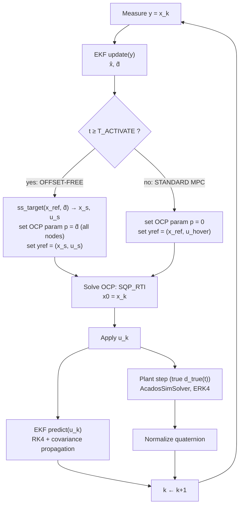

# Stage 3 — Offset-Free NMPC: Theory & Implementation

Stage 1 and Stage 2 assume the plant matches the prediction model exactly. Under that assumption, terminal-cost design (Stage 1) and terminal-cost + terminal-set design (Stage 2) are enough for stability. Stage 3 removes that assumption: the plant now carries a **constant, unmodeled disturbance** (wind, mass mismatch, CoG offset), and the question is how NMPC — which has no integral action by construction — is made to reject it exactly, not just approximately.

This document derives the three pieces that make up the fix (disturbance-augmented model, EKF, steady-state target calculator), lays out the exact per-step control-loop logic implemented in `simulate_offsetfree.py`, and cross-checks the analytical equilibrium against the closed-loop validation run in the main README.

---

## 1. Problem: Why Standard NMPC Has Offset

NMPC solves, at every step, an optimization over the **nominal** model `f(x, u)`. If the true plant is `f(x, u) + w` for some constant disturbance `w`, the controller has no way to represent `w` in its prediction — it only ever sees the effect of `w` through the measured state error at the current step. There is no state in the formulation whose job is "remember and cancel a persistent error," which is precisely the definition of integral action.

Linearize near the hover reference to make this concrete. Let the true (LTI) closed loop be

```
ẋ = A x + B u + w
u = −K (x − x_ref) + u_ref        (the NMPC horizon behaves like this LQR-type law
                                    near the reference, since the OCP cost is
                                    quadratic and SQP_RTI takes one Gauss-Newton
                                    step per sample)
```

At steady state (`ẋ = 0`), and using that `(x_ref, u_ref)` is itself an equilibrium of the *nominal* system (`A x_ref + B u_ref = 0`, true at level hover with `u_ref = f_hover`):

```
(A − BK)(x* − x_ref) = −w
        x* − x_ref   = −(A − BK)⁻¹ w
```

This is the textbook symptom noted going into this stage: **a residual offset proportional to the disturbance and inversely related to closed-loop gain — never zero for `w ≠ 0`.**

For this quadrotor, the offset shows up asymmetrically between position and attitude:

- **Translational dynamics are a pure double integrator** (`p̈ = f(attitude, thrust)/m + w_f`, no term restores `p` to any particular value). The only steady-state requirement is `v̇ = 0`, i.e. the *attitude and thrust* must supply exactly enough force to cancel gravity and `w_f` — this says nothing about *where* the position converges. Position offset is therefore driven entirely by how tightly the receding-horizon law's implicit feedback gain `K` couples position error to attitude command — it can be made small with aggressive `Q_pos` weighting, but never exactly zero for `w ≠ 0`.
- **Attitude has no such freedom.** Whatever tilt is needed to null `v̇` under `w_f` is exactly the tilt the closed loop must converge to, or velocity keeps drifting. This is why the residual offset in the Stage 3 validation run is far more visible in roll/pitch than in position — the controller was already forced very close to the correct tilt by physics; it just doesn't know it's the *correct* tilt versus a tracking error to fight.

## 2. Disturbance-Augmented Plant Model

The disturbance is modeled as a 6-dimensional constant bias, split by where it physically enters the dynamics:

```
d = [d_fx, d_fy, d_fz, d_tx, d_ty, d_tz]

d_fx, d_fy, d_fz   [N]     force disturbance, WORLD frame   (wind, Δm·g)
d_tx, d_ty, d_tz   [N·m]   torque disturbance, BODY frame   (CoG offset → parasitic torque)

ḋ = 0                       (constant-disturbance assumption)
```

Injected into the nominal 13-state dynamics:

```
v̇ = (f_total/m)·R(q)[:,2] − g·e_z + d_f / m          (translational, world frame)
q̇ = 0.5 · q ⊗ [0, p, q, r]                            (unaffected by disturbance)
I·ω̇ = τ(u) − ω × (I·ω) + d_τ                          (rotational, body frame)
```

The codebase reuses **one** dynamics builder (`_build_f_expl(s, d_fx=0, ..., d_tz=0)`, defaulting to zero) for three separate acados/CasADi objects, so all three variants are provably the same physics:

| Variant | Disturbance role | State dim | Used by |
|---|---|---|---|
| `create_model()` | `d = 0` (nominal) | `NX=13` | Stages 1–2 |
| `create_disturbance_model()` / `create_disturbance_plant()` | `d` = runtime parameter `model.p` | `NX=13`, `p ∈ R^6` | MPC solver (`p = d̂`) and plant simulator (`p = d_true`) |
| `get_augmented_dynamics_casadi()` | `d` = extra **states** | `NZ = NX+ND = 19` | EKF only |

This separation matters: the MPC and the plant both use the *same* 13-state model with `d` as an external parameter (so the state dimension the solver optimizes over never changes), while only the EKF needs `d` promoted to an estimated state, since that's the only place a disturbance *estimate* is produced.

## 3. State & Disturbance Estimation — Augmented EKF

**Augmented state:** `z = [x(13); d(6)] ∈ R¹⁹`. **Measurement model:** `y = H z = x`, with `H = [I₁₃ | 0₁₃ₓ₆]` — the project's measurement assumption is that `p, v, q, ω` are all directly observed (standing in for a fused IMU+GPS/VIO front end that Stage 3 doesn't model). Since `x` is fully measured, only `d` is genuinely being *estimated*.

**Predict** (continuous-discrete EKF, called once per step with the applied input):

```
ẑ(k+1|k) = RK4( f_aug(ẑ(k|k), u(k)), Ts )      ← nonlinear plant states integrated;
                                                    disturbance states pass through
                                                    unchanged since ḋ = 0

F_c = ∂f_aug/∂z |_(ẑ,u)                          ← 19×19 continuous Jacobian (CasADi AD)
F_d ≈ I + F_c · Ts                               ← first-order discretization

P(k+1|k) = F_d P(k|k) F_dᵀ + Q_aug · Ts
```

**Update** (called before the OCP is solved, using the new measurement):

```
e = y − H ẑ                                      ← innovation
                                                    (quaternion sign-flip guard: if
                                                     y_qw and ẑ_qw disagree in sign,
                                                     flip y's quaternion — same rotation,
                                                     avoids a spurious large innovation
                                                     from the q/−q double cover)

S = H P Hᵀ + R
K = P Hᵀ S⁻¹                                     ← 19×13 Kalman gain

ẑ ← ẑ + K e
P ← (I − KH) P (I − KH)ᵀ + K R Kᵀ                ← Joseph form (numerically stable)
```

**Why does `d̂` update at all, if `x` is fully measured?** The innovation `e` only ever multiplies rows 1–13 of `K` directly into the `x`-block of `ẑ`. The correction to `d̂` (rows 14–19 of `K`) exists only because of the **cross-covariance** `P_xd` built up during the predict step: the Jacobian `F_c` has nonzero entries coupling `d` into `ẋ` (e.g. `∂v̇/∂d_f = I/m`), so uncertainty in `d` shows up as *predicted* uncertainty in `x`. When the measurement then corrects `x` beyond what the model alone anticipated, the same Kalman gain — through `P_xd` — pulls `d̂` in the direction that would have explained that error. This is exactly the mechanism that gives an EKF (or any observer built this way) integral-action-like behavior: a persistent, systematic prediction error gets attributed to the disturbance state until it explains the error away.

**Default tuning** (from `get_default_ekf_tuning()`):

| Block | Values | Rationale |
|---|---|---|
| `Q_x` (state process noise) | small (`1e-3`–`1e-2`) | model is accurate; just prevents covariance collapse |
| `Q_d` (disturbance process noise) | `[0.1,0.1,0.1, 0.01,0.01,0.01]` | forces assumed to vary faster than torques in practice; larger `Q_d` → faster `d̂` adaptation but noisier estimate |
| `R` (measurement noise) | small, position/attitude tighter than velocity/rate | reflects the "clean full-state access" assumption for this stage |

## 4. Steady-State Target Calculator

**Why it's needed.** Without it, the MPC reference stays at `(x_ref, u_hover)` — position at the target, attitude level, thrust at hover. Under a lateral disturbance, *both cannot hold simultaneously*: staying level means drifting off position; holding position means tilting. Feeding the raw `d̂` into the prediction model alone doesn't resolve this tension — the OCP would still be penalizing deviation from an unreachable reference. `ss_target.py` computes the actual reachable equilibrium `(x_s, u_s)` under `d̂`, so the OCP's cost is zero at a point the plant can actually sit at.

**Derivation.** At equilibrium, `v = 0`, `ω = 0`, so all rate terms and gyroscopic couplings vanish, leaving a static force/torque balance:

**(1) Force balance (world frame) → thrust magnitude & direction.**

```
T_s · z_b + d_f = m g e₃
T_s · z_b = [0, 0, mg] − d_f  =:  F_req

T_s = ‖F_req‖                       (required total thrust)
z_b = F_req / T_s                   (required body z-axis, expressed in world frame)
```

**(2) Attitude from `z_b` + desired yaw.** `z_b` alone fixes two degrees of freedom of the rotation (which way "up" points in the body frame); yaw `ψ` (taken from the reference quaternion) fixes the third. A body frame consistent with both is built directly (Gram–Schmidt against a yaw-aligned candidate `x`-axis):

```
x_c = [cos ψ, sin ψ, 0]              (candidate x-axis in the xy-plane, at reference yaw)
y_b = (z_b × x_c) / ‖z_b × x_c‖      (falls back to [−sinψ, cosψ, 0] if z_b is
                                       nearly vertical, i.e. the cross product
                                       degenerates — any yaw-consistent y_b works then)
x_b = y_b × z_b                      (completes a right-handed, orthonormal frame)

R_s = [x_b | y_b | z_b]              (columns — body axes expressed in world frame)
q_s = rotmat_to_quat(R_s)            (Shepperd's method; qw > 0 hemisphere enforced)
```

**(3) Torque balance (body frame, `ω = 0` → no gyroscopic term) → motor mixer inversion.**

```
τ(u_s) + d_τ = 0   ⟹   τ(u_s) = −d_τ

    [T_s ]     [ 1    1    1    1 ] [f1]
    [−d_tx] =  [ 0   −L    0    L ] [f2]     =:  M · u_s
    [−d_ty]    [−L    0    L    0 ] [f3]
    [−d_tz]    [−c_τ  c_τ −c_τ  c_τ] [f4]

u_s = M⁻¹ [T_s, −d_tx, −d_ty, −d_tz]ᵀ,   then clipped to [0, f_max]
```

**(4) Assemble the equilibrium state.** Position is free at equilibrium (per §1, the translational dynamics impose no constraint on *where* — only on `v̇=0`), so the achievable position target is simply the reference position:

```
x_s = [ p_ref ;  0₃ ;  q_s ;  0₃ ]      u_s  as computed above
```

This is the whole reason offset-free tracking is exact rather than approximate here: the equilibrium the plant *can* reach is computed in closed form from `d̂`, rather than approached asymptotically by penalizing the gap to an unreachable point.

## 5. OCP Modification

Two runtime updates are made every control step, on top of the unchanged Stage 2 OCP structure:

```
for k in 0..N:  ocp_solver.set(k, 'p', d̂)                # disturbance parameter
                                                           # (same d̂ at every node —
                                                           #  ḋ=0 assumption)
for k in 0..N-1: ocp_solver.set(k, 'yref',   [x_s; u_s])  # stage reference
ocp_solver.set(N, 'yref_e', x_s)                          # terminal reference
```

The **terminal cost is untouched**: `W_e = P_lqr`, the same reduced-order DARE solution from Stage 2, computed once offline at the nominal hover linearization (`d` does not enter the DARE). This is a deliberate separation of concerns: the terminal cost's job is to certify stability of the *tracking error* dynamics near equilibrium; the *offset* is corrected entirely through the prediction model (`p = d̂`) and the moving reference (`x_s, u_s`) — not by re-deriving a disturbance-dependent terminal weight.

| Quantity | Stage 2 | Stage 3 |
|---|---|---|
| State dim | `NX = 13` | `NX = 13` (unchanged — `d` is a parameter, not a state) |
| Disturbance dim | — | `ND = 6` |
| EKF augmented dim | — | `NZ = NX + ND = 19` |
| `model.p` | none | `d ∈ R⁶`, set from `d̂` (MPC) or `d_true` (plant) |
| Reference | fixed `(x_ref, u_hover)` | moving `(x_s, u_s)`, recomputed from `d̂` every step |
| Terminal cost | `P_lqr` (DARE) | `P_lqr` (DARE) — identical |

## 6. Closed-Loop Implementation Logic

Per control step `k`, in the order `simulate_offsetfree.py` executes them:

1. **Measure** `y = x_k` (full-state feedback per the project's measurement assumption).
2. **EKF update(`y`)** — always runs, whether or not offset-free correction is active, so `d̂` is already converged by the time it's needed. → yields `x̂`, `d̂`.
3. **Activation switch.**
   - `t ≥ T_ACTIVATE`: compute `(x_s, u_s) = ss_target(x_ref, d̂)`; inject `d̂` as the OCP parameter at every node; set the reference to `(x_s, u_s)` — **offset-free ON**.
   - `t < T_ACTIVATE`: inject `d = 0`; keep the reference at `(x_ref, u_hover)` — **standard MPC**, the Stage 2 baseline, for direct comparison inside the same run.
4. **Solve the OCP** with `x0` fixed to the measured state (`lbx = ubx = x_k`), `SQP_RTI` (one Gauss-Newton/QP iteration per call — real-time iteration).
5. **Apply** `u_k` = the first control action from the solution.
6. **EKF predict(`u_k`)** — propagate `ẑ, P` forward using the *applied* input (must happen after the input is known, before the next update).
7. **Step the true plant** forward one sample with the *true* disturbance `d_true(t)` (unknown to the controller/EKF) via the disturbance-parameterized `AcadosSimSolver`; normalize the quaternion.



## 7. Validation Scenario & Cross-Check

`simulate_offsetfree.py` runs both regimes in one 10 s simulation, hovering at `x_ref = (2, 1, 3)` m:

| Quantity | Value |
|---|---|
| `d_fx` (wind, world x) | `0.5 N` |
| `d_fy` (wind, world y) | `−0.3 N` |
| `d_fz` (mass error, world z) | `−0.981 × 3 = −2.943 N` (≈30 % mass error) |
| `d_τ` (torque) | `0` (no CoG offset in this run) |
| `T_ACTIVATE` | `4.0 s` |
| Disturbance onset | `t = 0` (present throughout — isolates *estimation/activation*, not *detection*, delay) |

**Analytical equilibrium** (§4, evaluated at these numbers):

```
F_req = [−0.5, −(−0.3), 9.81 −(−2.943)] = [−0.5, 0.3, 12.753]        N
T_s   = ‖F_req‖ ≈ 12.77 N                     (vs. m g = 9.81 N)
z_b   = F_req / T_s ≈ [−0.0392, 0.0235, 0.9990]
tilt from vertical  = arcsin(‖[z_b_x, z_b_y]‖) ≈ 2.6°
  → splits, at ψ_ref = 0, into roughly pitch ≈ −2.2° to −2.6°, roll ≈ −1.3° to −1.5°
    (matches the previously logged run: θ_eq ≈ −2.65°)

no torque disturbance ⟹ τ(u_s) = 0 ⟹ uniform mixer split:
u_s = M⁻¹[T_s,0,0,0]ᵀ = (T_s/4)·[1,1,1,1] ≈ 3.19 N per motor   (vs. f_hover ≈ 2.45 N)
```

This matches the closed-loop result in `results/stage3_offsetfree/`:


`d̂` converges to `[0.5, −0.3, −2.943, 0, 0, 0]` within ~2 s — well before `T_ACTIVATE` — confirming that the *estimator* isn't the bottleneck on activation delay; only the *correction mechanism* is gated by `T_ACTIVATE` in this scenario. Torque-disturbance estimates show a transient (correlated with the aggressive early attitude maneuver, note the `1e-5` scale) and correctly decay to ~0.


After `t = 4 s`, total thrust settles at `≈12.8 N` and each motor at `≈3.19 N` — matching the analytical `T_s` and `u_s` above to within numerical tolerance.


Position is already close to `x_ref` under standard MPC (§1's `(A−BK)⁻¹w` offset is small here because position is weighted heavily, `Q_pos = diag(80,80,120)`, relative to attitude). The offset is unambiguous in roll/pitch: the state settles near the analytically-predicted tilt *before* `T_ACTIVATE` too (because that tilt is what physically nulls `v̇`, regardless of whether the controller "intends" it) — what changes at `t = 4 s` is that the reference itself moves onto the `eq. target` (green dashed) instead of remaining at level hover, so the small step seen at the activation boundary is the reference catching up to where the plant already needed to be, and velocity/angular rates settle exactly to zero afterward rather than hovering near it.

## 8. Looking Ahead — Stage 4

The measurement assumption fixed here (`p, q, ω` directly observed; only `v` and `d` estimated) is deliberately the same one Stage 4 will use to compare **DOB vs. EKF vs. MHE** as disturbance/state estimators under an identical scenario — this EKF is the first data point in that comparison, not a final choice. Keeping the measurement model, disturbance scenario, and (where applicable) OCP structure identical across estimators is what makes that later comparison free of confounding variables.

## 9. Key Takeaways

- A soft cost against an unreachable reference is not the same as tracking the reachable one — the target calculator, not the disturbance parameter alone, is what makes the offset *exactly* zero rather than merely smaller.
- Full state measurement does not make disturbance estimation redundant: the disturbance is not directly measured, and the EKF's cross-covariance is what lets a fully-measured state still carry information about an unmeasured one.
- Consistent with the maglev-project lesson carried into this one: an EKF (not a linearized KF) is used because the operating point shifts with the disturbance-dependent equilibrium, not just with the reference.
