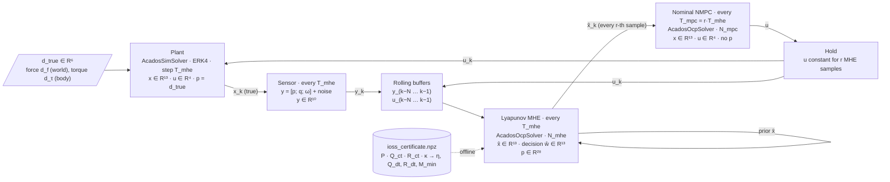

# Stage 4.2 — Lyapunov-based Moving Horizon Estimation for the 3D Quadrotor

This document describes the moving horizon estimator (MHE) used in Stage 4.2 of
`quadrotor_3d_nmpc`: the theory it is built on, the model it optimizes over, the
offline δ-IOSS certificate that supplies its weights, the online optimization
problem, and how it is wired into the closed loop with the NMPC.

| File | Role |
|---|---|
| `quadrotor_3d_model.py` | `create_mhe_model()` (ẋ = f_nom + w), `export_mhe_meas_model()`, quaternion helpers |
| `detectability_check.py` | Offline δ-IOSS LMI: computes and verifies (P, Q, R, η), writes the certificate |
| `ocp_config_mhe.py` | Certificate I/O, `export_drone_mhe_solver()` (acados OCP of the MHE) |
| `sensor_simulator.py` | Measurement y = [p; q; ω] + Gaussian noise |
| `simulate_mhe.py` | Closed loop: plant → sensor → MHE → nominal NMPC |

---

## 1. Lyapunov-based MHE with stability guarantees

Reference: J. D. Schiller, S. Muntwiler, J. Köhler, M. N. Zeilinger, M. A. Müller,
*A Lyapunov Function for Robust Stability of Moving Horizon Estimation*,
IEEE Transactions on Automatic Control 68(12), 7466–7481, 2023.
Preprint: [arXiv:2202.12744](https://arxiv.org/abs/2202.12744).
Equation numbers in this section refer to the paper.

This section presents the **general, discrete-time** formulation exactly as in the paper.
Sections 2 and 3 then apply it to the quadrotor in **continuous time**; §1.6 explains how the two connect.

### 1.1 Setting

The paper considers a discrete-time system with a *generalized* disturbance $w$
that covers both process disturbance and measurement noise:

$$
x_{t+1} = f(x_t, u_t, w_t), \qquad y_t = h(x_t, u_t, w_t). \tag{1}
$$

The input $u$ is known. Optional prior knowledge $(x,u,w,y)\in\mathbb X\times\mathbb U\times\mathbb W\times\mathbb Y$
describes the domain of real trajectories (not control constraints).

### 1.2 Detectability as an incremental Lyapunov function (δ-IOSS)

**Assumption 1 (exponential δ-IOSS).** There exist $W_\delta$, $P_1, P_2 \succ 0$, $Q, R \succeq 0$ and $\eta\in[0,1)$ with

$$
\Vert x-\tilde x\Vert _{P_1}^2 \le W_\delta(x,\tilde x) \le \Vert x-\tilde x\Vert _{P_2}^2, \tag{4a}
$$

$$
W_\delta\big(f(x,u,w), f(\tilde x,u,\tilde w)\big) \le \eta\, W_\delta(x,\tilde x) + \Vert w-\tilde w\Vert _Q^2 + \Vert y-\tilde y\Vert _R^2 . \tag{4b}
$$

Reading: two trajectories driven by the same input approach each other at rate $\eta$
*unless* their disturbances or their outputs differ. If two trajectories produce the same
outputs under the same disturbances, they must converge — this is detectability in incremental,
Lyapunov form. $Q$ and $R$ are the *supply rates* that quantify how much a disturbance
or output mismatch can "pay for" a growth of $W_\delta$.

### 1.3 MHE formulation (filtering prior, time-discounted cost)

At time $t$ with window $M_t=\min\{t,M\}$, the MHE optimizes the initial state of the window
and the disturbance sequence:

$$
V_\text{MHE} = 2\eta^{M_t}\,\Vert \hat x_{t-M_t|t} - \hat x_{t-M_t}\Vert _{P_2}^2
+ \sum_{j=1}^{M_t} \eta^{\,j-1}\Big( 2\Vert \hat w_{t-j|t}\Vert _Q^2 + \Vert \hat y_{t-j|t} - y_{t-j}\Vert _R^2 \Big) \tag{6}
$$

subject to the model $\hat x_{j+1|t} = f(\hat x_{j|t},u_j,\hat w_{j|t})$, $\hat y_{j|t} = h(\hat x_{j|t},u_j,\hat w_{j|t})$
and the domain sets (7b–7e). The estimate is the *end point* of the window,
$\hat x_t = \hat x^*_{t|t}$ (8).

Three features distinguish this from a hand-tuned MHE:

1. **The cost weights are the certificate.** $\eta$, $P_2$, $Q$, $R$ in (6) are the ones from Assumption 1.
2. **The prior is the filtering prior** $\hat x_{t-M_t}$: the MHE estimate that was produced $M_t$ steps ago
   (paper, footnote 3) — not a smoothed estimate from the previous window.
3. **Exponential discounting.** The newest residual is weighted by $\eta^0$, the oldest by $\eta^{M-1}$,
   the prior by $\eta^{M}$. The measurements used are $y_{t-M},\dots,y_{t-1}$; $\hat x_{t|t}$ is propagated
   one step past the last measurement.

### 1.4 Stability result

**Theorem 1 (M-step Lyapunov function).** Under Assumption 1,

$$
W_\delta(\hat x_t, x_t) \le 4\eta^{M_t}\lambda_{\max}(P_2,P_1)\, W_\delta(\hat x_{t-M_t}, x_{t-M_t})
+ 4\sum_{j=1}^{M_t}\eta^{\,j-1}\Vert w_{t-j}\Vert _Q^2 . \tag{14}
$$

If the horizon satisfies

$$
\rho^M := 4\,\eta^M \lambda_{\max}(P_2,P_1) < 1, \tag{16}
$$

then $W_\delta(\hat x_t, x_t)$ decreases over every $M$ steps up to a disturbance term, and
**Corollary 1** gives robust global exponential stability (RGES): the estimation error decays exponentially
from the initial error and is bounded by a discounted max over past true disturbances (18).

**Remark 3.** For a quadratic $W_\delta = \Vert x-\tilde x\Vert _P^2$ we have $P_1=P_2=P$, $\lambda_{\max}=1$, and (16) reduces to

$$
4\eta^M < 1 \quad\Longleftrightarrow\quad M \ge M_\text{min} = \left\lceil \frac{\ln 4}{-\ln\eta} \right\rceil .
$$

Proof idea (why the cost looks the way it does):

1. Apply (4b) $M$ times between the estimated trajectory and the true trajectory. The accumulated supply terms
   $\eta^{j-1}(\Vert \hat w - w\Vert _Q^2 + \Vert \hat y - y\Vert _R^2)$ appear.
2. Young's inequality $\Vert a-b\Vert ^2 \le 2\Vert a\Vert ^2+2\Vert b\Vert ^2$ splits them into terms of the MHE cost and terms of the
   true disturbance — this is where the factors **2** in (6) come from.
3. The true trajectory is a feasible candidate for the MHE, so $V^*_\text{MHE} \le V_\text{MHE}(\text{truth})$.
   Combining gives (14). The factor **4** in (16) is $2\times 2$ from these two Young steps.

**Remark 1 (scaling).** Assumption 1 is invariant to scaling of $W_\delta$; any positive definite weights work if
$\eta$ is close enough to 1. Choosing the prior weight equal to the Lyapunov matrix gives the best ratio
$\lambda_{\max}(P_2,P_1)=1$ and thus the shortest horizon.

### 1.5 Verifying δ-IOSS with LMIs (Corollary 3)

Let $h$ be affine in $(x,w)$ and $\mathbb X$, $\mathbb W$ **convex**. If there are $\eta\in[0,1)$, $P\succ 0$, $Q,R\succeq 0$ with

$$
\begin{pmatrix}
A^\top P A - \eta P - C^\top R C & A^\top P B - C^\top R D\\
B^\top P A - D^\top R C & B^\top P B - Q - D^\top R D
\end{pmatrix} \preceq 0 \tag{33}
$$

for all $(x,u,w)\in\mathbb X\times\mathbb U\times\mathbb W$, where $A,B,C,D$ are the Jacobians (27), then
$W_\delta = \Vert x-\tilde x\Vert _P^2$ satisfies Assumption 1. The proof integrates the differential dissipation
inequality along the straight line between $x$ and $\tilde x$; affinity of $h$ makes the output derivative
constant along that line, so the integral equals exactly $\Vert y-\tilde y\Vert _R^2$. Convexity is what keeps the
straight line inside the set where the LMI was imposed.

The paper's own quadrotor example (Sec. V-B) uses the same structure as this project: additive disturbances on
**every** state derivative, $T_s = 0.05$ s, pose measurements, gridding of the state domain; it reports
$\eta = 0.87$ and $M = 30$.

### 1.6 From the discrete-time theory to our continuous-time implementation

The paper is formulated for a discrete-time map $f$. In this project the model is written in **continuous time**,
and acados discretizes it internally:

| Paper (discrete time) | This project (continuous time) |
|---|---|
| $x_{t+1} = f(x_t,u_t,w_t)$ | $\dot x = f_c(x,u) + w$, implemented as `f_expl_expr` |
| $f$ given | $f = \Phi_{T_s}$: one ERK4 step of acados with $u$, $w$ held constant over $T_s$ |
| decay $\eta$ per step | decay rate $\kappa$ per second, $\eta = e^{-\kappa T_s}$ |
| supply rates $Q, R$ per step | CT supply rates $Q_{ct}, R_{ct}$; per step $Q_{dt}=T_sQ_{ct}$, $R_{dt}=T_sR_{ct}$ |
| LMI (33) on $A=\partial f/\partial x$ | CT-LMI on $A_c=\partial f_c/\partial x$ (§3.1) |

Two consequences:

- **One CT certificate serves every sample time.** $\kappa$, $P$, $Q_{ct}$, $R_{ct}$ do not depend on $T_s$; only the
  conversion to $(\eta, Q_{dt}, R_{dt})$ does. This matters because the MHE runs at a shorter sample time than the
  MPC (§5).
- **The conversion is first order in $T_s$.** It becomes more accurate as $T_s$ shrinks, which again favours a fast
  MHE. The remaining gap is listed as R3 in §6.

The horizon condition (16) counts **MHE steps**. With $\eta = e^{-\kappa T_{s}}$:

$$
4\eta^{M}<1 \iff M\,T_{s} > \frac{\ln 4}{\kappa}.
$$

The guarantee therefore requires a fixed **time window** $\ln 4/\kappa$, independent of the sample time. A shorter
$T_s$ means more nodes for the same window; the lever for a short horizon is a larger $\kappa$ in the LMI.

---

## 2. Project context and MHE dynamic model

### 2.1 Where Stage 4.2 sits

Stage 4 compares estimators under one fixed measurement assumption: position $p$, attitude $q$ and body rate
$\omega$ are measured (mocap-equivalent fused output); linear velocity $v$ and disturbances are not.

| | Stage 4.1 (EKF) | Stage 4.2 (this document) |
|---|---|---|
| Estimator state | $z=[x;d]\in\mathbb R^{19}$ | $x\in\mathbb R^{13}$ |
| Disturbance model | constant $d$, $\dot d = 0$ | none — absorbed in process noise $w$ |
| Controller | offset-free NMPC with $\hat d$ | nominal NMPC |
| Stability argument | — | Theorem 1 via δ-IOSS certificate |

### 2.2 Signals

| Symbol | Dim | Content | acados binding (MHE) |
|---|---|---|---|
| $x$ | 13 | $[p,\ v,\ q,\ \omega]$, $q$ scalar-first, body→world | `model.x` |
| $u$ | 4 | rotor thrusts $[f_1..f_4]$ — known, from the MPC | part of `model.p` |
| $w$ | 13 | process noise on every derivative $[w_p, w_v, w_q, w_\omega]$ | `model.u` (decision variable) |
| $y$ | 10 | $[p,\ q,\ \omega]$ | used in the cost only |

### 2.3 Continuous-time model

$$
\dot x = f_\text{nom}(x,u) + w, \qquad y = h(x) = Cx,\quad C = \text{selection of } (p,q,\omega)
$$

with the nominal dynamics shared by every model variant (`_build_f_expl`):

$$
\begin{aligned}
\dot p &= v\\
\dot v &= \tfrac{T}{m} R(q)e_3 - g e_3, \qquad T=\textstyle\sum_i f_i\\
\dot q &= \tfrac12\, q\otimes[0;\omega]\\
\dot\omega &= J^{-1}\big(\tau(u) - \omega\times J\omega\big),\quad
\tau = \big[L(f_4-f_2),\ L(f_3-f_1),\ c_\tau(-f_1+f_2-f_3+f_4)\big]
\end{aligned}
$$

Structural consequences used later: $B=\partial f/\partial w = I_{13}$, $C$ constant, $D=\partial h/\partial w = 0$.

### 2.4 acados role swap

In the MPC, `model.u` is the rotor thrust. In the MHE, `model.u` is the noise $w$ the optimizer chooses, and the
rotor thrust becomes a per-stage parameter. The OCP layer augments `model.p` to

```
p = [ eta_exp (1) | x_prior (13) | y_meas (10) | u_rotor (4) ]   → 28
```

so every shooting node carries its own measurement, its own applied thrust, and its own discount exponent.

### 2.5 Discretization

The model is handed to acados in continuous time only (`f_expl_expr` $= f_c + w$). acados discretizes it
internally: one ERK4 step per shooting interval, with $u_i$ and $w_i$ held constant over $[t_i, t_i+T_{mhe})$
(zero-order hold). The discrete model the MHE actually optimizes over is therefore
$x_{i+1} = \Phi_{T_{mhe}}(x_i, u_i, w_i)$ with $\Phi$ the RK4 map — this is the $f$ of the paper (§1.6).

The shooting interval is the **MHE** sample time $T_{mhe}$, which is chosen shorter than the MPC sample time
$T_{mpc}$ (§5).

### 2.6 What $w$ means for the true system

The plant is driven by a constant force/torque disturbance $d=[d_f; d_\tau]$. Seen through the MHE model, the
true trajectory is generated by

$$
w_\text{true} = \big[\,0_3;\ d_f/m;\ 0_4;\ J^{-1}d_\tau\,\big] \quad(\text{constant}).
$$

The MHE therefore does not *model* the disturbance — it has to pay for it through $\Vert \hat w\Vert _Q^2$ at every node.
Theorem 1 then guarantees a bounded, not a vanishing, estimation error (the $\Vert w\Vert _Q$ term in (14) never goes away).
An implicit disturbance estimate is still available: $m\cdot\text{mean}(\hat w_v)$ over the window should approach
$d_f$ — worth logging when comparing with the EKF.

---

## 3. δ-IOSS certificate for the quadrotor (`detectability_check.py`)

### 3.1 Continuous-time LMI

The project imposes a continuous-time counterpart of (33). With $\delta\dot x = A\delta x + B\delta w$,
$\delta y = C\delta x$ and $V = \delta x^\top P\delta x$, the requirement

$$
\dot V \le -\kappa V + \Vert \delta w\Vert _Q^2 + \Vert \delta y\Vert _R^2
$$

is equivalent to

$$
\begin{pmatrix}
PA + A^\top P + \kappa P - C^\top R C & PB\\
B^\top P & -Q
\end{pmatrix} \preceq 0 \qquad (26\times 26,\ B = I_{13}).
$$

This is the continuous-time counterpart of Corollary 3 (which the paper states in discrete time). It is imposed on
the same CT expression that acados receives, and it contains no sample time: $\kappa$, $P$, $Q_{ct}$, $R_{ct}$ are
properties of the CT model alone.

### 3.2 From continuous to per-sample quantities

Integrating over one sample with $w$ held constant:

$$
W(t+T_s) \le e^{-\kappa T_s}W(t) + \int_t^{t+T_s} e^{-\kappa(t+T_s-s)}\big(\Vert \Delta w\Vert _Q^2 + \Vert \Delta y(s)\Vert _R^2\big)\,ds .
$$

Here $T_s$ is the **MHE** sample time $T_{mhe}$. The current code specifies the per-step factor and derives the CT rate:

| Quantity | Value / rule |
|---|---|
| $\eta$ (per step, = MHE discount) | 0.97 |
| $T_s = T_{mhe}$ | 0.05 s — currently equal to $T_{mpc}$ = `T_horizon / N_mpc`; to be reduced (§5) |
| $\kappa = -\ln\eta/T_s$ | 0.609 s⁻¹ |
| $Q_{dt}$ | $T_s Q_{ct}$ |
| $R_{dt}$ | $T_s R_{ct}$ (first-order: $\int\Vert \Delta y\Vert ^2 \approx T_s\Vert \Delta y(t)\Vert ^2$) |
| $P$ | unchanged |

The $Q$ term is a valid upper bound (the exponential factor is ≤ 1). The $R$ term is a first-order
approximation, because the MHE only sees $y$ at sample instants; its error shrinks with $T_s$ — see review note R3.

**Planned change — $\kappa$ as the design input.** Because the LMI depends on $\kappa$ only, `detectability_check.py`
should take $\kappa$ as input and store the CT quantities $(P, Q_{ct}, R_{ct}, \kappa)$ plus the certified envelope.
`load_ioss_certificate(Ts)` then computes $\eta = e^{-\kappa T_s}$, $Q_{dt}=T_sQ_{ct}$, $R_{dt}=T_sR_{ct}$ and $M_\text{min}$
for whatever MHE sample time is used, instead of rejecting a mismatched $T_s$. Changing $T_{mhe}$ then needs no new
SDP solve.

### 3.3 Structure of the Jacobian — what must be gridded

| Block of $A=\partial f/\partial x$ | Depends on |
|---|---|
| $\partial\dot p/\partial v = I_3$ | constant |
| $\partial\dot v/\partial q = \tfrac{T}{m}\,\partial(R(q)e_3)/\partial q$ | $q$ (linear), $T$ (linear) |
| $\partial\dot q/\partial q = \tfrac12\Omega(\omega)$ | $\omega$ (linear) |
| $\partial\dot q/\partial \omega = \tfrac12\Xi(q)$ | $q$ (linear) |
| $\partial\dot\omega/\partial\omega$ (gyroscopic) | $\omega$ (linear) |

- $p$ and $v$ never appear in $A$ → not gridded.
- Torques are linear in $u$ and state-independent, so $u$ enters $A$ only through $T=\sum f_i$.
  The grid spans $T\in[0,\ 4\cdot 3f_\text{hover}] = [0, 29.43]$ N with $f_i = T/4$;
  `build_jacobians()` asserts this by comparing $A$ for equal and unequal splits of the same $T$.
- $A$ is **multi-affine** in the 8 scalars $(q_w,q_x,q_y,q_z,\omega_x,\omega_y,\omega_z,T)$: affine in each one
  when the others are fixed (checked symbolically — all second derivatives w.r.t. a single scalar vanish).
  This is relevant for review note R4.

Grid parameter vector: $\theta = (q,\ \omega_x,\ \omega_y,\ \omega_z,\ T)$ with $|\omega_i|\le 2$ rad/s.

### 3.4 The quaternion grid trick

Gridding $q_w,q_x,q_y,q_z$ as four independent axes has two problems: almost all samples are not unit
quaternions, and the grid grows with $n^4$. Instead the quaternion is **one** grid axis — an index into a table
of unit quaternions built from hyperspherical coordinates on $S^3$:

$$
q(\theta_1,\theta_2,\theta_3) =
\begin{bmatrix}
\cos\theta_1\\ \sin\theta_1\cos\theta_2\\ \sin\theta_1\sin\theta_2\cos\theta_3\\ \sin\theta_1\sin\theta_2\sin\theta_3
\end{bmatrix},\quad
\theta_1\in[0,\tfrac\pi2],\ \theta_2\in[0,\pi],\ \theta_3\in[0,2\pi).
$$

$\theta_1\le\pi/2$ restricts to the hemisphere $q_w\ge 0$; since the rotation angle is $2\theta_1\in[0,\pi]$, this still
covers every attitude in SO(3) once. Every sample has $\Vert q\Vert =1$ by construction. This is what the current
code does; §3.4.1 describes the planned replacement.

**Why the hemisphere is enough.** With $S=\operatorname{diag}(I_6,-I_4,I_3)$ one has
$A(-q) = S\,A(q)\,S$ (verified numerically). Since $B=I$ and $C S = S_y C$ with $S_y=\operatorname{diag}(I_3,-I_4,I_3)$,
the LMI at $-q$ with $(P,Q,R)$ is the LMI at $q$ with $(SPS,\ Q,\ S_yRS_y)$ — $Q$ and $R$ are diagonal, so only $P$
changes. If $P$ has non-zero coupling between the $q$-block and the other states, the certificate is valid on
$q_w\ge 0$ only. That is acceptable as long as truth, measurements, prior **and estimate** all stay in that hemisphere
(the plant's `normalize_quaternion` enforces $q_w>0$) — see R5 for the estimate.

#### 3.4.1 Planned: grid in Euler angles, convert to quaternions

The hyperspherical grid covers all of SO(3), including attitudes the drone never flies (upside down). The
certificate only has to hold where the closed loop operates, and a smaller domain allows a larger $\kappa$, hence a
shorter horizon. The envelope is easiest to state in Euler angles — the paper does the same with
$\vert\xi_i\vert\le\pi/6$:

1. Grid roll and pitch in $[-\phi_\text{max}, \phi_\text{max}]$ and yaw in $[-\pi,\pi)$.
2. Convert with the ZYX convention used by `quat_to_euler`: $q = q_z(\psi)\otimes q_y(\theta)\otimes q_x(\phi)$.
3. Flip the sign where $q_w<0$ (happens for $\vert\psi\vert$ near $\pi$), so all samples lie in the hemisphere of §3.4.
   Gimbal lock is not an issue in this direction: Euler → quaternion is defined everywhere.
4. Use the same envelope in `verify()`, and store $\phi_\text{max}$ in the certificate.

Points to keep in mind:

- **Yaw still has to be gridded** with the current unstructured $P$: once the drone is tilted, $R(q)e_3$ and hence
  $\partial\dot v/\partial q$ change with yaw. The dynamics are yaw-equivariant, $A(q_\psi) = T_\psi A(q) T_\psi^{-1}$ with
  $T_\psi = \operatorname{diag}(R_z, R_z, L(q_z(\psi)), I_3)$ (verified numerically). Constraining $P$ and $R$ to be
  invariant under $T_\psi$ would make a roll/pitch-only grid sufficient — an optional refinement.
- **The envelope becomes an assumption of the guarantee.** The closed-loop simulation should log
  $\max\vert\phi\vert$, $\max\vert\theta\vert$, $\max\vert\omega_i\vert$ and $\max T$ and check them against the certificate.
- **This does not resolve R4 by itself.** Euler samples are still unit quaternions. Combined fix: take the
  componentwise bounds of $q$ over the Euler envelope as a box and use the vertex check of R4.

### 3.5 SDP (semidefinite program)

The LMI problem is solved as a **semidefinite program (SDP)**: a convex optimization problem with a linear objective
and constraints of the form "a symmetric matrix that depends affinely on the decision variables is positive (or
negative) semidefinite". Each such constraint is an LMI; an SDP is an optimization over a set of LMIs. SDPs are solved
to global optimality by interior-point methods (MOSEK, CLARABEL) or first-order methods (SCS).

For a fixed grid point the CT-LMI is affine in $(P, Q, R)$ — but only because $\kappa$ is fixed: the term $\kappa P$
is bilinear if both are free. To find the fastest certifiable decay (shortest horizon), bisect on $\kappa$ and solve
one SDP per candidate.

| Item | Choice |
|---|---|
| Decision variables | $P = P^\top\in\mathbb R^{13\times 13}$, $Q=\operatorname{diag}(q)\in\mathbb R^{13\times 13}$, $R=\operatorname{diag}(r)\in\mathbb R^{10\times 10}$ |
| Constraints | $P\succeq 10^{-2}I$ (fixes the scale, Remark 1), $q_i, r_i\ge 10^{-4}$, CT-LMI $\preceq -\varepsilon I$ at every grid point |
| Objective | $\min\ \operatorname{tr}Q + \operatorname{tr}R$ (smallest supply rates → tightest detectability statement) |
| Grid in the solve | 6 quaternions (random from a pool of $20^3$) × $4^3$ rates × 3 thrusts = 1152 LMIs |
| Solvers | MOSEK → CLARABEL → SCS (first that reaches `optimal`) |

### 3.6 A-posteriori verification

Gridding only proves the LMI at the grid points. `verify()` draws fresh samples — 10 runs, each with 6 new
quaternions and 6 random values per rate axis and for $T$ ($6\cdot 6^4 = 7776$ points per run, 77 760 in total) — and
checks $\lambda_{\max}(\text{LMI})\le 0$. Only a certificate without violations is written to
`data/ioss_certificate.npz`:

```
P, Q_dt, R_dt, eta, M_min          → used by the MHE
Q_ct, R_ct, kappa, Ts, omega_max, T_total_max, max_eig   → provenance
```

`load_ioss_certificate(Ts=...)` refuses a certificate computed for a different sample time and checks the matrix
shapes against `NX, NW, NY`.

### 3.7 Horizon bound

With $P_1=P_2=P$ (Remark 3) and $\eta=e^{-\kappa T_{mhe}}$:

$$
M_\text{min} = \left\lceil \frac{\ln 4}{\kappa\, T_{mhe}}\right\rceil ,
\qquad\text{time window } M_\text{min}T_{mhe} \approx \frac{\ln 4}{\kappa}.
$$

| $\kappa$ [s⁻¹] | window $\ln 4/\kappa$ | $M_\text{min}$ at $T_{mhe}=0.05$ s | at 0.025 s | at 0.01 s |
|---|---|---|---|---|
| 0.609 (current, $\eta=0.97$ at 0.05 s) | 2.28 s | 46 | 92 | 228 |
| 1.4 | 0.99 s | 20 | 40 | 100 |

**Horizon policy.** `N_mhe = 20` is used for the preliminary tests. The final horizon is chosen as
$N_{mhe}\ge M_\text{min}$ for the final $(\kappa, T_{mhe})$. Since a faster MHE multiplies the number of nodes for
the same guarantee, the practical route to a tractable horizon is a larger certified $\kappa$ (smaller envelope,
§3.4.1; bisection, §3.5).

---

## 4. Lyapunov MHE for the quadrotor (`ocp_config_mhe.py`)

### 4.1 Window and indexing

Here $k$ counts **MHE samples** ($t = kT_{mhe}$) and $N = N_{mhe}$. At time $k\ge N$ the OCP has $N$ shooting
intervals of length $T_{mhe}$ and nodes $0..N$:

| Node $i$ | Time | Measurement | Thrust | Discount exponent | Cost |
|---|---|---|---|---|---|
| 0 | $k-N$ | $y_{k-N}$ | $u_{k-N}$ | $N-1$ | arrival + noise + measurement |
| $i$ | $k-N+i$ | $y_{k-N+i}$ | $u_{k-N+i}$ | $N-1-i$ | noise + measurement |
| $N-1$ | $k-1$ | $y_{k-1}$ | $u_{k-1}$ | $0$ | noise + measurement |
| $N$ | $k$ | — | — | (unused) | none — estimate $\hat x_k$ |

This is exactly the index map of (6) with $j = N-i$: node 0 ↔ $j=N$ (weight $\eta^{N-1}$), node $N-1$ ↔ $j=1$ (weight $\eta^0$).

### 4.2 Cost function

$$
V = \underbrace{2\eta^{N}\, e_x^\top P\, e_x}_{\text{arrival, node 0}}
+ \sum_{i=0}^{N-1}\eta^{\,N-1-i}\Big(2\,\hat w_i^\top Q_{dt}\,\hat w_i + e_{y,i}^\top R_{dt}\, e_{y,i}\Big)
+ \sum_{i=0}^{N-1} 10^4 s_i^2
$$

Implemented as `EXTERNAL` cost: `cost_expr_ext_cost_0` (arrival + stage) and `cost_expr_ext_cost` (stage).
$\eta$ and $N$ are compile-time constants; `eta_exp` is a parameter so the same generated code serves every node.

State error $e_x(\hat x_0, \bar x)$ and measurement error $e_{y,i}(h(\hat x_i), y_i)$ are componentwise differences for
$p, v, \omega$, and the quaternion error of §4.3 for the attitude.

### 4.3 Quaternion error

For unit $q$ and reference $q_r$ (prior or measurement):

$$
q_\text{err} = q\otimes q_r^{-1},\qquad e_q = |q_\text{err}| - [1,0,0,0]^\top \quad(\text{elementwise } |\cdot|).
$$

- Aligned attitudes give $q_\text{err}=\pm[1,0,0,0]$ (double cover); the absolute value makes $e_q=0$ for both signs.
- For a small rotation $\delta\theta$: $q_\text{err}\approx\pm[1,\ \delta\theta/2]$, so $\Vert e_q\Vert ^2\approx\Vert \delta\theta\Vert ^2/4$.
- `quat_error_casadi` uses the conjugate as inverse, which requires unit quaternions — one reason for §4.4.

### 4.4 Soft unit-norm constraint

The noise channels $\hat w_q$ can move $\hat q$ off $S^3$ at every step. A nonlinear constraint
$h(x) = \Vert q\Vert ^2$ with $l_h = u_h = 1$ is imposed at nodes $0..N-1$ (`con_h_expr_0`, `con_h_expr`) and softened with a
slack: quadratic penalty $Z_l=Z_u=10^4$, linear penalty $z_l=z_u=0$ (an L2 penalty, not exact). Soft rather than hard,
because a hard equality with an exact Hessian and a non-smooth cost is prone to infeasible QPs, and the measurement
term already pins $\hat q$ close to the unit sphere.

### 4.5 Solver settings

| Option | Value |
|---|---|
| NLP | `SQP`, max 200 iterations, tol $10^{-10}$ |
| QP | `PARTIAL_CONDENSING_HPIPM`, qp_tol $10^{-10}$ |
| Hessian | `EXACT` |
| Integrator | `ERK` (RK4), $t_f = N_{mhe} T_{mhe}$ |

### 4.6 Outer loop (`simulate_mhe.py`)

Current implementation (single rate, $T_{mhe}=T_{mpc}$):

```
for k = 0 .. n_sim-1:
    y_k = sensor(x_k)
    if k < N:                       # warm-up, buffers not full
        x̂_k = [p_meas, 0, q_meas, ω_meas]
    else:
        if k == N: x̄ = direct_projection(y_0)
        set node i = 0..N-1:  p = [N-1-i, x̄, y_{k-N+i}, u_{k-N+i}]
        set node N:           p = [N,     x̄, 0,         0        ]
        solve;  x̂_k = x̂_N ;  x̄ ← x̂_1          # prior for the next window (see R2)
    u_k = MPC(x̂_k)
    x_{k+1} = plant(x_k, u_k, d_true)
    roll buffers: append y_k, u_k
```

Target implementation (multi-rate, §5): $T_{mpc} = r\,T_{mhe}$ with integer $r\ge 2$.

```
for k = 0 .. n_sim-1:                     # k counts MHE samples
    y_k = sensor(x_k)
    x̂_k = MHE(...)  or warm-up projection
    if k % r == 0:                        # MPC runs every r-th MHE sample
        u_hold = MPC(x̂_k)
    u_k = u_hold                          # zero-order hold between MPC updates
    x_{k+1} = plant(x_k, u_k, d_true)     # plant integrates over T_mhe
    roll buffers: append y_k, u_k         # u buffer at MHE rate: each u repeated r times
```

---

## 5. Closed-loop architecture: NMPC + MHE

**Multi-rate design.** The MHE runs faster than the MPC: $T_{mhe} = T_{mpc}/r$ with integer $r\ge 2$
($T_{mpc} = 0.05$ s). Reasons:

- The estimate handed to the MPC is based on more and fresher measurements, and the one-sample lag of the
  prediction form (R10) shrinks to $T_{mhe}$.
- The CT → per-sample conversion (§3.2) is more accurate at a shorter sample time.
- Sensors (mocap, IMU) naturally deliver at a higher rate than the control update.

Cost: for the same guarantee the horizon in nodes grows as $1/T_{mhe}$ (§3.7), and one MHE solve must now fit into
$T_{mhe}$ rather than $T_{mpc}$. An integer $r$ keeps the MPC input piecewise constant on the MHE grid, so the thrust
buffer is exact.



### 5.1 Signals per block

| Block | State | Input | Parameter | Disturbance |
|---|---|---|---|---|
| Plant | true $x\in\mathbb R^{13}$ | $u_k\in\mathbb R^4$ | $d_\text{true}\in\mathbb R^6$ | acts physically: $d_f$ on $\dot v$ (world), $d_\tau$ on $\dot\omega$ (body) |
| Sensor | — | $x_k$ | $\sigma_p=0.01$ m, $\sigma_q=0.001$, $\sigma_\omega=0.005$ rad/s | measurement noise |
| MHE ($T_{mhe}$) | $\hat x_0..\hat x_N\in\mathbb R^{13}$ | decision $\hat w_i\in\mathbb R^{13}$ | $[\eta_\text{exp}, \bar x, y_i, u_i]\in\mathbb R^{28}$ | not modeled — absorbed into $\hat w$ |
| MPC ($T_{mpc}$) | $x\in\mathbb R^{13}$, $x_0=\hat x_k$ | $u\in\mathbb R^4$, $0\le f_i\le 3f_\text{hover}$ | none | not modeled (nominal) |

### 5.2 What each block knows

| | $p$ | $v$ | $q$ | $\omega$ | $d$ |
|---|---|---|---|---|---|
| Sensor output | measured | — | measured | measured | — |
| MHE output | smoothed/predicted | **reconstructed** | smoothed/predicted | smoothed/predicted | implicitly in $\hat w_v, \hat w_\omega$ |
| MPC uses | $\hat p$ | $\hat v$ | $\hat q$ | $\hat\omega$ | nothing |

### 5.3 One MHE sample, in order

| Step | Action |
|---|---|
| 1 | Sensor samples $y_k$ from the true $x_k$ |
| 2 | MHE solves on $\{y,u\}_{k-N}^{k-1}$ and the prior, returns $\hat x_k$ (node $N$) |
| 3 | Only if $k \bmod r = 0$: MPC fixes $x_0=\hat x_k$, solves, updates the held input |
| 4 | Plant integrates $x_k\to x_{k+1}$ over $T_{mhe}$ with the held $u_k$ and $d_\text{true}$ |
| 5 | $y_k$ and $u_k$ enter the buffers — used from $k+1$ on |

### 5.4 Scenario and expected behaviour

Constant disturbance from $t=0$: $d_{fx}=+0.5$ N, $d_{fy}=-0.3$ N, $d_{fz}=-2.943$ N (30 % mass error);
reference $p_\text{ref}=[2,1,3]$ m, level hover. Because the MPC is nominal and the MHE carries no disturbance state,
a steady-state position offset is expected. The comparison with Stage 4.1 isolates the value of augmenting the
estimator state with $d$.

---

## 6. Review notes (to be checked against the code)

Found while writing this document. Priority: **H** = the Theorem 1 guarantee does not apply as implemented,
**M** = correctness/robustness, **L** = hygiene.

| # | Pri | Issue | Where | Suggested fix |
|---|---|---|---|---|
| R1 | H (final) | `N_mhe = 20` is a deliberate preliminary setting; with $\kappa = 0.609$ s⁻¹ the bound requires 46 nodes at 0.05 s and more at a shorter $T_{mhe}$. The guarantee holds only once $N_{mhe}\ge M_\text{min}$. | `simulate_mhe.__main__` | Final: compute $M_\text{min}$ from the final $(\kappa, T_{mhe})$ (§3.7) and set $N_{mhe}\ge M_\text{min}$; keep the runtime warning. Raise $\kappa$ (envelope §3.4.1, bisection §3.5) if the node count gets too large. |
| R2 | H | Prior is the smoothed node-1 estimate $\hat x_{k-N+1\mid k}$. The paper's result uses the filtering prior $\hat x_{k-N}$ (the estimate delivered $N$ steps earlier). | `solve_mhe_step`, `simulate` | Use `x_prior = X_hat[k - N_mhe]`; during warm-up that entry is the direct projection, so the first solve is unchanged. |
| R3 | M | The CT design is intended (§1.6), but the CT → per-sample conversion is first order: $\int\Vert \Delta y\Vert ^2 \approx T_s\Vert \Delta y_k\Vert ^2$ is not a bound. The error shrinks with $T_{mhe}$. | `detectability_check` | Keep the CT-LMI as the design step; add an a-posteriori check of the **DT** LMI (33) with $A_d=\partial\Phi_{RK4}/\partial x$, $B_d=\partial\Phi_{RK4}/\partial w$ (CasADi), using the stored $P, Q_{dt}, R_{dt}, \eta$. Note $A_d$ depends on all four thrusts, not only $T$. |
| R4 | H | Corollary 3 needs the LMI on a **convex** set. The grid covers only $\Vert q\Vert =1$; the straight line between two attitudes passes through $\Vert q\Vert <1$. Random verification is also not a proof. | `quat_grid_hypersp`, `verify` | The planned Euler grid (§3.4.1) still samples unit quaternions only. Impose the LMI on a box in $q$ — e.g. the componentwise bounds of $q$ over the Euler envelope (e.g. $q_w\in[0,1]$, $q_{x,y,z}\in[-1,1]$) and exploit multi-affinity: the LMI holds on the whole box iff it holds at its $2^8 = 256$ vertices in $(q,\omega,T)$. More conservative, but rigorous. |
| R5 | H | Metric mismatch: the certificate is for $\Vert x-\tilde x\Vert _P^2$ with a **Euclidean** $\delta q$; the MHE cost uses the multiplicative error $\lvert q\otimes q_r^{-1}\rvert-[1,0,0,0]$. The absolute value also lets $\hat q$ jump to the $q_w<0$ hemisphere at zero cost, where the certificate may not hold (§3.4). With a full $P$, cross terms $\lvert e_{q,x}\rvert\cdot e_{p}$ make the arrival cost non-smooth exactly at the optimum. | `export_drone_mhe_solver` | Option A (consistent with the theory): plain difference $q-q_r$, after aligning the signs of $y_q$ and $\bar q$ to the current estimate in NumPy before `set()`. Option B (keep multiplicative): $e_q=[\,\lvert q_{e,w}\rvert-1;\ \operatorname{sign}(q_{e,w})\,q_{e,\text{vec}}\,]$, smooth near alignment — but still a different metric than $P$. |
| R6 | M | Node $N$ — the node whose state is used — has no norm constraint, and $\hat x_k$ is passed to the MPC unnormalized. | `export_drone_mhe_solver`, `simulate` | Add `con_h_expr_e` with slack, and/or `normalize_quaternion(x_hat)` before the MPC. |
| R7 | M | First solve starts from the acados default (zeros): $q=0$ makes $\nabla\Vert q\Vert ^2=0$ and the quaternion error degenerate. Later solves warm-start from the unshifted previous solution. | `simulate` | Initialize all nodes from direct projections of the buffer ($v$ from finite differences of $p$), $w=0$; then shift the trajectory by one node each step. |
| R8 | M | Exact Hessian of a non-convex external cost without regularization can give indefinite QPs; tol $10^{-10}$ / 200 SQP iterations is heavy for the Stage-4 compute-time comparison. | solver options | `regularize_method = 'PROJECT'` (or `'MIRROR'`); tol $\sim10^{-6}$; later consider `SQP_RTI` for timing. |
| R9 | L | Recent acados versions scale stage costs by the time step (`cost_scaling`). All cost terms live in stages $0..N-1$, so the minimizer is unchanged, but the reported cost is $T_s\cdot V$ — matters if the value function is later used as an error indicator (Prop. 1). | solver options | `ocp.solver_options.cost_scaling = np.ones(N+1)` (check your acados version). |
| R10 | L | $y_k$ is available but first used at $k+1$ (prediction form, as in the paper) → one-sample lag in $\hat p,\hat q,\hat\omega$. | loop order | Keep for theory consistency; document it in the Stage 4 comparison. |
| R11 | L | MPC, MHE and plant generate code into the same default directory. | solver creation | Separate `code_export_directory` per solver. |
| R12 | M | Multi-rate loop not implemented: `simulate` uses one `Ts = T_horizon / N_mpc` for plant, sensor, MHE and MPC. | `simulate`, `detectability_check`, `ocp_config_mhe` | Introduce `T_mhe = T_mpc / r`; plant and sensor at $T_{mhe}$; MPC every $r$ samples with held input; certificate converted for $T_{mhe}$ (§3.2 planned change). |
