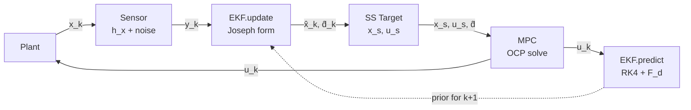

# Stage 4 — State Estimator Comparison for Offset-Free NMPC

**Purpose.** Stage 3 assumed the full 13-state plant was directly measured, so the estimator only had to infer the 6-dim disturbance. Stage 4 drops that assumption: only $y = [p; q; \omega] \in \mathbb{R}^{10}$ is measured, and the estimator must recover both the unmeasured velocity $v$ and the disturbance $d$. This is a realistic partial-measurement setup where the closed-loop performance depends on the estimator's design choices — making it the natural setting to compare two estimator families (**EKF** implemented here; **MHE** to follow) under identical measurement and disturbance conditions.

**Scope.** Sensor *noise* is treated here (it is a statistical property that estimators exist to reject). Sensor *fusion* — raw IMU + GPS + VIO with different sample rates, biases, and latencies — is a separate engineering problem deferred to a future ROS project. The measurement $y = [p; q; \omega]$ represents the fused output of an idealized outer pose source (mocap-equivalent).

---

## 1. Measurement Model

The augmented state carried by the estimator is

$$z = \begin{bmatrix} x \\ d \end{bmatrix} \in \mathbb{R}^{19}, \qquad x \in \mathbb{R}^{13},\ d \in \mathbb{R}^6$$

with dynamics $\dot z = f_{\text{aug}}(z, u)$ where the disturbance channel is modeled as constant, $\dot d = 0$ (standard offset-free assumption, carried over from Stage 3).

The measurement is a **linear selection** of 10 components from $z$:

$$y = h(z) = \begin{bmatrix} p \\ q \\ \omega \end{bmatrix} = H z, \qquad H \in \mathbb{R}^{10 \times 19}$$

with

$$H = \begin{bmatrix} I_3 & 0 & 0 & 0 & 0 \\ 0 & 0 & I_4 & 0 & 0 \\ 0 & 0 & 0 & I_3 & 0 \end{bmatrix}$$

Because $h$ is linear, the measurement Jacobian $H$ is a **constant matrix**, independent of $z$. The EKF's measurement update requires no linearization step — the same $H$ is reused every timestep. This is a structural simplification specific to Stage 4's measurement assumption.

---

## 2. Observability at Hover

Detectability is a *necessary* condition for the estimator to work (EKF's covariance updates converge, MHE is well-posed). We verify the stronger property, observability, at the hover linearization.

Linearize the augmented dynamics at $(z_{\text{hover}}, u_{\text{hover}})$:

$$F = \left.\frac{\partial f_{\text{aug}}}{\partial z}\right|_{z_{\text{hover}}, u_{\text{hover}}} \in \mathbb{R}^{19 \times 19}$$

The Kalman observability matrix is

$$\mathcal{O} = \begin{bmatrix} H \\ H F \\ H F^2 \\ \vdots \\ H F^{18} \end{bmatrix} \in \mathbb{R}^{190 \times 19}$$

$(F, H)$ is observable ⟺ $\text{rank}(\mathcal{O}) = 19$. This is checked numerically via SVD in `observability_check.py`.

**Observability chains for our system:**

| Unmeasured state | Chain to measurement | Steps |
|---|---|---|
| Velocity $v$ | $v \to \dot p \to p$ (measured) | 1 |
| Torque disturbance $d_\tau$ | $d_\tau \to \dot\omega \to \omega$ (measured) | 1 |
| Force disturbance $d_f$ | $d_f \to \dot v \to v \to \dot p \to p$ (measured) | 2 |

**Numerical result** at hover: $\text{rank}(\mathcal{O}) = 19$ (full observability). The two smallest singular values ($\sigma_{17}, \sigma_{18} \approx 5.1 \times 10^{-2}$) come as a pair — the fingerprint of the horizontal force-disturbance chains $d_{fx} \to v_x \to p_x$ and $d_{fy} \to v_y \to p_y$, which are the weakest observability modes in the system. Condition number $\kappa(\mathcal{O}) \approx 2 \times 10^4$.

This tells us that under noisy measurements, $d_{fx}$ and $d_{fy}$ will be the slowest-converging estimates. With mocap-equivalent Gaussian noise on every channel (Stage 4a baseline), this weakness shows up directly as elevated steady-state jitter on the horizontal force estimates — the empirical signature that will drive estimator differentiation in Stage 4b.

---

## 3. Extended Kalman Filter

The EKF is the standard workhorse: it linearizes the nonlinear dynamics at the current estimate, then applies the linear Kalman recursion. For the augmented state $z \in \mathbb{R}^{19}$ with linear measurement model, the recursion at each step $k$ is:

### 3.1 Prediction

Linearize the augmented dynamics at the current estimate:

$$F_c(z_k, u_k) = \frac{\partial f_{\text{aug}}}{\partial z}\bigg|_{z_k, u_k}$$

Discretize with first-order Euler:

$$F_d = I + F_c(z_k, u_k) \cdot T_s$$

State propagation uses RK4 for accuracy (higher-order integration matters more for the state than for the covariance):

$$\begin{aligned}
k_1 &= f_{\text{aug}}(z_k, u_k) \\
k_2 &= f_{\text{aug}}(z_k + \tfrac{T_s}{2} k_1, u_k) \\
k_3 &= f_{\text{aug}}(z_k + \tfrac{T_s}{2} k_2, u_k) \\
k_4 &= f_{\text{aug}}(z_k + T_s k_3, u_k) \\
z_{k+1|k} &= z_k + \tfrac{T_s}{6}(k_1 + 2 k_2 + 2 k_3 + k_4)
\end{aligned}$$

Covariance propagation is the standard linear form:

$$P_{k+1|k} = F_d\, P_k\, F_d^\top + Q$$

**Why Euler for covariance and RK4 for state:** state errors compound if the integration is poor, so RK4 is worth the extra function evaluations. Covariance is a second-order statistic already averaged over many possibilities, so the linearization error swamps the discretization error — RK4 on the covariance would be wasted computation.

### 3.2 Measurement Update (Joseph Form)

The innovation is

$$e_k = y_k - H z_{k+1|k}$$

Kalman gain:

$$S_k = H P_{k+1|k} H^\top + R, \qquad K_k = P_{k+1|k} H^\top S_k^{-1}$$

State update:

$$z_{k+1} = z_{k+1|k} + K_k e_k$$

Covariance update in **Joseph form**:

$$P_{k+1} = (I - K_k H)\, P_{k+1|k}\, (I - K_k H)^\top + K_k R K_k^\top$$

The Joseph form is algebraically equivalent to the standard $P = (I - KH) P$ but is guaranteed to remain symmetric positive-definite even under numerical roundoff. Given that our covariance carries both well-conditioned modes (measured states) and weakly-observable modes ($d_{fx}, d_{fy}$), the robustness matters — the standard form can accumulate asymmetric roundoff that leads to filter divergence over long runs.

### 3.3 Quaternion Handling

Two subtleties arise from representing rotations as unit quaternions:

**Renormalization.** The linear update $z \leftarrow z + K e$ operates on the 4-dim quaternion space without knowledge of the unit-norm constraint $\|q\| = 1$. After each update (and after each prediction, to be safe), we renormalize:

$$q \leftarrow q / \|q\|, \qquad q \leftarrow \operatorname{sign}(q_w) \cdot q$$

The sign enforcement pins the estimate to the $q_w > 0$ hemisphere, consistent with the plant convention.

**Double-cover fix in the innovation.** Because $q$ and $-q$ represent the same rotation (SO(3) is double-covered by unit quaternions), a naive innovation $y_q - \hat q$ can be huge even when the rotations agree. Before computing the innovation:

$$\text{if } \langle y_q, \hat q \rangle < 0: \quad y_q \leftarrow -y_q$$

This flips the measurement into the same hemisphere as the estimate before subtraction. Absent this, an estimate near $[1, 0, 0, 0]$ receiving a measurement near $[-0.999, -0.01, 0, 0]$ (same rotation, opposite sign) would trigger a spurious "innovation" of magnitude $\approx 2$ and destabilize the filter.

---

## 4. Sensor Simulator

`SensorSimulator` produces the 10-dim measurement stream $y = h(x)$ from the 13-dim plant state $x$:

$$y = \begin{bmatrix} x_{1:3} \\ x_{7:10} \\ x_{11:13} \end{bmatrix} + \begin{bmatrix} \nu_p \\ \nu_q \\ \nu_\omega \end{bmatrix}$$

with noise $\nu_p \sim \mathcal{N}(0, \sigma_p^2 I_3)$, $\nu_q \sim \mathcal{N}(0, \sigma_q^2 I_4)$, $\nu_\omega \sim \mathcal{N}(0, \sigma_\omega^2 I_3)$. Quaternion noise is renormalized after injection: $y_q \leftarrow y_q / \|y_q\|$.

**Disturbance-blind design.** The sensor takes $x \in \mathbb{R}^{13}$, not the augmented $z \in \mathbb{R}^{19}$. This mirrors physical reality — a real sensor sees the physical state, not the disturbance state the estimator invented. The sensor and the estimator's $h(z)$ agree by construction (verified in the test block).

**Baseline noise levels (mocap-equivalent, used in all Stage 4 closed-loop runs):**

| Channel | $\sigma$ | Physical meaning |
|---|---|---|
| position | 0.01 m | 1 cm, realistic commercial mocap |
| quaternion | 0.001 | ≈ 0.06° small-angle equivalent |
| angular velocity | 0.005 rad/s | ≈ 0.3°/s, conservative MEMS gyro |

The EKF's $R$ matrix is set to match these values (so the filter believes what the sensor advertises). A noise-free mode (`noise_std=None`) is retained for open-loop checks, where any measurement noise would confound pass/fail thresholds.

---

## 5. Closed-Loop Architecture

Per-step data flow:

Per-step sequence:

1. Sensor produces $y_k = h(x_k) + \nu_k$.
2. `EKF.update(y_k)` computes posterior $\hat z_k = [\hat x_k; \hat d_k]$.
3. `compute_ss_target(x_{\text{ref}}, \hat d_k)` solves the force/torque balance for the achievable equilibrium $(x_s, u_s)$ under the estimated disturbance.
4. MPC OCP is configured with $\hat d_k$ (as runtime parameter) and reference $(x_s, u_s)$; solved with the **estimate** $\hat x_k$ as the initial condition — not the true state.
5. `EKF.predict(u_k)` propagates $\hat z$ to the next step.
6. Plant advances: $x_{k+1} = \text{plant}(x_k, u_k, d_{\text{true}})$.

**Key difference from Stage 3:** step 4 uses $\hat x_k$ where Stage 3 used $x_k$ directly. This is what makes the partial-measurement setup meaningful — using $x_k$ in the MPC would cheat by leaking the unmeasured velocity into the controller.

---

## 6. Tuning Rationale

Default covariance matrices are structured by whether each state is measured directly:

**Process noise $Q$ (19×19, diagonal):**

| Block | Value | Rationale |
|---|---|---|
| Position (3) | $10^{-6}$ | Directly measured; small process noise |
| Velocity (3) | $10^{-4}$ | Unmeasured; allow model uncertainty to accumulate |
| Quaternion (4) | $10^{-6}$ | Directly measured |
| Angular vel (3) | $10^{-6}$ | Directly measured |
| Force dist (3) | $10^{-2}$ | Sets disturbance tracking bandwidth |
| Torque dist (3) | $10^{-4}$ | Sets torque-disturbance tracking bandwidth |

Larger $Q_d$ ⟹ faster disturbance tracking but higher jitter under noise. Under matched sensor noise, $Q_{d,\text{force}} = 10^{-2}$ gives ~1-s tracking transient with $\pm 0.3$ N steady-state jitter; dropping to $10^{-3}$ would filter more aggressively at the cost of a slower transient.

**Measurement noise $R$ (10×10, diagonal):**

Set to the sensor's advertised $\sigma^2$ per channel — $\sigma_p^2 = 10^{-4}$, $\sigma_q^2 = 10^{-6}$, $\sigma_\omega^2 = 2.5 \times 10^{-5}$ — so the Kalman gain reflects the actual signal-to-noise ratio at every innovation.

**Initial covariance $P_0$ (19×19, diagonal):**

| Block | Value | Rationale |
|---|---|---|
| Position (3) | $10^{-2}$ | Will snap in one update (measured) |
| Velocity (3) | $1.0$ | ±1 m/s prior uncertainty (unmeasured) |
| Quaternion (4) | $10^{-2}$ | Will snap in one update (measured) |
| Angular vel (3) | $10^{-2}$ | Will snap in one update (measured) |
| Force dist (3) | $1.0$ | ±1 N prior uncertainty (unmeasured) |
| Torque dist (3) | $0.1$ | ±0.3 N·m prior uncertainty (unmeasured) |

---

## 7. Validation Scenario

**Setup** (identical to Stage 3 for comparability):

- Reference: hover at $x_{\text{ref}} = (2, 1, 3)$ m, level attitude
- Initial state: origin, level, at rest
- Constant disturbance active from $t = 0$:
  - $d_{fx} = +0.5$ N (wind, world x)
  - $d_{fy} = -0.3$ N (wind, world y)
  - $d_{fz} = -2.943$ N (30% mass error, $\Delta m \cdot g$)
- EKF initialized with pose from first measurement, $\hat v = 0$, $\hat d = 0$ (no cheating from the true initial state)
- Simulation time: 10 s at 20 Hz control rate

**Standalone verification** (open-loop, noise-free sensor) before closed-loop integration:

| Test | Result |
|---|---|
| Fixed-point stability | $\|\hat z - z_{\text{hover}}\| < 10^{-4}$ over 10 s |
| Wrong initial velocity ($\hat v_x = 1$, true = 0) | $|\hat v_x| < 10^{-8}$ after 10 s |
| Open-loop disturbance recovery ($d_{fx} = 0.5$ N) | $|\hat d_{fx} - 0.5| < 10^{-12}$ after 4 s |

---

## 8. Cross-Validation with Steady-State Target Calculator

At the closed-loop equilibrium, the computed target $(x_s, u_s)$ from `ss_target.py` (analytical force/torque balance) should match the actual settling point of the plant. This is a stronger validation than either alone: two independent computations (offline analytical vs. online numerical) landing on the same answer.

For the Stage 4 baseline scenario ($d_{fx} = 0.5$, $d_{fy} = -0.3$, $d_{fz} = -2.943$):

| Quantity | ss_target | Simulation | Match |
|---|---|---|---|
| Position (m) | (2, 1, 3) | (2, 1, 3) | ✓ |
| Roll (°) | −1.3486 | −1.35 | ✓ |
| Pitch (°) | −2.2440 | −2.24 | ✓ |
| Motor thrust each (N) | 3.192 | 3.19 | ✓ |
| Total thrust (N) | 12.766 | 12.77 | ✓ |

Physical consistency check: $T_{\text{total}} \cdot \cos(\text{tilt}) = 12.77 \cdot \cos(2.62°) = 12.75$ N, matching the required vertical force $mg - d_{fz} = 9.81 + 2.94 = 12.75$ N.

---

## 9. Comparison with Stage 3

| Aspect | Stage 3 | Stage 4a |
|---|---|---|
| Measurement | $y = x \in \mathbb{R}^{13}$ (full state) | $y = [p; q; \omega] \in \mathbb{R}^{10}$ (partial) |
| Estimator role | Infer $d$ only | Infer $v$ **and** $d$ |
| Measurement Jacobian $H$ | Full-state selection | Constant $10 \times 19$ selection |
| MPC initial condition | True $x_k$ from plant | Estimated $\hat x_k$ from EKF |
| Sensor model | None (idealized) | `SensorSimulator` with optional Gaussian noise |
| Observability concern | Only over disturbance channels | Full augmented state |
| Result under nominal ops | Position offset eliminated | Position offset eliminated + realistic estimation |

Same across both stages: augmented dynamics $\dot z = f_{\text{aug}}(z, u)$, disturbance model $\dot d = 0$, analytical steady-state target calculator, offset-free MPC formulation with $\hat d$ as runtime parameter.

---

## 10. Roadmap: Stage 4b

Stage 4b will share the harness bit-for-bit — same `SensorSimulator`, same scenario, same seed, same closed-loop wiring; only the estimator class swaps.

**Stage 4b — Moving Horizon Estimator (MHE).** Solves a constrained least-squares problem over a sliding window of past measurements:

$$\min_{\{z_j\}_{j=k-N+1}^{k}} \sum_{j} \|y_j - H z_j\|_{R^{-1}}^2 + \sum_{j} \|z_{j+1} - f_{\text{aug}}(z_j, u_j)\|_{Q^{-1}}^2 + \|z_{k-N+1} - \bar z\|_{P_0^{-1}}^2$$

Solved with the same acados stack as the NMPC. Detectability check (weaker than the observability check above — allows stable unobservable modes) will be added alongside implementation. Trade-off vs EKF: better handling of nonlinearity and noise via explicit window smoothing, at higher per-step cost.

**Comparison dimensions** (identical scenario, two estimators):
- Convergence speed (transient response of $\hat v$ and $\hat d$)
- Steady-state error under noise
- Per-step computational cost
- Robustness to model mismatch (if a stressed scenario is added — mass or inertia mismatch between plant and estimator model)

After Stage 4, the best-performing estimator is locked in as the default for Stages 5 (obstacle avoidance) and 6 (trajectory tracking).

---

## 11. Demonstration Results

Scenario as in §7 (`simulate_ekf.py`): the same disturbance and reference as Stage 3, but the MPC is fed the EKF estimate $\hat x$ from the partial measurement $y = [p; q; \omega]$. Mocap-equivalent Gaussian noise ($\sigma_p = 1$ cm, $\sigma_q = 0.001$, $\sigma_\omega = 0.005$ rad/s) is active on every channel; the EKF's $R$ is matched to those variances.

### Velocity estimation (unmeasured)

Velocity is the state that must be inferred through the kinematic coupling $\dot p = v$. The estimate tracks the truth closely with a small filter lag on peaks — the expected low-pass behaviour of the Kalman correction. This is the actual test of the estimator; position, quaternion, and angular-rate estimates track truth to sensor precision because they are measured directly.

### Disturbance estimation

Force disturbances converge in mean to the true values within ~1 s. The steady-state jitter reflects the noise-vs-tracking-bandwidth trade-off set by $Q_d$: $\hat d_{fz}$ is markedly tighter than $\hat d_{fx}$ or $\hat d_{fy}$ — the empirical fingerprint of the observability gap seen in the singular values of $\mathcal O$ (§2). Torque estimates decay to $\approx 0$ (no true torque disturbance is injected).

### Motor thrusts

Motor thrusts show corresponding chatter around the equilibrium of $\approx 3.19$ N per motor — the level predicted by the analytical target calculator (§8).

### Plant states and 3D path

Position tracking holds to within ~1 cm oscillation around the reference; attitude settles at the tilted equilibrium $(\text{roll} \approx -1.35°,\ \text{pitch} \approx -2.24°)$ predicted analytically. Tuning $Q_{d,\text{force}}$ downward would trade jitter for a slower tracking transient, but this level is kept as the Stage 4 baseline so the MHE branch sees the same signal-to-noise conditions.
