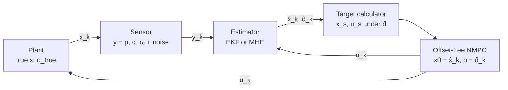
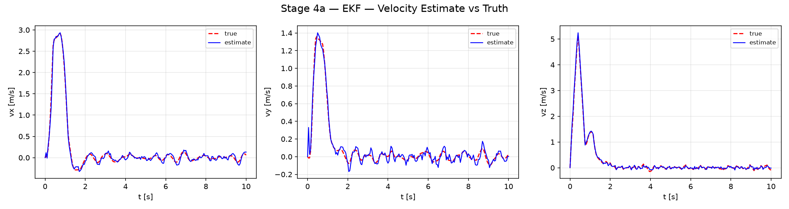
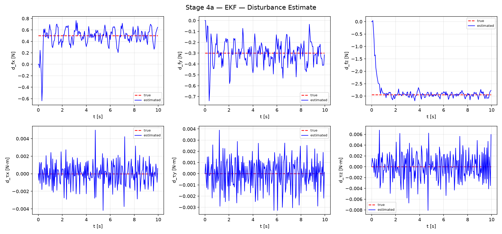
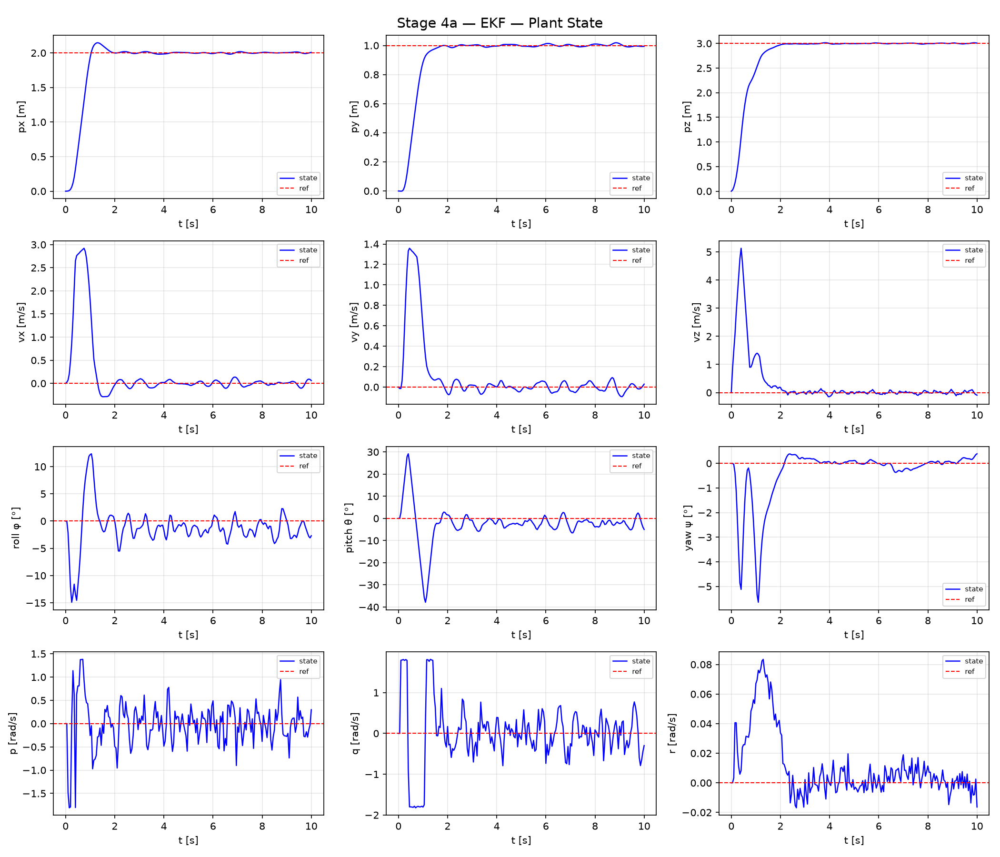
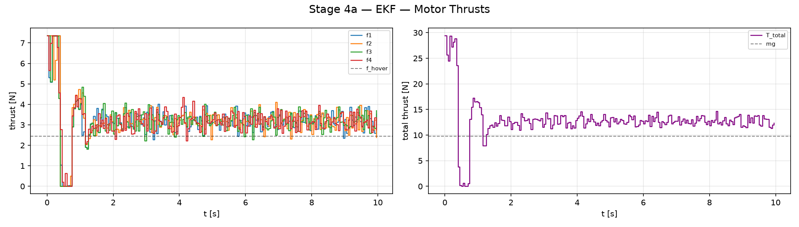
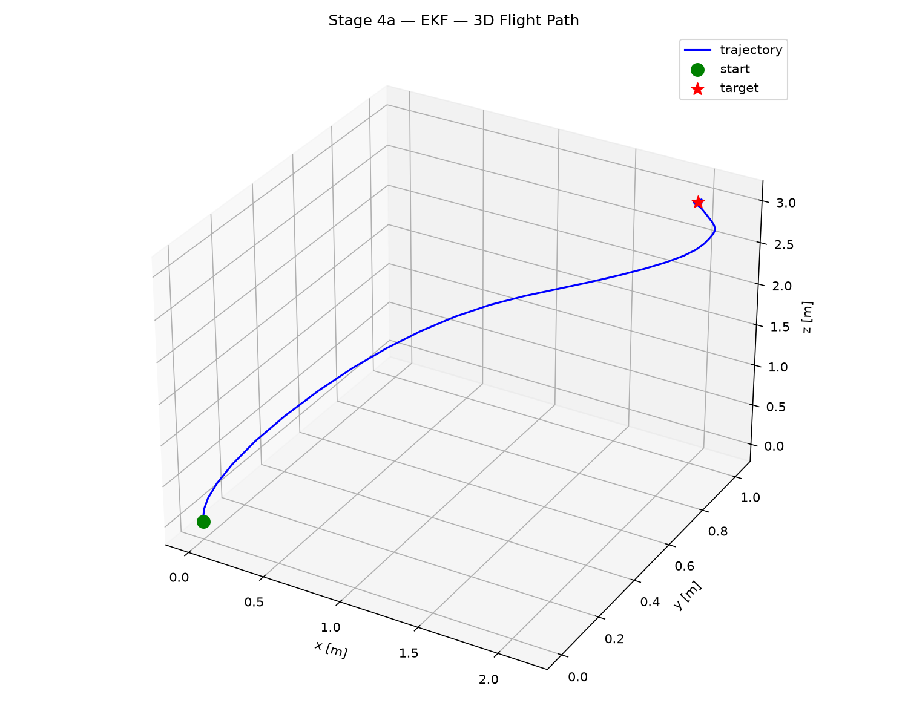
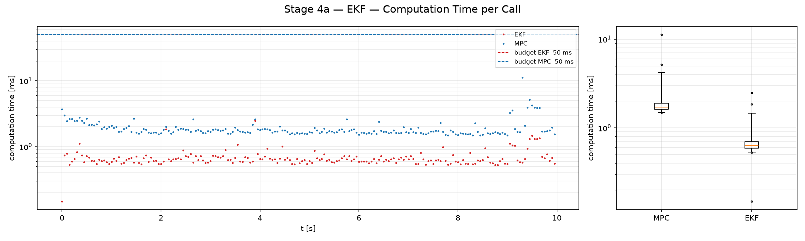

# Stage 4a — Partial Measurement and Augmented EKF

| | |
|---|---|
| Git tag | `stage4` |
| Files | `state_est_ekf.py`, `sensor_simulator.py`, `observability_check.py`, `closed_loop_sim_config.py`, `simulate_ekf.py` (+ `ocp_config_offsetfree.py`, `ss_target.py` from Stage 3) |
| Measurement | $y = [p;\, q;\, \omega] \in \mathbb{R}^{10}$ with Gaussian noise; $v$ and $d$ unmeasured |
| Estimator | augmented EKF on $z = [x;\, d] \in \mathbb{R}^{19}$ |
| Results | `results/stage4_ekf/` |

Stage 4 has two parts that share one closed loop. This document introduces the partial
measurement setting, the shared simulation harness, and the EKF. [Stage 4b](stage4b_mhe.md)
replaces the EKF with a Lyapunov-based MHE and compares the two.

## 1. Motivation

[Stage 3](stage3_offset_free.md) assumed the full 13-state plant was measured, so the
estimator only had to infer the disturbance $d$. A real quadrotor does not measure linear
velocity. A motion-capture system, or a fused IMU + GPS/VIO front end, delivers position,
attitude and body rates. Stage 4 adopts that measurement contract:

$$y = [p;\; q;\; \omega] \in \mathbb{R}^{10}, \qquad v \text{ and } d \text{ unmeasured}.$$

The estimator must now reconstruct the velocity *and* the disturbance from the model's
coupling, and the MPC is initialized with the estimate $\hat x$ instead of the true state.
Every channel carries sensor noise, so the estimator also has to filter.

**Scope.** Measurement *noise* is part of this stage. Sensor *fusion* (raw IMU, GPS and VIO
with different rates, biases and latencies) is a separate engineering problem and is left to
a follow-up ROS project. Here $y$ stands for the fused output of an idealized pose source.

## 2. Formulation

### 2.1 Augmented model and measurement

The estimator works on the augmented state of Stage 3,

$$z = [x;\; d] \in \mathbb{R}^{19}, \qquad \dot z = f_{\text{aug}}(z, u), \qquad \dot d = 0,$$

with a measurement that is a linear selection of $z$:

$$y = Hz, \qquad
H = \begin{bmatrix} I_3 & 0 & 0 & 0 & 0 \\ 0 & 0 & I_4 & 0 & 0 \\ 0 & 0 & 0 & I_3 & 0 \end{bmatrix} \in \mathbb{R}^{10 \times 19}.$$

Because $h$ is linear, $H$ is constant and the measurement update needs no linearization.

### 2.2 Observability at hover

Before any estimator runs, `observability_check.py` verifies that the linearized augmented
pair is observable at hover:

$$F = \left.\frac{\partial f_{\text{aug}}}{\partial z}\right|_{\text{hover}} \in \mathbb{R}^{19 \times 19}, \qquad
\mathcal{O} = \begin{bmatrix} H \\ HF \\ \vdots \\ HF^{18} \end{bmatrix} \in \mathbb{R}^{190 \times 19}.$$

**Result:** $\mathrm{rank}(\mathcal{O}) = 19$, so the full augmented state is locally observable.
The unmeasured states reach the measurement through these chains:

| Unmeasured state | Path to a measured signal | Integrations |
|---|---|---|
| velocity $v$ | $v \to \dot p \to p$ | 1 |
| torque disturbance $d_\tau$ | $d_\tau \to \dot\omega \to \omega$ | 1 |
| force disturbance $d_f$ | $d_f \to \dot v \to v \to \dot p \to p$ | 2 |

The force disturbance is the hardest to estimate: it sits two integrations away from the
measured position, so its effect has to be separated from position noise by a model that
double-integrates. The SVD gives a condition number $\kappa(\mathcal{O}) \approx 2 \times 10^4$, with
the two smallest singular values ($\approx 5.1 \times 10^{-2}$) forming a pair. This check is
local and single-point; [Stage 4b](stage4b_mhe.md#3-detectability-certificate) needs and
provides a much stronger, non-local detectability statement.

### 2.3 Extended Kalman filter

**Prediction** with the applied input $u_{k-1}$. The Jacobian is evaluated at the current
estimate before propagation; the mean uses RK4, the covariance a first-order discretization:

$$F_d = I + F_c(\hat z_{k-1}, u_{k-1})\, T_s, \qquad
\hat z_{k|k-1} = \mathrm{RK4}\bigl(f_{\text{aug}}, \hat z_{k-1}, u_{k-1}, T_s\bigr), \qquad
P_{k|k-1} = F_d P_{k-1} F_d^\top + Q.$$

RK4 matters for the mean because integration error there accumulates directly in the estimate.
For the covariance, the linearization error dominates the discretization error, so the cheap
first-order form is adequate.

**Update** with $y_k$ (Joseph form, gain via a linear solve instead of an explicit inverse):

$$S = HPH^\top + R, \qquad K = PH^\top S^{-1}, \qquad
\hat z_k = \hat z_{k|k-1} + K\bigl(y_k - H\hat z_{k|k-1}\bigr), \qquad
P_k = (I - KH)P(I - KH)^\top + KRK^\top.$$

The Joseph form keeps $P$ symmetric positive definite under round-off, which matters here
because $P$ mixes well-conditioned (measured) and weakly observable (force disturbance) modes.

**Quaternion handling.** The additive update ignores $\|q\| = 1$, so the quaternion is
renormalized after prediction and after update, with $q_w > 0$ enforced. Before the
innovation is formed, the measured quaternion is flipped if $\langle y_q, \hat q \rangle < 0$:
$q$ and $-q$ are the same rotation, and without the flip a measurement in the other
hemisphere would produce a spurious innovation of magnitude $\approx 2$.

The EKF is a *filter*: $\hat z_k$ already contains $y_k$.

### 2.4 Tuning

$Q$ is specified as a continuous-time spectral density $Q_c$ and scaled per sample,
$Q = Q_c T_s$, so changing $T_s$ does not silently change how fast $\hat d$ may move.
$R$ is matched to the sensor.

| Block | $Q_c$ | per sample ($T_s = 0.05$ s) | $P_0$ | Rationale |
|---|---|---|---|---|
| position | $2 \cdot 10^{-5}$ | $10^{-6}$ | $10^{-2}$ | measured |
| velocity | $2 \cdot 10^{-3}$ | $10^{-4}$ | $1.0$ | unmeasured, absorbs model error |
| quaternion | $2 \cdot 10^{-5}$ | $10^{-6}$ | $10^{-2}$ | measured |
| body rate | $2 \cdot 10^{-5}$ | $10^{-6}$ | $10^{-2}$ | measured |
| force disturbance | $0.2$ N²/s | $10^{-2}$ | $1.0$ | sets the $\hat d_f$ bandwidth (≈ 1 s transient) |
| torque disturbance | $2 \cdot 10^{-3}$ N²m²/s | $10^{-4}$ | $0.1$ | well observable through $\omega$ |

$R = \mathrm{diag}(\sigma_p^2 I_3,\; \sigma_q^2 I_4,\; \sigma_\omega^2 I_3)$ with the sensor values of §3.1.
The force-disturbance density $Q_{c,f}$ is the main knob: larger values track a disturbance step
faster but pass more measurement noise into $\hat d_f$, and through the MPC into the thrusts.

## 3. Implementation — the shared Stage 4 closed loop

### 3.1 Sensor simulator

`SensorSimulator` maps the 13-dim plant state to $y$ and adds Gaussian noise
(mocap-equivalent, fixed seed for reproducibility):

| Channel | $\sigma$ | Meaning |
|---|---|---|
| position | $0.01$ m | 1 cm, commercial motion capture |
| quaternion | $0.001$ | $\approx 0.06°$ small-angle equivalent |
| body rate | $0.005$ rad/s | $\approx 0.3°$/s gyro noise |

The noisy quaternion is renormalized. The sensor takes the physical state $x \in \mathbb{R}^{13}$,
not the augmented $z$: a real sensor never sees the disturbance the estimator invents.

### 3.2 Closed loop

`closed_loop_sim_config.py` is the one loop both Stage 4 estimators run in. The entry scripts
only choose the estimator; sensor, seed, scenario, controller and prior are identical.



Per step $k$:

1. $y_k = h(x_k) + \nu_k$.
2. $\hat z_k = $ `estimator.step`$(y_k, u_{k-1})$ — the common interface of EKF and MHE.
3. $(x_s, u_s) = $ `compute_ss_target`$(x_{\text{ref}}, \hat d_k)$; the NMPC gets $\hat d_k$ as parameter,
   $(x_s, u_s)$ as reference and the normalized **estimate** $\hat x_k$ as initial state.
4. The plant advances with the true disturbance.

Step 3 is the key difference from Stage 3: the MPC no longer sees the true state, so
estimation errors now affect the closed loop.

**Shared settings.**

| Item | Setting |
|---|---|
| Rates | plant, sensor, estimator and MPC at $T_s = 0.05$ s (the harness supports an MPC at an integer multiple, $r = 1$ here) |
| Prior | $\bar z_0$ = projection of $y_0$: measured $p, q, \omega$; $\hat v = 0$, $\hat d = 0$ |
| NMPC | Stage 3 offset-free NMPC ($N = 20$, $T = 1$ s, DARE terminal cost) plus a soft body-rate box $\lvert\omega_i\rvert \le 0.9\,\omega_{\max} = 1.8$ rad/s |
| Timing | wall-clock time of every estimator and controller call, `OMP_NUM_THREADS = 1` |

The body-rate box keeps the plant inside the envelope on which the Stage 4b MHE certificate
holds ($\lvert\omega_i\rvert \le 2$ rad/s). It is part of the controller in *both* runs, so it does
not bias the comparison. It does make the transient slower than in Stage 3, where the pitch rate
reached $5$ rad/s.

```bash
git checkout stage4
./run.sh observability_check.py    # rank check at hover
./run.sh simulate_ekf.py           # → results/stage4_ekf/   (--no-disturbance for the nominal plant)
```

## 4. Scenario

Identical to Stage 3: hover-to-hover step from the origin to $p_{\text{ref}} = (2, 1, 3)$ m,
$T_{\text{sim}} = 10$ s, constant disturbance from $t = 0$ ($d_{f_x} = 0.5$ N, $d_{f_y} = -0.3$ N,
$d_{f_z} = -2.943$ N, $d_\tau = 0$). Offset-free control is active from the start; there is no
activation switch as in Stage 3.

Before the closed loop, the EKF was verified open loop with a noise-free sensor: it holds the
hover fixed point ($\|\hat z - z_{\text{hover}}\| < 10^{-4}$ over 10 s), recovers from a wrong
initial velocity ($\hat v_x = 1$ m/s → $\lvert\hat v_x\rvert < 10^{-8}$), and recovers
$d_{f_x} = 0.5$ N to $10^{-12}$ within 4 s.

## 5. Results

Steady-state numbers below cover $t = 5$–$10$ s, after all transients. Errors are the norm of the
per-axis mean absolute error, as printed by `simulate_compare.py`.

### 5.1 Velocity estimation



Velocity is the state that must be inferred, so this is the real test of the estimator. During
the maneuver the EKF tracks the true velocity closely, including the $5.1$ m/s peak in $v_z$.
In steady state the estimate carries visible noise: the velocity error is
$53$ mm/s. Position noise of 1 cm per sample, differentiated by the filter over one
$50$ ms step, is the main source.

### 5.2 Disturbance estimation



The force estimates reach the right *mean* within about $1$ s, as intended by the tuning, and
stay unbiased (mean error below $0.01$ N per axis). Around that mean they fluctuate with a
standard deviation of about $0.1$ N on all three axes ($0.11$, $0.09$, $0.09$ N for $x, y, z$).
Relative to the true values this matters most for the horizontal components: $\pm 0.1$ N is
small against $2.94$ N in $z$ but $20$–$30\%$ of $0.5$ N and $0.3$ N in $x$ and $y$. The torque
estimates fluctuate around zero at the $10^{-3}$ N·m level.

### 5.3 States and inputs



Position reaches the reference within about $2$ s, with an overshoot of $15$ cm in $x$ at
$t = 1.3$ s, and then holds it with an error of $10$ mm and no bias (mean offset below
$2$ mm per axis). The pitch rate saturates at the $1.8$ rad/s box twice during the maneuver.
Roll and pitch settle around the equilibrium tilt of Stage 3
($\phi_s = -1.35°$, $\theta_s = -2.24°$; measured mean $-1.43°$, $-2.17°$), but with a standard
deviation of $1.4°$ and $2.0°$: the noisy $\hat d$ moves the target attitude, and the noisy $\hat v$
moves the MPC's initial state.



The same noise is visible in the thrusts. The mean total thrust is $12.77$ N, exactly the
equilibrium $T_s$, but each motor fluctuates with a standard deviation of about $0.35$ N, and the
total with $0.75$ N.



The path is S-shaped rather than straight as in Stage 3. The vertical motion comes in two
bursts ($v_z$ peaks at $t \approx 0.4$ s and $1.1$ s) separated by the zero-thrust braking phase,
while the horizontal motion is one continuous burst, so the drone climbs, flattens out, and
climbs again. The rate-limited attitude response, which lengthens the braking phase, is the
most likely reason this differs from Stage 3.

### 5.4 Computation time



The EKF takes $0.69$ ms per step on average ($1.5$ ms at the 99th percentile), the MPC
$2.0$ ms. Both are far below the $50$ ms sample time.

## 6. Takeaways

- **The partial-measurement loop works.** With only $[p;\, q;\, \omega]$ measured, the augmented
  EKF reconstructs velocity and disturbance well enough for offset-free tracking: no position
  bias, attitude and thrust at the analytical equilibrium on average.
- **The price is noise.** The EKF reacts within one sample and converges in about 1 s, but the
  same bandwidth passes sensor noise into $\hat v$ and $\hat d$, and from there into attitude and
  motor commands. This is the usual Kalman trade-off, set here by $Q_{c,f}$.
- **The tuning is a choice, not a certificate.** $Q$ was chosen by hand for a fast transient.
  Nothing in the EKF proves convergence; observability holds only locally at hover.

Stage 4b replaces the hand-tuned filter by an MHE whose weights come from a detectability
certificate, and compares both in this same loop → [Stage 4b — MHE](stage4b_mhe.md).

## References

- D. Simon, *Optimal State Estimation: Kalman, H∞, and Nonlinear Approaches*, Wiley, 2006.
- G. Pannocchia, J. B. Rawlings, "Disturbance models for offset-free model-predictive control," *AIChE Journal*, 2003.
