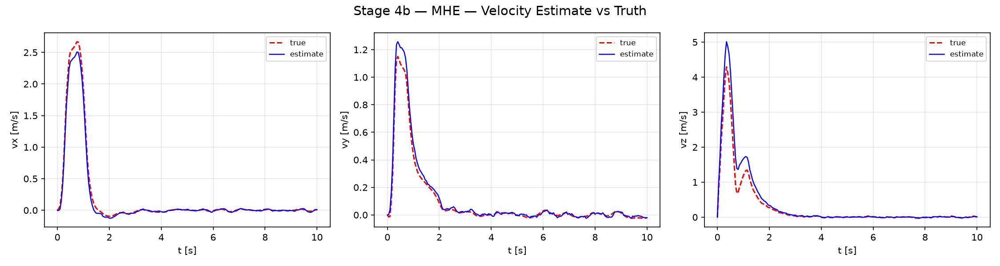
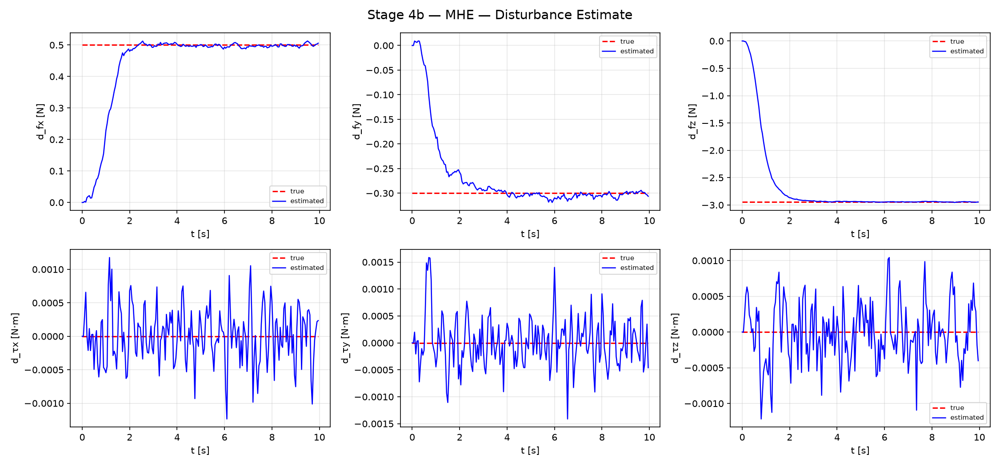
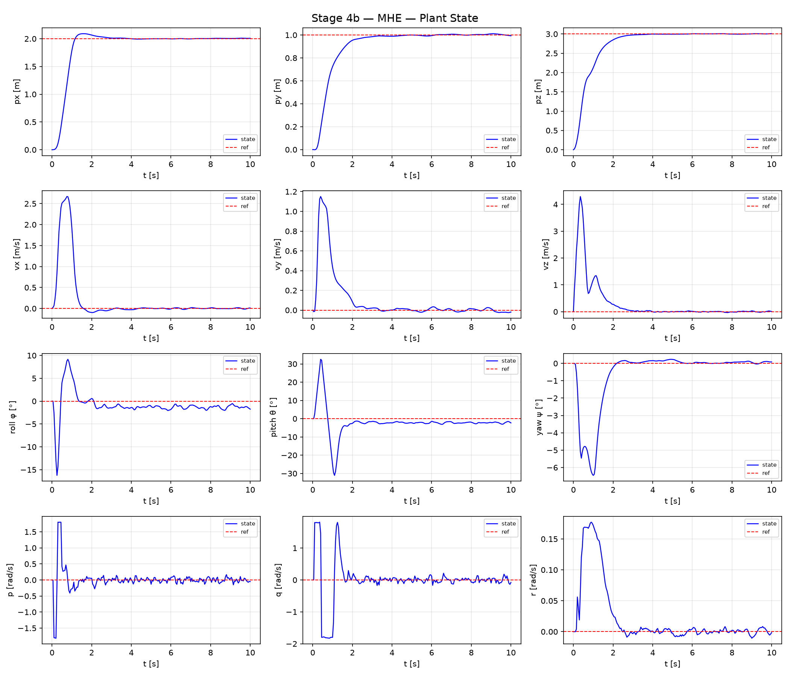
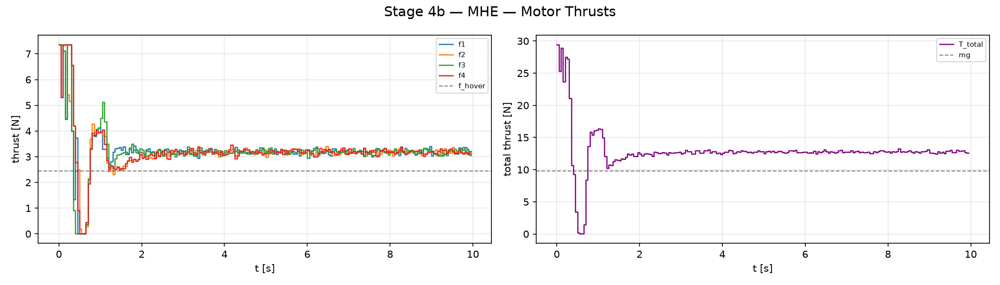
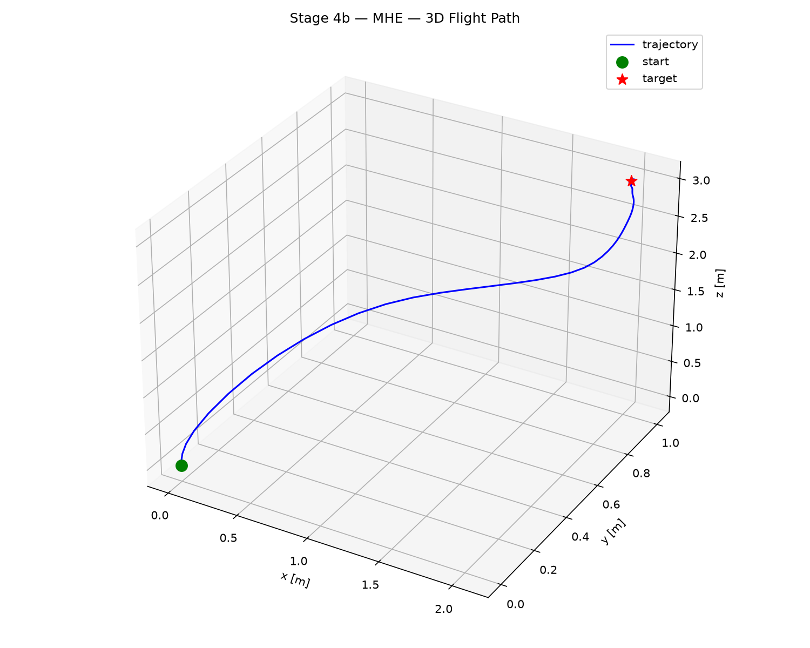
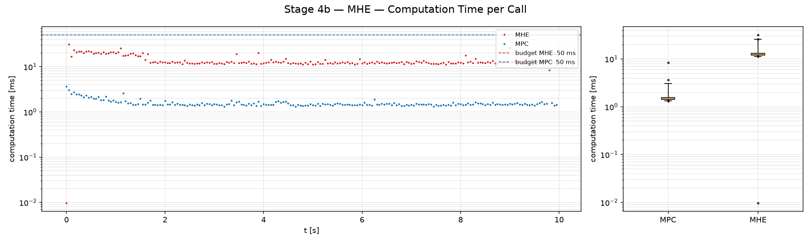
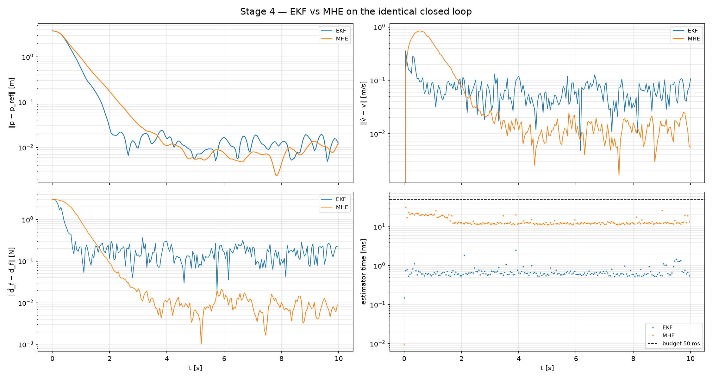

# Stage 4b — Lyapunov MHE and Comparison with the EKF

| | |
|---|---|
| Git tag | `stage4` |
| Files | `detectability_check.py` (offline), `ocp_config_mhe.py`, `state_est_mhe.py`, `simulate_mhe.py`, `simulate_compare.py` (+ shared loop `closed_loop_sim_config.py`) |
| Estimator | moving horizon estimator on $z = [x;\, d] \in \mathbb{R}^{19}$, weights from an i-iIOSS (LMI) certificate |
| Certificate | `data/mhe_params.npz` — $P$, $Q$, $R$, $\lambda$, $T_{\min}$, envelope |
| Results | `results/stage4_mhe/`, `results/stage4_compare/` |

Main references:
J. D. Schiller, S. Muntwiler, J. Köhler, M. N. Zeilinger, M. A. Müller, *A Lyapunov function
for robust stability of moving horizon estimation*, IEEE TAC 68(12), 2023
([arXiv:2202.12744](https://arxiv.org/abs/2202.12744)) — discrete time;
J. D. Schiller, M. A. Müller, *Robust stability of moving horizon estimation for
continuous-time systems*, 2024 ([arXiv:2305.06614](https://arxiv.org/abs/2305.06614)) —
continuous time, the version implemented here. Equation numbers refer to the 2024 preprint.

## 1. Motivation

The [Stage 4a](stage4a_ekf.md) EKF works, but it has three weaknesses:

- **Hand tuning.** Its covariances were chosen for a fast transient, and they directly set how
  much sensor noise reaches $\hat v$, $\hat d$ and the motors.
- **Local.** It linearizes once per step; observability was verified only at hover.
- **No guarantee.** Nothing proves that the estimation error converges.

A moving horizon estimator (MHE) solves an optimization over a window of past measurements
instead of a one-step recursion. It can use the nonlinear model over the whole window, respect
constraints, and average noise over many samples. The Lyapunov MHE of Schiller et al. adds
the missing theory: if the system satisfies a detectability condition in Lyapunov form, and
the MHE uses the weights of that Lyapunov function and a long enough horizon, the estimation
error is robustly exponentially stable. Stage 4b implements this on the same augmented state
and in the same closed loop as the EKF, so the estimator is the only difference.

## 2. Theory

### 2.1 Detectability as an incremental Lyapunov function

Consider $\dot z = f(z, u, w)$, $y = h(z)$, with a generalized disturbance $w$. The system is
**i-iIOSS** (integral incremental input/output-to-state stable, the continuous-time detectability
notion of the 2024 paper) with a quadratic Lyapunov function if there are $P \succ 0$,
$Q, R \succeq 0$ and $\kappa > 0$ such that for any two trajectories with the same input

$$\frac{d}{dt}\|z - \tilde z\|_P^2 \;\le\; -\kappa\, \|z - \tilde z\|_P^2 + \|w - \tilde w\|_Q^2 + \|y - \tilde y\|_R^2 .$$

Reading: two trajectories converge at rate $\kappa$ *unless* their disturbances or their outputs
differ. If they produce the same outputs under the same disturbances, they must converge,
which is exactly detectability. $Q$ and $R$ are supply rates: how much a disturbance or output
difference can "pay for" growth of the Lyapunov function. The decay per second is
$\lambda = e^{-\kappa}$.

### 2.2 MHE cost and stability result

At time $t$ the MHE optimizes the state at the start of the window $[t - T, t]$ and the
disturbance trajectory, with cost (paper, eq. 9)

$$J = 2\,\lambda^{T}\, \bigl\|\hat z(t - T) - \bar z\bigr\|_P^2
\;+\; \int_{t-T}^{t} \lambda^{\,t - \tau} \Bigl(2\,\|\hat w(\tau)\|_Q^2 + \|\hat y(\tau) - y(\tau)\|_R^2\Bigr)\, d\tau ,$$

subject to the model. The estimate is the end point $\hat z(t)$. Three features distinguish it
from a hand-tuned MHE:

1. **The weights are the certificate.** $P$, $Q$, $R$ and $\lambda$ are those of §2.1, not tuning parameters.
2. **Filtering prior.** $\bar z$ is the estimate the MHE *delivered* for time $t - T$, not a
   smoothed value from the previous window.
3. **Discounting.** Older data is weighted down by $\lambda^{t-\tau}$; the prior by $\lambda^T$.

The factors 2 come from Young's inequality in the proof, which compares the MHE solution with
the true trajectory (a feasible candidate). With $P_1 = P_2 = P$ the result is:

$$\boxed{\;T > T_{\min} = \frac{\ln 4}{\kappa}\;} \quad \text{(paper, eq. 17)}
\quad\Longrightarrow\quad \text{robust global exponential stability of the estimation error},$$

with guaranteed contraction rate $\rho = 4^{1/T}\lambda$ per second (eq. 18). The bound is in
**seconds**, independent of the sample time: a shorter sample time needs more nodes for the
same window. The guarantee is robust, not exact: the error is bounded by a discounted
term in the true disturbances.

### 2.3 Verifying detectability with an LMI

For $\dot z = f(z, u) + w$ (so $B = \partial f / \partial w = I$) and a linear measurement
$y = Cz$ ($D = 0$), the i-iIOSS inequality holds on a **convex** set if the LMI (paper, eq. 31)

$$\begin{bmatrix} PA + A^\top P + \kappa P - C^\top R C & PB \\ B^\top P & -Q \end{bmatrix} \preceq 0,
\qquad A = \frac{\partial f}{\partial z},$$

holds at every point of that set. The proof integrates along the straight line between two
states, so the line must stay inside the set where the LMI was imposed; this is why convexity
is required.

## 3. Detectability certificate (`detectability_check.py`)

### 3.1 Model and sets

The certificate is computed for exactly the model the MHE optimizes over:

$$\dot z = \begin{bmatrix} f(x, u, d) \\ 0 \end{bmatrix} + w, \quad z \in \mathbb{R}^{19}, \quad
w \in \mathbb{R}^{19}, \qquad y = Cz = [p;\, q;\, \omega].$$

The structure of $A = \partial f / \partial z$ decides what has to be covered. The script asserts
each property symbolically before solving:

| Variable | Enters $A$? | Set used |
|---|---|---|
| $p$, $v$, $d$, $w$ | no | unbounded |
| $q$ | yes, affinely | ball $\|q\| \le r_{\max} = 1.02$ (the unit sphere is not convex; the ball is its convex hull, with margin for norm drift of the estimate) |
| $\omega$ | yes, affinely | box $\lvert\omega_i\rvert \le \omega_{\max} = 2$ rad/s |
| $u$ | only through $T_{\text{total}} = \sum f_i$, affinely | $T_{\text{total}} \in [0,\, 4 f_{\max}] = [0,\, 29.4]$ N |

### 3.2 Finite reduction and cutting-plane solve

Because $A$ is affine in $(q, \omega)$ and in $T_{\text{total}}$, and the LMI is affine in $A$, the LMI
holds on the convex hull of the points where it is imposed. So only the 8 vertices of the
$\omega$ box and the 2 endpoints of $T_{\text{total}}$ are needed, combined with a set of attitude
points on $\|q\| = r_{\max}$ whose hull approximates the ball. Only the attitude needs real gridding.

1. **Attitude pool.** A $20^3$ hyperspherical grid on the unit sphere (both hemispheres, since
   $A(q) \ne A(-q)$ and the hull must contain the interior), scaled to $r_{\max}$.
2. **SDP.** For a fixed $\kappa$, the LMI is affine in $(P, Q, R)$. Minimize
   $\mathrm{tr}\,Q + \mathrm{tr}\,R$ (tightest detectability statement) subject to $P \succeq 10^{-2} I$
   (fixes the scale), lower bounds on $\mathrm{diag}(Q)$ and $\mathrm{diag}(R)$, and the LMI
   $\preceq -10^{-5} I$ at each point. $P$ is a full $19 \times 19$ matrix, $Q$ and $R$ are diagonal.
   The floors on $Q$ for $w_p$ and $w_q$ are set to $1$ so the exact kinematics
   ($\dot p = v$, $\dot q = \tfrac12 q \otimes \omega$) stay expensive to violate in the MHE.
3. **Cutting plane.** Solve on a small active set of attitudes, evaluate the LMI eigenvalue on
   the *whole* pool independently of the solver, add the worst violators, repeat until none
   remain. The certificate is this eigenvalue check, not the solver status.
4. **Spot check.** $20\,000$ random attitudes on the sphere with interior $\omega$, $T_{\text{total}}$ guard
   the gap between the pool's polytope hull and the ball.

Only a certificate that passes both checks is written to `data/mhe_params.npz`.

### 3.3 Design order and result

The decay is the design input; everything else follows:

$$\lambda = 0.5 \text{ per s} \;\to\; \kappa = \ln 2 = 0.693 \text{ s}^{-1} \;\to\; \text{LMI} \;\to\; P, Q, R \;\to\;
T_{\min} = \frac{\ln 4}{\kappa} = 2.0 \text{ s}.$$

All stored quantities are continuous time, so changing the MHE sample time or horizon factor
needs no new SDP solve. If the LMI is infeasible for a chosen $\lambda$, the options are a slower
decay ($\lambda \to 1$, longer $T_{\min}$) or a smaller envelope.

## 4. MHE (`ocp_config_mhe.py`, `state_est_mhe.py`)

### 4.1 acados formulation

| Symbol | Dim | acados role |
|---|---|---|
| $z$ | 19 | `model.x` |
| $w$ (process noise on every derivative) | 19 | `model.u` — the decision variable |
| rotor thrust $u$ | 4 | part of `model.p` (known input) |
| per-node parameter | 36 | `[t_age, a_arr, m_meas, z_prior(19), y_meas(10), u_rotor(4)]` |

The roles of `model.u` swap compared with the MPC: the optimizer chooses the noise, and the
thrust becomes a parameter that differs per node.

**Horizon.** $N = \lceil c\, T_{\min} / T_s \rceil$ with $c = 1.5$, giving $N = 60$ and $T = 3.0$ s at
$T_s = 0.05$ s. The minimum allowed is $N_{\min} = 41$ (strict $T > 2$ s). The guaranteed rate is
$\rho = 4^{1/3} \cdot 0.5 = 0.794$ per second. The MHE window is independent of the 1 s MPC horizon.

**Cost on the grid.** Every stage $i$ carries its age $\tau_i = (N - i) T_s$ and uses one expression,
the integrand of [§2.2](stage2_terminal_cost.md#22-stage-2b--dare-terminal-cost):

$$\ell_i = a_i \frac{2\,\lambda^{\tau_i}}{T_s} \|e_z\|_P^2 + 2\,\lambda^{\tau_i} \|w_i\|_Q^2 + m_i\, \lambda^{\tau_i} \|e_{y,i}\|_R^2 .$$

acados multiplies each stage cost by its time step (default `cost_scaling`), which turns the
integrand into the Riemann sum of the integral. The arrival term is a point cost, so the
$1/T_s$ cancels the scaling and it carries exactly $2\lambda^T\|\cdot\|_P^2$. The flags $a_i, m_i \in \{0, 1\}$
mark the node with the arrival cost and the nodes with measurements.

**Quaternion error.** For the attitude parts of $e_z$ and $e_y$:
$e_q = \lvert q \otimes q_r^{-1} \rvert - [1, 0, 0, 0]^\top$ (elementwise absolute value), which is zero
for both $q_r$ and $-q_r$.

**Constraints.**
- Soft $\|q\|^2 = 1$ on every node, including the terminal node whose state goes to the MPC
  (quadratic slack penalty $10^4$).
- Hard $\lvert\hat\omega_i\rvert \le \omega_{\max}$ on every node: the estimated trajectory must stay in the
  certified set (paper, constraint 8c). It is always feasible because $w_\omega$ can bend any
  trajectory into the box. The MPC keeps the *true* rates inside with its soft $0.9\,\omega_{\max}$ box.

**Solver.** `SQP_RTI` (one SQP iteration per sample), exact Hessian, `PARTIAL_CONDENSING_HPIPM`,
ERK4 over each $T_s$.

### 4.2 Window, prior and start-up

The MHE is in **prediction form**, as in the paper: nodes $0 \dots N-1$ hold the measurements
$y_{k-N} \dots y_{k-1}$ and thrusts $u_{k-N} \dots u_{k-1}$; node $N$ is the free end point $\hat z_k$. The
current measurement $y_k$ is stored and first used at $k + 1$, so the estimate lags the EKF by
one sample.

- **Filtering prior:** $\bar z = \hat z_{k-N}$, the estimate delivered $N$ steps earlier, kept in a
  rolling buffer.
- **Growing horizon** while $t < T$: the available $k$ samples fill the last $k$ stages, with the
  initial prior $\bar z_0$ at node $N - k$ (window length $\min(t, T)$, as in the paper). The leading
  nodes carry no data; the penalized $w$ makes the optimum pass straight through them.
- **Warm start:** the previous solution shifted by one node; the first solve starts from $\bar z_0$
  rather than acados' zeros, where $q = 0$ would make the quaternion error degenerate.

Buffers for $\hat z$, $y$ and $u$ have length $N$, so the growing and the sliding phase run the
same code.

```bash
git checkout stage4
./run.sh detectability_check.py   # certificate → data/mhe_params.npz (needs cvxpy + MOSEK)
./run.sh simulate_mhe.py          # → results/stage4_mhe/
./run.sh simulate_compare.py      # EKF vs MHE from the saved runs → results/stage4_compare/
```

## 5. Scenario

Identical to [Stage 4a](stage4a_ekf.md#4-scenario): same reference, disturbance, sensor noise,
seed, prior $\bar z_0$ and controller. Steady-state numbers cover $t = 5$–$10$ s; errors are the
norm of the per-axis mean absolute error, as printed by `simulate_compare.py`.

## 6. Results

### 6.1 Velocity estimation



In steady state the velocity estimate is smooth and close to the truth (error
$11$ mm/s). During the maneuver it is visibly biased: $\hat v_x$ is too small ($2.5$ vs.
$2.7$ m/s at the peak), $\hat v_y$ and $\hat v_z$ too large ($1.26$ vs. $1.15$ m/s, $5.0$ vs. $4.3$ m/s).
Each sign matches the disturbance estimate at that time, which has not converged yet: with
$\hat d_f$ still near zero, the model underestimates the push in $+x$ and the pull in $-y$, and the
extra weight in $-z$, so it predicts too little $v_x$ and too much $v_y$ and $v_z$. The velocity error
is a consequence of the disturbance error, not an independent one.

### 6.2 Disturbance estimation



Starting from $\hat d = 0$, the force estimates approach the true values smoothly over about
$2$ s: the error norm stays below $0.1$ N from $t = 1.95$ s and below $0.05$ N from $t = 2.35$ s.
In steady state they are unbiased with a standard deviation of about $0.005$ N per axis, roughly
$20\times$ less than the EKF. Torque estimates stay within $\pm 10^{-3}$ N·m.

### 6.3 States and inputs



Position settles within $2$ cm after $3.6$ s, with an $x$ overshoot of $9$ cm, and then holds the
reference with an error of $6.8$ mm and no bias (below $3$ mm per axis). Roll and pitch settle
at $-1.34°$ and $-2.24°$, the analytical equilibrium, with a standard deviation of only $0.35°$.
The maximum true body rate is $1.83$ rad/s, inside the certified $2$ rad/s.



Thrusts settle at the equilibrium ($12.77$ N total) with a standard deviation of $0.08$ N per
motor and $0.15$ N in total, about $4$–$5\times$ less than with the EKF.



### 6.4 Computation time



One MHE solve takes $13.8$ ms on average ($25.8$ ms at the 99th percentile, $31.5$ ms maximum).
It is about $20$ ms during the first $1.7$ s of large maneuvers and $12.6$ ms afterwards. MHE plus
MPC stays below $35$ ms in every step, inside the $50$ ms sample time. The MPC itself takes
$1.6$ ms. All SQP_RTI calls succeeded.

## 7. EKF vs MHE



| Steady state ($t = 5$–$10$ s) | EKF | MHE | Ratio |
|---|---|---|---|
| position error $\|\Delta p\|$ | $10.1$ mm | $6.8$ mm | $1.5\times$ |
| velocity estimation error $\|\Delta \hat v\|$ | $53.2$ mm/s | $11.0$ mm/s | $4.8\times$ |
| force-disturbance error $\|\Delta \hat d_f\|$ | $0.138$ N | $0.0078$ N | $18\times$ |
| roll / pitch standard deviation | $1.4°$ / $2.0°$ | $0.35°$ / $0.37°$ | $4$–$5\times$ |
| total thrust standard deviation | $0.75$ N | $0.15$ N | $5\times$ |

| Transient and cost | EKF | MHE |
|---|---|---|
| $\hat d_f$ mean converged | $\approx 1$ s | $\approx 2$ s |
| $\|\hat d_f - d_f\| < 0.1$ N from | not reached (noise band $\approx 0.1$–$0.3$ N) | $1.95$ s |
| $\|p - p_{\text{ref}}\| < 5$ cm / $< 2$ cm from | $1.9$ s / $4.0$ s | $2.75$ s / $3.6$ s |
| $p_x$ overshoot | $15$ cm | $9$ cm |
| estimator time, mean / p99 | $0.69$ / $1.5$ ms | $13.8$ / $25.8$ ms |

**Interpretation.** The two estimators sit at different points of the same bandwidth-versus-noise
trade-off. The EKF reacts within one sample and gets the disturbance mean right in about 1 s,
but its one-step correction passes position noise straight into $\hat v$ and $\hat d$. The MHE
fits a 3 s window of measurements to the nonlinear model; this averages the noise away and
gives a $5–20\times$ more accurate estimate once converged, but it needs about 2 s to move $\hat d$
away from the zero prior. The MHE also starts with a one-sample information disadvantage
(prediction form) and still wins in steady state.

The slow start is consistent with the certificate weights: minimizing $\mathrm{tr}\,Q + \mathrm{tr}\,R$
makes the measurement weight $R$ as small as the LMI allows, so early on the arrival prior
($\hat d = 0$) dominates. One SQP iteration per sample (RTI) further limits how far the estimate can
move per step during large changes.

**What the comparison does not show.** The EKF tuning was chosen by hand for a fast transient;
the MHE weights come from the certificate. The two are therefore not compared at equal
bandwidth. An EKF retuned to the MHE's $\approx 2$ s convergence (smaller $Q_{c,f}$) would be less
noisy, and that comparison would isolate the benefit of the window from the effect of tuning.
Robustness to model mismatch (mass or inertia error between plant and estimator model) is
also not tested yet.

## 8. Limitations and open points

- **Quaternion metric.** The certificate bounds $\|z - \tilde z\|_P^2$ with a Euclidean difference in
  $q$; the MHE cost uses the multiplicative error $\lvert q \otimes q_r^{-1}\rvert - [1,0,0,0]$. For small
  errors the two agree up to a factor, but the cost is not literally the certified function.
- **Exact optimizer vs. RTI.** The stability result of [§2.2](stage2_terminal_cost.md#22-stage-2b--dare-terminal-cost) applies to the optimal MHE solution; `SQP_RTI` performs
  one iteration per sample. All solves succeeded, but optimality is not checked.
- **Continuous-time certificate, discrete implementation.** The cost integral is a left Riemann
  sum on the $T_s$ grid and the model an RK4 step. Both approximations shrink with $T_s$; the
  certificate itself is purely continuous time.
- **Hull of the attitude pool.** The LMI is proven on the convex hull of a finite attitude pool,
  a polytope inside the ball $\|q\| \le 1.02$. The random spot check guards the gap but is not a
  proof.
- **Envelope.** The guarantee assumes the true and estimated trajectories stay in the certified
  set. The body rates are logged and stay inside ($1.83 \le 2$ rad/s); $\|q\|$ of the estimate is
  not logged yet.

## 9. Takeaways

- **The Lyapunov MHE turns tuning into a certificate.** One design input, the decay
  $\lambda = 0.5$ per second, fixes the weights through an LMI and the horizon through
  $T > \ln 4 / \kappa = 2$ s. The resulting estimator is robustly stable by construction on the
  certified envelope, with the caveats of §8.
- **It is the more accurate estimator on this scenario.** Once converged it estimates velocity
  about $5\times$ and the disturbance about $20\times$ better than the EKF, which shows up as calmer
  attitude and thrust and a smaller position error.
- **The price is a slower start and $20\times$ the computation.** $\hat d$ needs about 2 s instead of 1 s,
  and a solve takes $14$ ms instead of $0.7$ ms, still well inside the $50$ ms budget.

Stages 5 and 6 build on one of the two estimators. The comparison above favours the MHE as
long as the closed loop fits the time budget once the MPC grows with obstacle constraints and
time-varying references.

## References

- J. D. Schiller, S. Muntwiler, J. Köhler, M. N. Zeilinger, M. A. Müller, "A Lyapunov function for robust stability of moving horizon estimation," *IEEE TAC*, 68(12), 2023.
- J. D. Schiller, M. A. Müller, "Robust stability of moving horizon estimation for continuous-time systems," arXiv:2305.06614, 2024.
- J. B. Rawlings, D. Q. Mayne, M. M. Diehl, *Model Predictive Control: Theory, Computation, and Design*, 2nd ed., Nob Hill, 2017 (Ch. 4, state estimation).
